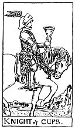

  
[Intangible Textual Heritage](../../index)  [Tarot](../index) 
[Index](index)  [Previous](gbt71)  [Next](gbt73) 

------------------------------------------------------------------------

[Buy this Book at
Amazon.com](https://www.amazon.com/exec/obidos/ASIN/0766157350/internetsacredte)

------------------------------------------------------------------------

*General Book of the Tarot*, by A. E. Thierens, \[1930\], at Intangible
Textual Heritage

------------------------------------------------------------------------

 

#### Knight of Cups

TRADITION: "The higher graces of the imagination" (*W*.). Arrival,
approach, advances, proposition, demeanour, invitation, incitement,
reception, comparison. Reversed: Trickery, fraud, duplicity, subtlety,
swindle, artifice.

THEORY: The Water of the soul on the *Twelfth* and on the *Eighth
house*. The double influence of water makes the emotions and feelings
prominent, relates to the imagination, to deeper experiences and strong
reactions of the soul, processes of psychic life, which may end in
wonderful success or in less desirable phenomena. It is sure to indicate
much relating to the subways of human life and the human soul. This is
not always favourable or pleasant, of course, but is in almost every
instance intensive, though the cups never go to anything like hatred or
crime or real malice. Their weakness is in being unreliable or
incalculable with regard to things of the exact world or matter. So in
the worst cases this card may indicate everything connected with
swindling from sheer mental instability. But it may also be, that the
term 'swindler' (charlatan) is wrongly given to people who are standing
apart from the common herd and are more or less occultists. The "higher
graces of the imagination."

There may be certainly a considerable degree of

p. 139

falsehood expressed by this card: false interpretation, misjudgment,
tendencious or fantastic narratives, exaggerated complaints, imaginary
wrongs, pathos and what the world calls miscarriage. On account of the
eighth house all this may be connected with sex-questions or intimate
and private affairs. The card may express indiscretion committed and
slanderous reports, secretly promulgated. It has to do with secrets and
the divulgation of secrets. But there may be also a higher sway in the
emotional realm: devotion, sacrifice, charity.

CONCLUSION--(On account of the twelfth house): *A stranger, sailor or
naval officer, man coming from far away. It makes one forget troubles,
perhaps intoxicates. Wine or strong liquors. Merchants of same.
Narcotics. Imagination, vision, dreams, poetic turn of mind. Occultism.
Devotion, sacrifice, charity*. (On account of the eighth house): *Strong
sexual tendencies, but the power to master them, and extract from them
the element of happiness and health: transmutation of inner forces. The
latter may also be translated as: changing his aspect of life wholly:
going from one state of life into a quite different sort of existence.
In some cases: falsehood, venomous reports, slander, blackmail,
trickery, fraud, subtlety, swindling, artifice. The evil influences may
cause the reasons for the said change of life, which in itself may well
prove benefic after all. There is much occultism in this card; this
Knight may be unknown or anonymous but a very important messenger (to
the soul?) At its best he is Saint George, killing the dragon, the
Rosicrucian brother*.

------------------------------------------------------------------------

[Next: Ace of Swords](gbt73)
