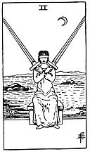

  
[Intangible Textual Heritage](../../index)  [Tarot](../index) 
[Index](index)  [Previous](gbt73)  [Next](gbt75) 

------------------------------------------------------------------------

[Buy this Book at
Amazon.com](https://www.amazon.com/exec/obidos/ASIN/0766157350/internetsacredte)

------------------------------------------------------------------------

*General Book of the Tarot*, by A. E. Thierens, \[1930\], at Intangible
Textual Heritage

------------------------------------------------------------------------

 

#### Two of Swords

TRADITION: Friendship, attachment, affection, intimacy, affinity,
tenderness, attraction, etc. "Concord in a state of arms." (*W*.)
Reversed: Falsity, imposture, lie, duplicity, bad faith, deception,
superficiality.

THEORY: The element *Earth* on the *Second house*. By virtue of the
Venusian qualities of the Taurus-house, this Saturnian and Martian
element, as will easily be understood, leads up to the magnetic affinity
of the sexes, consequently to intimacy, attraction, affection, etc. But
the idea of 'friendship' is different and not in this card. It denotes
also artistic appreciation, founded on the perfect functioning of the
senses. Taste for art will be born from this and an exact knowledge of
prices and values. It is the card which means quality and essential
virtue. Therefore it has been rendered as 'falsehood,' etc., when
reversed, i.e. when the innate virtue is wanting. Now in weak cases this
card will certainly denote sensuality and lazy luxurious habits, which
will be found accompanied in many instances by the desire for money. For
the rest we see in such cases the possibility of stupid resistance,
dullness, cruelty, relentless opposition and recreation, passive
obstruction, perhaps silent, unforgiving hatred. But in another respect
it means the will to cultivate

p. 142

the soil, in the literal as well as in the figurative sense.

CONCLUSION: *Latent force, magnetism, the principle of art, artistic
appreciation; quality, virtue; magnetic attraction, affinity, intimacy,
affection, that force which binds by the reduction of the senses; in
weak cases sensuality, laziness, dullness. When badly aspected cruelty,
unforgiving hatred, passive obstruction, etc*.

------------------------------------------------------------------------

[Next: Three of Swords](gbt75)
