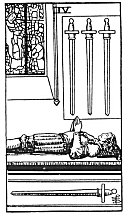

  
[Intangible Textual Heritage](../../index)  [Tarot](../index) 
[Index](index)  [Previous](gbt75)  [Next](gbt77) 

------------------------------------------------------------------------

[Buy this Book at
Amazon.com](https://www.amazon.com/exec/obidos/ASIN/0766157350/internetsacredte)

------------------------------------------------------------------------

*General Book of the Tarot*, by A. E. Thierens, \[1930\], at Intangible
Textual Heritage

------------------------------------------------------------------------

 

#### Four of Swords

TRADITION: Solitude, retreat, hermitage, exile, isolation, inhibited
condition, abandonment. Tomb and coffin. Reversed: Economy, good
conduct, circumspection, precaution, wise administration, testament,
avarice, household, savings, order, etc.

THEORY: The element of *Earth* on the *Fourth house*, house of the home
and the sign Cancer. This immediately explains why this card has been
said to stand for economy, savings, even avarice and household affairs
as well as for many things in connection with the end of life, since the
fourth house in the horoscope relates to the end of life, and to the
inner side of life as long as this lasts. Tradition is

p. 144

once more very correct in this case. When it enumerates "concord,
harmony, etc.," amongst the synonyms of this card, however, there is
some discrepancy, because the only thing that can be meant here is
'repose' or the condition of rest, as that of the grave, in which
external differences are lost. So taken in the strictly etymological
sense of the words, 'concord,' etc., have nothing to do with it. If in
any case this card should relate to business, it certainly does not mean
that anything like accord has been or will be reached, but that one of
the parties retires or takes his proposals back. It may also relate to
the condition of the soul, in which one harvests the results of material
life in the world, whether spiritually, by meditation, or materially, by
economy. In any case it points to a stillness and heavy condition of the
mind. Further, to the tendency of collecting, gathering.

CONCLUSION: *Solitude, repose, retreat, retiring from the world,
"hermit's repose"* (*W*.); *gathering, collecting, taking home one's
savings or impressions, meditation, economy, avarice, precaution,
testament, and the place occupied at the end of life, hermitage, grave,
coffin. The place of the card in the horoscopic scheme indeed suggests
the idea of being buried under the earth*.

------------------------------------------------------------------------

[Next: Five of Swords](gbt77)
