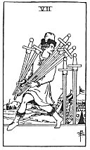

  
[Intangible Textual Heritage](../../index)  [Tarot](../index.md) 
[Index](index)  [Previous](gbt78)  [Next](gbt80.md) 

------------------------------------------------------------------------

[Buy this Book at
Amazon.com](https://www.amazon.com/exec/obidos/ASIN/0766157350/internetsacredte.md)

------------------------------------------------------------------------

*General Book of the Tarot*, by A. E. Thierens, \[1930\], at Intangible
Textual Heritage

------------------------------------------------------------------------

 

#### Seven of Swords

TRADITION: Hope, wish, design, will, taste, fantasy. Another version
says: "Also quarrelling; a plan that may fail." (*W*.) Reversed: Good
counsel, advice, helpful warning, news, announcement, consultation,
observation, reflexion, lesson, instruction, slander, babbling.

THEORY: The element *Earth* on the *Seventh house* indicates the actual
and material union of the Self and the Not-self in the organism, as a
material building. In this we have to see the 'accomplishment' or
attainment of the Self, that which the Self wishes to join. Since the
seventh house represents 'the opponent' as well, there may be something
like quarrelling in this card, attempts to reach agreement with an
opponent; this will be done in a practical,

p. 148

business-like way. A combative spirit, ready for the defensive. Owing to
the diplomatic and fox-like qualities of the house of Libra, the querent
may, by this card, attempt to steal the weapons of the opponent, as the
figure rightly suggests: using the arguments and fighting with the
weapons of the enemy.

Tradition is rather elusive in its definitions of this card; there are
some particulars of Libra indicated, curiously enough, but they are not
much of the nature of 'swords'--earth. The card must indicate everything
in the line of material ability, from the science of the use of tools,
crafts and arts up to tricks of abuse. It may equally favour a labourer,
an engineer, a dentist, a surgeon and a burglar.

CONCLUSION: *Meeting the opponent, perhaps some fighting, but more
probably the strategy than the fighting itself is indicated. Using the
weapons of the enemy. Practical ability. Science of the arts and crafts.
Tricks. Understanding of practical and material obstacles, and of the
work to be done. The enemy will be disarmed, arguments undone. A person
of technical ability; favours technical professions. Success by means of
capability, combined with diplomacy. Good care taken. Scheme, design*.

------------------------------------------------------------------------

[Next: Eight of Swords](gbt80.md)
