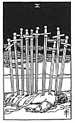

  
[Intangible Textual Heritage](../../index)  [Tarot](../index) 
[Index](index)  [Previous](gbt81)  [Next](gbt83) 

------------------------------------------------------------------------

[Buy this Book at
Amazon.com](https://www.amazon.com/exec/obidos/ASIN/0766157350/internetsacredte)

------------------------------------------------------------------------

*General Book of the Tarot*, by A. E. Thierens, \[1930\], at Intangible
Textual Heritage

------------------------------------------------------------------------

 

#### Ten of Swords

TRADITION: Tears, affliction, plaints, complaints, sadness, desolation,
sorrow. Reversed: Advantage, profit, favour. "But none of these are
permanent," says *W*.-- Power, might, usurpation, authority.

THEORY: The element of *Earth* on the *Tenth house*: Capricorn, of
course relates to authority and earthy might or power, and we do not see
why this should be only in a 'reversed' position. With regard to
religion this is the mother-church (compare: Capricorn the 'married
woman' or the mother), the materialisation of dogma and creed in a
building, a church, chapel, monastery. In the secular line it may be any
official building or office and, relating to persons, any official or
public authority under the civil law. The card represents material

p. 152

necessity and the limits and corner-stones which it erects. It is
ultimately the card of inexorable karmic results, say material karma
itself. To the profane this means very often affliction, etc., and the
personality may be burdened by the weight of fate. The image of this
card seems to suggest this specially. On the other hand tradition is
certainly not wrong in stating that it may represent gain and profit, as
the card of karma will bring the full measure of material things in
general and not only in the way of tragedy. Profit and advantage,
however, may also become oppressive and its possibility must be
considered here.

CONCLUSION: *Karmic results, whether benefic or malific; material
limits, physical necessity; authority, official might and power,
obedience to the same; official persons. The mother-church, monastery,
etc. Affliction, sadness, etc. In good cases due reward and honest
profit, merited position. Possession may become a curse. Fate may lay
low the personality. The card is not very benefic for the parents of the
querent, or he himself does not much esteem them. It relates to his
position in the world*.

P.S.--The cards of the suit of swords, from the ace up to the ten,
relate to the respective 'sins' prohibited by the Ten Commandments.

------------------------------------------------------------------------

[Next: King of Swords](gbt83)
