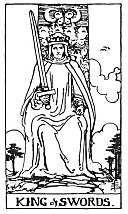

  
[Intangible Textual Heritage](../../index)  [Tarot](../index) 
[Index](index)  [Previous](gbt82)  [Next](gbt84) 

------------------------------------------------------------------------

[Buy this Book at
Amazon.com](https://www.amazon.com/exec/obidos/ASIN/0766157350/internetsacredte)

------------------------------------------------------------------------

*General Book of the Tarot*, by A. E. Thierens, \[1930\], at Intangible
Textual Heritage

------------------------------------------------------------------------

 

#### King of Swords

TRADITION: A man of the law or robe, councillor, senator, business-man,
doctor, etc. "Whatsoever arises out of the idea of judgment and all its
concessions, power, authority, command, militant intelligence . . ."
(*W*.) Reversed: Bad intentions, evil, perversity, perfidy, cruelty,
etc.

p. 153

THEORY: The King of the suit of *Earth*, coming on the house of Aries,
*First house* or ascendant. Whatsoever we may say of the 'reversed' side
or weaker cases of this card, a king is a king and always denotes a
higher accord, some one or something of principal value and rank. The
king of the Martian and Saturnian element naturally is the king of
matter and of war, i.e. also he who wins war and conducts the battle of
earthy interests. It denotes the dominion and rulership of this element,
consequently the military chief. This by the way we are astonished not
to find mentioned by tradition, which mentions the man of the law,
lawyer, advocate or judge, who rules or guides worldly strife and
contention. As the ruler of the ascendant, the card may certainly mean
any person heading a cycle of material activity and before all a pioneer
on this plane, an independent man living on his own means. While
material integrity is implicit, duplicity, doubt, double-dealing or
uncertainty are definitely excluded. It indicates material certainty and
severity, whether benefic or malific from a personal point of view,
healthy or rude, even cruel. But we fail to see what it has to do with
perversity, unless the meaning be the overruling of everything else, the
higher by the material power, and the misuse of the latter. The card
means an emphatic Yes.

CONCLUSION: *General, captain, military chief, worldly authority, chief
or captain in any branch of activity, man of the law; power, command,
decision, initiative, pioneering, valour, integrity, severity, material
certainty; in weak cases cruelty, misuse of power, tyranny*.

------------------------------------------------------------------------

[Next: Queen of Swords](gbt84)
