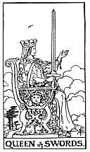

  
[Intangible Textual Heritage](../../index)  [Tarot](../index) 
[Index](index)  [Previous](gbt83)  [Next](gbt85) 

------------------------------------------------------------------------

[Buy this Book at
Amazon.com](https://www.amazon.com/exec/obidos/ASIN/0766157350/internetsacredte)

------------------------------------------------------------------------

*General Book of the Tarot*, by A. E. Thierens, \[1930\], at Intangible
Textual Heritage

------------------------------------------------------------------------

p. 154

 

#### Queen of Swords

TRADITION: Widowhood, female sadness, privation, absence, sterility,
poverty, vacancy, unemployment, mourning, separation. Reversed: Bad
woman, malice, bigotry, prudishness, hypocrisy, artifice, deceit.

THEORY: The female rulership of the element of *Earth* on the house of
Taurus, in which the Moon is exalted and 'womanhood eternal' is
contained. The house of money, in worldly affairs. So this card must
mean either woman ruling by matter, material or magnetic attraction,
purely physical charm, or ruled by material elements herself. The latter
may be seen as: ruled by the desire of luxury and money, or as:
overpowered by material difficulties, weighed down under the burden of a
material world. A woman of Saturnian and Martian qualities is seldom
charming unless in a purely physical and sexual way; there may be higher
virtues, however, which in this case will be developed by suffering,
such as chastity, severity, continence--from which it will be easily
seen, that sterility, privation and mourning may derive, personally.
Astrologically the Martian and Saturnian qualities are seldom found to
be very 'benefic' for women, being very often signs of an unpleasant
character or injured reputation. On the one hand this card may be a
woman under affliction and severed from her natural protector or
protection--widow, divorced, separated, though not the unmarried; on the
other hand we have to see in this card the woman who is paid for her
'love,' and the fact that "woman costs money," a fact of more occult
significance than the world at

p. 155

large understands. It is indicated in the commandment of JHVH that 'man'
should till the soil (Taurus) after the loss of the paradisical state.
So this card has to do with the material necessity of married life, with
peasantry and husbandry and economical exploitation. Well aspected, it
may indicate art in general and sometimes wealth after assiduous
struggle and toil.

CONCLUSION: *Suffering, afflicted woman, widow, divorced or separated;
or woman of a lower sort of character, hateful, spiteful, paid love,
deception in love; material stress, heavy expenses, burdening; also
exploitation, peasantry, possibility of wealth after enduring toil. In
many cases it means sterility, privation. Only strong characters can
stand this card. To weak characters it is full of menace and may cause
grief, mourning, failure in the face of the hardship of life and
unemployment. It may mean the absence of woman where she is wished for
or desired. It warns against the evil influence of* (*a*) *woman*.

------------------------------------------------------------------------

[Next: Page of Swords](gbt85)
