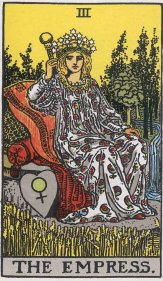

  
[Intangible Textual Heritage](../../index)  [Tarot](../index.md) 

------------------------------------------------------------------------

[Buy this Book at
Amazon.com](https://www.amazon.com/exec/obidos/ASIN/0766157350/internetsacredte.md)

------------------------------------------------------------------------

<table width="75%">
<colgroup>
<col style="width: 50%" />
<col style="width: 50%" />
</colgroup>
<tbody>
<tr class="odd">
<td width="50%" data-valign="TOP"></td>
<td width="50%" data-valign="CENTER"><h1 id="general-book-of-the-tarot" data-align="CENTER">General Book of the Tarot</h1>
<h2 id="by-a.e.-thierens" data-align="CENTER">by A.E. Thierens</h2>
<h4 id="section" data-align="CENTER">[1930]</h4></td>
</tr>
</tbody>
</table>

------------------------------------------------------------------------

[Contents](#contents)    [Start Reading](gbt00.md)

------------------------------------------------------------------------

|                                                                                                                           |
|---------------------------------------------------------------------------------------------------------------------------|
|  |

There have been numerous attempts to construct systems of correspondence
between the Tarot and the Sephiroth of the Kabbalah. Another fertile
ground for this activity is to try to match the Tarot cards with
astrology. This book was one of the first to try to make this
connection. Beginning with a theoretical section, it then discusses each
card. Another feature of this book is a comparison of characteristics
attributed to each card by some of the previous writers such as Waite
and Papus.

Originally published in 1930 under the title General Book of the Tarot,
it was reprinted in paperback by Newcastle in 1975 under the much more
germane title Astrology of the Tarot. The Newcastle edition is long out
of print but not hard to find used. More recently Kessinger has added it
to their print on demand inventory under the original title.

Production notes: the original book is a bit difficult to use as a
reference because it does not have running headers in the Lesser Arcana
section. To remedy this, we have added descriptive titles for each of
the files in that section. We have also inserted images of the
Rider-Waite-Smith deck of each card for additional context. These titles
and images are not in the original book.

------------------------------------------------------------------------

 [Title Page](gbt00.md)  
[Contents](gbt01.md)  
[Introduction](gbt02.md)  

### I. The Doctrine

[The Doctrine](gbt03.md)  
[The Lesser Arcana](gbt04.md)  
[The Greater Arcana](gbt05.md)  
[The Method of Divination](gbt06.md)  

### II. Significance of the Cards

### The Greater Arcana

[The Greater Arcana](gbt07.md)  
[I. The Magician. Aries](gbt08.md)  
[II. The High Priestess. Taurus](gbt09.md)  
[III. The Empress. Gemini](gbt10.md)  
[IV. The Emperor. Cancer](gbt11.md)  
[V. The Hierophant. Leo](gbt12.md)  
[VI. The Lovers. Virgo](gbt13.md)  
[VII. The Chariot. Libra](gbt14.md)  
[VIII. Justice. Scorpio](gbt15.md)  
[IX. The Hermit. Sagittarius](gbt16.md)  
[X. The Wheel of Fortune. Capricorn](gbt17.md)  
[XI. Strength. Aquarius](gbt18.md)  
[XII. The Hanged Man. Pisces](gbt19.md)  
[XIII. Death. Saturn](gbt20.md)  
[XIV. Temperance. Mercury](gbt21.md)  
[XV. The Devil. Mars](gbt22.md)  
[XVI. The Tower. Uranus](gbt23.md)  
[XVII. The Star. Venus](gbt24.md)  
[XVIII. The Moon](gbt25.md)  
[XIX. The Sun](gbt26.md)  
[XX. The Last Judgment. Jupiter](gbt27.md)  
[XXI. The World. Neptune](gbt28.md)  
[0. (Zero) The Fool. Our Earth](gbt29.md)  

### The Lesser Arcana

[The Lesser Arcana](gbt30.md)  

### Wands

[Ace of Wands](gbt31.md)  
[Two of Wands](gbt32.md)  
[Three of Wands](gbt33.md)  
[Four of Wands](gbt34.md)  
[Five of Wands](gbt35.md)  
[Six of Wands](gbt36.md)  
[Seven of Wands](gbt37.md)  
[Eight of Wands](gbt38.md)  
[Nine of Wands](gbt39.md)  
[Ten of Wands](gbt40.md)  
[King of Wands](gbt41.md)  
[Queen of Wands](gbt42.md)  
[Page of Wands](gbt43.md)  
[Knight of Wands](gbt44.md)  

### Pentacles

[Ace of Pentacles](gbt45.md)  
[Two of Pentacles](gbt46.md)  
[Three of Pentacles](gbt47.md)  
[Four of Pentacles](gbt48.md)  
[Five of Pentacles](gbt49.md)  
[Six of Pentacles](gbt50.md)  
[Seven of Pentacles](gbt51.md)  
[Eight of Pentacles](gbt52.md)  
[Nine of Pentacles](gbt53.md)  
[Ten of Pentacles](gbt54.md)  
[King of Pentacles](gbt55.md)  
[Queen of Pentacles](gbt56.md)  
[Page of Pentacles](gbt57.md)  
[Knight of Pentacles](gbt58.md)  

### Cups

[Ace of Cups](gbt59.md)  
[Two of Cups](gbt60.md)  
[Three of Cups](gbt61.md)  
[Four of Cups](gbt62.md)  
[Five of Cups](gbt63.md)  
[Six of Cups](gbt64.md)  
[Seven of Cups](gbt65.md)  
[Eight of Cups](gbt66.md)  
[Nine of Cups](gbt67.md)  
[Ten of Cups](gbt68.md)  
[King of Cups](gbt69.md)  
[Queen of Cups](gbt70.md)  
[Page of Cups](gbt71.md)  
[Knight of Cups](gbt72.md)  

### Swords

[Ace of Swords](gbt73.md)  
[Two of Swords](gbt74.md)  
[Three of Swords](gbt75.md)  
[Four of Swords](gbt76.md)  
[Five of Swords](gbt77.md)  
[Six of Swords](gbt78.md)  
[Seven of Swords](gbt79.md)  
[Eight of Swords](gbt80.md)  
[Nine of Swords](gbt81.md)  
[Ten of Swords](gbt82.md)  
[King of Swords](gbt83.md)  
[Queen of Swords](gbt84.md)  
[Page of Swords](gbt85.md)  
[Knight of Swords](gbt86.md)  

 

[Epilogue](gbt87.md)  
