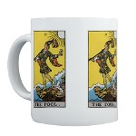

The best known Tarot deck is the
[Rider-Waite-Smith](https://www.amazon.com/exec/obidos/ASIN/0880796863/internetsacredte)
deck. There are hundreds of others, but the images of the RWS Tarot are
the ones which are instantly recognizable. This page has abundant detail
about the history and significance of the RWS deck, as well as other
texts about Tarot divination.

### Texts

 [The Pictorial Key to the
Tarot](pkt/index)   by A.E. Waite
\[1911\]   The essential
Tarot reference by the designer of the best known Tarot deck.

 [The Tarot of the
Bohemians](tob/index)   by Papus; tr.
A. P Morton, \[1896\]
  A detailed study of the esoteric roots of the
Tarot. 

 [The Tarot](mathers/index)  
by S.L. MacGregor Mathers \[1888\]   A short essay on the
Tarot, by a prominent occultist of the 19th Century. Mathers also
wrote [The Kabbalah Unveiled](../jud/tku/index). 

 [The Symbolism of the
Tarot](sot/index)   by P. D. Ouspensky
\[1913\]   An evocative inner
journey through the Major Arcana of the Tarot. 

 [General Book of the
Tarot](gbt/index)   by A.E. Thierens
\[1930\]   A system of
correspondences between the Tarot and Astrology. 

 [Fortune-Telling by
Cards](ftc/index)   by P.R.S. Foli
\[1915\]   Several methods of
telling fortunes with a standard deck of playing cards. 

### Other Resources

------------------------------------------------------------------------

[  
New! Tarot Coffee mugs](../cdshop/giftshop).  
Buy one today and help keep Intangible Textual Heritage online.

------------------------------------------------------------------------

[Get a Tarot Reading](pkt/tarot0)  
This is a frames-based JavaScript-powered Celtic spread Tarot generator.
The Tarot reading application is presented for entertainment purposes
only. We cannot answer any questions about its results or outcome.

[Rider-Waite-Smith Tarot Deck Copyright FAQ](faq)  
Strangely enough, "what is the copyright status of the Tarot deck?" is
the most commonly asked question about this section. This FAQ attempts
to address this complicated issue.

[Tarot Card Cross-reference](xr/index)  
This is an index of all of the Tarot Card images at Intangible Textual
Heritage. Currently this includes the color 1909 RWS deck, the greyscale
RWS images from the Pictorial Key, and the Wirth and Marseilles images
from Tarot of the Bohemians.

[Tarot Card Comparison](tcc/index)  
by J.B. Hare  
This presents high resolution images of three cards from the 1909 Tarot
deck and the US Games deck. Are they different? You be the judge.

**NOTE ON THE COLOR TAROT CARD IMAGES**: [Holly
Voley](https://home.comcast.net/~vilex/) has graciously scanned a set of
vintage Tarot cards for sacred-texts, the earliest in her collection.
These images can be viewed when you click on any of the black and white
thumbnails in the Pictorial Key to the Tarot, or in the right-hand frame
in the Tarot card reader. They can also be viewed sequentially in the
[Tarot Card Cross-reference](xr/index). These Tarot card images are
unambiguously in the public domain in the United States, and differ only
slightly from the US Games Tarot deck. This deck is the one known as the
'Pamela-A' deck with the [dried mud](pkt/img/verso.jpg) pattern on the
back of the cards. There are also high resolution images of three of the
Pamela-A cards available below in the [Tarot Card Comparison](tcc/index)
essay.
