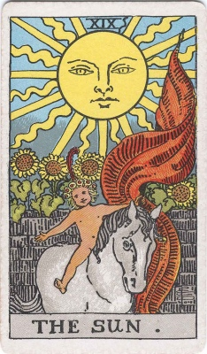

  
[Intangible Textual Heritage](../../index)  [Tarot](../index.md)  [Tarot
Reading](tarot0.md) 

------------------------------------------------------------------------

[Buy this Book at
Amazon.com](https://www.amazon.com/exec/obidos/ASIN/B002ACPMP4/internetsacredte.md)

------------------------------------------------------------------------

<table width="75%">
<colgroup>
<col style="width: 50%" />
<col style="width: 50%" />
</colgroup>
<tbody>
<tr class="odd">
<td width="50%" data-valign="TOP"></td>
<td width="50%" data-valign="CENTER"><h1 id="the-pictorial-key-to-the-tarot" data-align="CENTER">The Pictorial Key to the Tarot</h1>
<h2 id="by-arthur-edward-waite" data-align="CENTER">By Arthur Edward Waite</h2>
<h3 id="illustrations-by-pamela-colman-smith." data-align="CENTER">Illustrations By Pamela Colman Smith.</h3>
<h4 id="section" data-align="CENTER">[1911]</h4></td>
</tr>
</tbody>
</table>

------------------------------------------------------------------------

[Contents](#contents)    [Start Reading](pkttp.md)    [Text
\[Zipped\]](pkt.txt.gz.md)

------------------------------------------------------------------------

|                                                                                                                           |
|---------------------------------------------------------------------------------------------------------------------------|
|  |

Although there were many Tarot decks prior to the Rider-Waite-Smith
deck, and many after, none has gripped the popular imagination as much
as this set. Waite covers the significance and deeper implications of
each card, and gives practical instructions as to how to conduct a
reading. The symbolism of the Rider-Waite-Smith deck is based on
profound occult studies by Waite, and his exposition in this book of its
use and meaning is unexcelled. This is a must-read for anyone who wants
to understand the Tarot.--J. B. Hare

------------------------------------------------------------------------

 [Title Page](pkttp.md)  
[Introduction](pktintr.md)  
[The Contents](pktcont.md)  

### Part I: The Veil and its Symbols

[Section 1: Introductory And General](pkt0101.md)  
[Section 2: Class I. The Trumps Major](pkt0102.md)  
[Section 3: Class II. The Four Suites](pkt0103.md)  
[Section 4: The Tarot In History](pkt0104.md)  

### Part II: The Doctrine Behind the Veil

[Section 1: The Tarot and Secret Tradition](pkt0201.md)  
[Section 2: The Trumps Major and Inner Symbolism](pkt0202.md)  
[I. The Magician](pktar01.md)  
[II. The High Priestess](pktar02.md)  
[III. The Empress](pktar03.md)  
[IV. The Emperor](pktar04.md)  
[V. The Hierophant](pktar05.md)  
[VI. The Lovers](pktar06.md)  
[VII. The Chariot](pktar07.md)  
[VIII. Strength, or Fortitude](pktar08.md)  
[IX. The Hermit](pktar09.md)  
[X. Wheel of Fortune](pktar10.md)  
[XI. Justice](pktar11.md)  
[XII. The Hanged Man](pktar12.md)  
[XIII. Death](pktar13.md)  
[XIV. Temperance](pktar14.md)  
[XV. The Devil](pktar15.md)  
[XVI. The Tower](pktar16.md)  
[XVII. The Star](pktar17.md)  
[XVIII. The Moon](pktar18.md)  
[XIX. The Sun](pktar19.md)  
[XX. The Last Judgement](pktar20.md)  
[Zero. The Fool](pktar00.md)  
[XXI. The World](pktar21.md)  
[Section 3: Conclusion as to the Greater Keys](pkt0203.md)  

### Part III: The Outer Method of the Oracles

[Section 1: Distinction between the Greater and Lesser
Arcana](pkt0301.md)  
[Section 2 The Lesser Arcana](pkt0302.md)  
[King of Wands](pktwaki.md)  
[Queen of Wands](pktwaqu.md)  
[Knight of Wands](pktwakn.md)  
[Page of Wands](pktwapa.md)  
[Ten of Wands](pktwa10.md)  
[Nine of Wands](pktwa09.md)  
[Eight of Wands](pktwa08.md)  
[Seven of Wands](pktwa07.md)  
[Six of Wands](pktwa06.md)  
[Five of Wands](pktwa05.md)  
[Four of Wands](pktwa04.md)  
[Three of Wands](pktwa03.md)  
[Two of Wands](pktwa02.md)  
[Ace of Wands](pktwaac.md)  
[King of Cups](pktcuki.md)  
[Queen of Cups](pktcuqu.md)  
[Knight of Cups](pktcukn.md)  
[Page of Cups](pktcupa.md)  
[Ten of Cups](pktcu10.md)  
[Nine of Cups](pktcu09.md)  
[Eight of Cups](pktcu08.md)  
[Seven of Cups](pktcu07.md)  
[Six of Cups](pktcu06.md)  
[Five of Cups](pktcu05.md)  
[Four of Cups](pktcu04.md)  
[Three of Cups](pktcu03.md)  
[Two of Cups](pktcu02.md)  
[Ace of Cups](pktcuac.md)  
[King of Swords](pktswki.md)  
[Queen of Swords](pktswqu.md)  
[Knight of Swords](pktswkn.md)  
[Page of Swords](pktswpa.md)  
[Ten of Swords](pktsw10.md)  
[Nine of Swords](pktsw09.md)  
[Eight of Swords](pktsw08.md)  
[Seven of Swords](pktsw07.md)  
[Six of Swords](pktsw06.md)  
[Five of Swords](pktsw05.md)  
[Four of Swords](pktsw04.md)  
[Three of Swords](pktsw03.md)  
[Two of Swords](pktsw02.md)  
[Ace of Swords](pktswac.md)  
[King of Pentacles](pktpeki.md)  
[Queen of Pentacles](pktpequ.md)  
[Knight of Pentacles](pktpekn.md)  
[Page of Pentacles](pktpepa.md)  
[Ten of Pentacles](pktpe10.md)  
[Nine of Pentacles](pktpe09.md)  
[Eight of Pentacles](pktpe08.md)  
[Seven of Pentacles](pktpe07.md)  
[Six of Pentacles](pktpe06.md)  
[Five of Pentacles](pktpe05.md)  
[Four of Pentacles](pktpe04.md)  
[Three of Pentacles](pktpe03.md)  
[Two of Pentacles](pktpe02.md)  
[Ace of Pentacles](pktpeac.md)  
[Section 3: The Greater Arcana and their Divinatory Meanings](pkt0303.md)  
[Section 4: Some Additional Meanings of the Lesser Arcana](pkt0304.md)  
[Section 5 The Recurrence of Cards in Dealing](pkt0305.md)  
[Section 6 The Art of Tarot Divination](pkt0306.md)  
[Section 7: An Ancient Celtic Method of Divination](pkt0307.md)  
[Section 8: An Alternative Method of Reading the Tarot Cards](pkt0308.md)  
[Section 9: The Method of Reading by Means of Thirty-Five
Cards](pkt0309.md)  
[Bibliography](pktbib.md)  
