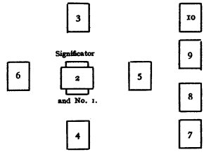

  
[Intangible Textual Heritage](../../index)  [Tarot](../index.md)  [Tarot
Reading](tarot0)  [Index](index)  [Previous](pkt0306)  [Next](pkt0308.md) 

------------------------------------------------------------------------

[Buy this Book at
Amazon.com](https://www.amazon.com/exec/obidos/ASIN/B002ACPMP4/internetsacredte.md)

------------------------------------------------------------------------

  
*The Pictorial Key to the Tarot*, by A.E. Waite, ill. by Pamela Colman
Smith \[1911\], at Intangible Textual Heritage

------------------------------------------------------------------------

### § 7

### AN ANCIENT CELTIC METHOD OF DIVINATION

This mode of divination is the most suitable for obtaining an answer to
a definite question. The Diviner first selects a card to represent the
person or, matter about which inquiry is made. This card is called the
Significator. Should he wish to ascertain something in connexion with
himself he takes the one which corresponds to his personal description.
A Knight should be chosen as the Significator if the subject of inquiry
is a man of forty years old and upward; a King should be chosen for any
male who is under that age a Queen for a woman who is over forty years
and a Page for any female of less age.

The four Court Cards in Wands represent very fair people, with yellow or
auburn hair, fair complexion and blue eyes. The Court Cards in Cups
signify people with light brown or dull fair hair and grey or blue eyes.
Those in Swords stand for people having hazel or grey eyes, dark brown
hair and dull complexion. Lastly, the Court Cards in Pentacles are
referred to persons with very dark brown or black hair, dark eyes and
sallow or swarthy complexions. These allocations are subject, however,
to the following reserve, which will prevent them being taken too
conventionally. You can be guided on occasion by the known temperament
of a person; one who is exceedingly dark may be very energetic, and
would be better represented by a Sword card than a Pentacle. On the
other hand, a very fair subject who is indolent and lethargic should be
referred to Cups rather than to Wands.

If it is more convenient for the purpose of a divination to take as the
Significator the matter about which inquiry is to be made, that Trump or
small card should be selected which has a meaning corresponding to the
matter. Let it be supposed that the question is: Will a lawsuit be
necessary? In this case, take the Trump No. 11, or justice, as the
Significator. This has reference to legal affairs. But if the question
is: Shall I be successful in my lawsuit? one of the Court Cards must be
chosen as the Significator. Subsequently, consecutive divinations may be
performed to ascertain the course of the process itself and its result
to each of the parties concerned.

Having selected the Significator, place it on the table, face upwards.
Then shuffle and cut the rest of the pack three times, keeping the faces
of the cards downwards.

Turn up the top or FIRST CARD of the pack; cover the Significator with
it, and say: This covers him. This card gives the influence which is
affecting the person or matter of inquiry generally, the atmosphere of
it in which the other currents work.

Turn up the SECOND CARD and lay it across the FIRST, saying: This
crosses him. It shews the nature of the obstacles in the matter. If it
is a favourable card, the opposing forces will not be serious, or it may
indicate that something good in itself will not be productive of good in
the particular connexion.

Turn up the THIRD CARD; place it above the Significator, and say: This
crowns him. It represents (a) the Querent's aim or ideal in the matter;
(b) the best that can be achieved under the circumstances, but that
which has not yet been made actual.

Turn up the FOURTH CARD; place it below the Significator, and say: This
is beneath him. It shews the foundation or basis of the matter, that
which has already passed into actuality and which the Significator has
made his own.

Turn up the FIFTH CARD; place it on the side of the Significator from
which he is looking, and say: This is behind him. It gives the influence
that is just passed, or is now passing away.

N.B.--If the Significator is a Trump or any small card that cannot be
said to face either way, the Diviner must decide before beginning the
operation which side he will take it as facing.

Turn up the SIXTH CARD; place it on the side that the Significator is
facing, and say: This is before him. It shews the influence that is
coming into action and will operate in the near future.

The cards are now disposed in the form of a cross, the
Significator--covered by the First Card--being in the centre.

The next four cards are turned up in succession and placed one above the
other in a line, on the right hand side of the cross.

The first of these, or the SEVENTH CARD of the operation, signifies
himself--that is, the Significator--whether person or thing-and shews
its position or attitude in the circumstances.

The EIGHTH CARD signifies his house, that is, his environment and the
tendencies at work therein which have an effect on the matter--for
instance, his position in life, the influence of immediate friends, and
so forth.

The NINTH CARD gives his hopes or fears in the matter.

The TENTH is what will come, the final result, the culmination which is
brought about by the influences shewn by the other cards that have been
turned up in the divination.

It is on this card that the Diviner should especially concentrate his
intuitive faculties and his memory in respect of the official divinatory
meanings attached thereto. It should embody whatsoever you may have
divined from the other cards on the table, including the Significator
itself and concerning him or it, not excepting such lights upon higher
significance as might fall like sparks from heaven if the card which
serves for the oracle, the card for reading, should happen to be a Trump
Major.

The operation is now completed; but should it happen that the last card
is of a dubious nature, from which no final decision can be drawn, or
which does not appear to indicate the ultimate conclusion of the affair,
it may be well to repeat the operation, taking in this case the Tenth
Card as the Significator, instead of the one previously used. The pack
must be again shuffled and cut three times and the first ten cards laid
out as before. By this a more detailed account of "What will come" may
be obtained.

If in any divination the Tenth Card should be a Court Card, it shews
that the subject of the divination falls ultimately into the hands of a
person represented by that card, and its end depends mainly on him. In
this event also it is useful to take the Court Card in question as the
Significator in a fresh operation, and discover what is the nature of
his influence in the matter and to what issue he will bring it.

Great facility may be obtained by this method in a comparatively short
time, allowance being always made for the gifts of the operator-that is
to say, his faculty of insight, latent or developed-and it has the
special advantage of being free from all complications.

I here append a diagram of the cards as laid out in this mode of
divination. The Significator is here facing to the left.

 

The Significator.

1\. That covers him

2\. What crosses him.

3\. What crowns him.

4\. What is beneath him.

5\. What is behind him.

6\. What is before him.

7\. Himself.

8\. His house.

9\. His hopes or fears.

10\. What will come.

------------------------------------------------------------------------

[Next: Section 8: An Alternative Method of Reading the Tarot
Cards](pkt0308.md)
