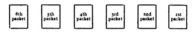
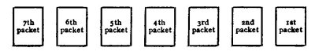
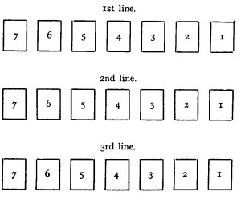
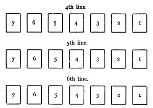

  
[Intangible Textual Heritage](../../index)  [Tarot](../index)  [Tarot
Reading](tarot0)  [Index](index)  [Previous](pkt0307)  [Next](pkt0309) 

------------------------------------------------------------------------

[Buy this Book at
Amazon.com](https://www.amazon.com/exec/obidos/ASIN/B002ACPMP4/internetsacredte)

------------------------------------------------------------------------

  
*The Pictorial Key to the Tarot*, by A.E. Waite, ill. by Pamela Colman
Smith \[1911\], at Intangible Textual Heritage

------------------------------------------------------------------------

### § 8

### AN ALTERNATIVE METHOD OF READING THE TAROT CARDS

Shuffle the entire pack and turn some of the cards round, so as to
invert their tops.

Let them be cut by the Querent with his left hand.

Deal out the first forty-two cards in six packets of seven cards each,
face upwards, so that the first seven cards form the first packet, the
following seven the second, and so on-as in the following diagram:--

 

Take up the first packet; lay out the cards on the table in a row, from
right to left; place the cards of the second packet upon them and then
the packets which remain. You will thus have seven new packets of six
cards each, arranged as follows--

 

Take the top card of each packet, shuffle them and lay out from right to
left, making a line of seven cards.

Then take up the two next cards from each packet, shuffle and lay them
out in two lines under the first line.

Take up the remaining twenty-one cards of the packets, shuffle and lay
them out in three lines below the others.

You will thus have six horizontal lines of seven cards each, arranged
after the following manner.

   
 

In this method, the Querent--if of the male sex--is represented by the
Magician, and if female by the High Priestess; but the card, in either
case, is not taken from the pack until the forty-two cards have been
laid out, as above directed. If the required card is not found among
those placed upon the table, it must be sought among the remaining
thirty-six cards, which have not been dealt, and should be placed a
little distance to the right of the first horizontal line. On the other
hand, if it is among them, it is also taken out, placed as stated, and a
card is drawn haphazard from the thirty-six cards undealt to fill the
vacant position, so that there are still forty-two cards laid out on the
table.

The cards are then read in succession, from right to left throughout,
beginning at card No. 1 of the top line, the last to be read being that
on the extreme left, or No. 7, of the bottom line.

This method is recommended when no definite question is asked-that is,
when the Querent wishes to learn generally concerning the course of his
life and destiny. If he wishes to know what may befall within a certain
time, this time should be clearly specified before the cards are
shuffled.

With further reference to the reading, it should be remembered that the
cards must be interpreted relatively to the subject, which means that
all official and conventional meanings of the cards may and should be
adapted to harmonize with the conditions of this particular case in
question--the position, time of life and sex of the Querent, or person
for whom the consultation is made.

Thus, the Fool may indicate the whole range of mental phases between
mere excitement and madness, but the particular phase in each divination
must be judged by considering the general trend of the cards, and in
this naturally the intuitive faculty plays an important part.

It is well, at the beginning of a reading, to run through the cards
quickly, so that the mind may receive a general impression of the
subject-the trend of the destiny--and afterwards to start again--reading
them one by one and interpreting in detail.

It should be remembered that the Trumps represent more powerful and
compelling forces--by the Tarot hypothesis--than are referable to the
small cards.

The value of intuitive and clairvoyant faculties is of course assumed in
divination. Where these are naturally present or have been developed by
the Diviner, the fortuitous arrangement of cards forms a link between
his mind and the atmosphere of the subject of divination, and then the
rest is simple. Where intuition fails, or is absent, concentration,
intellectual observation and deduction must be used to the fullest
extent to obtain a satisfactory result. But intuition, even if
apparently dormant, may be cultivated by practice in these divinatory
processes. If in doubt as to the exact meaning of a card in a particular
connexion, the Diviner is recommended, by those who are versed in the
matter, to place his hand on it, try to refrain from thinking of what it
ought to be, and note the impressions that arise in his mind. At the
beginning this will probably resolve itself into mere guessing and may
prove incorrect, but it becomes possible with practice to distinguish
between a guess of the conscious mind and an impression arising from the
mind which is sub-conscious.

It is not within my province to offer either theoretical or practical
suggestions on this subject, in which I have no part, but the following
*additamenta* have been contributed by one who has more titles to speak
than all the cartomancists of Europe, if they could shuffle with a
single pair of hands and divine with one tongue.

#### NOTES ON THE PRACTICE OF DIVINATION

1\. Before beginning the operation, formulate your question definitely,
and repeat it aloud.

2\. Make your mind as blank as possible while shuffling the cards.

3\. Put out of the mind personal bias and preconceived ideas as far as
possible, or your judgment will be tinctured thereby.

4\. On this account it is more easy to divine correctly for a stranger
than for yourself or a friend.

------------------------------------------------------------------------

[Next: Section 9: The Method of Reading by Means of Thirty-Five
Cards](pkt0309)
