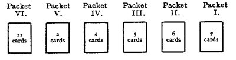

  
[Intangible Textual Heritage](../../index)  [Tarot](../index.md)  [Tarot
Reading](tarot0)  [Index](index)  [Previous](pkt0308)  [Next](pktbib.md) 

------------------------------------------------------------------------

[Buy this Book at
Amazon.com](https://www.amazon.com/exec/obidos/ASIN/B002ACPMP4/internetsacredte.md)

------------------------------------------------------------------------

  
*The Pictorial Key to the Tarot*, by A.E. Waite, ill. by Pamela Colman
Smith \[1911\], at Intangible Textual Heritage

------------------------------------------------------------------------

### § 9

### THE METHOD OF READING BY MEANS OF THIRTY-FIVE CARDS

When the reading is over, according to the scheme set forth in the last
method, it may happen-as in the previous case-that something remains
doubtful, or it may be desired to carry the question further, which is
done as follows:--

Take up the undealt cards which remain over, not having been used in the
first operation with 42 cards. The latter are set aside in a heap, with
the Querent, face upwards, on the top. The thirty-five cards, being
shuffled and cut as before, are divided by dealing into six packets
thus:--

Packet I consists of the first SEVEN CARDS

Packet II consists of the SIX CARDS next following in order; *Packet
III* consists of the FIVE CARDS following; *Packet IV* contains the next
FOUR CARDS; *Packet V* contains Two CARDS; and *Packet VI* contains the
last ELEVEN CARDS. The arrangement will then be as follows:--

 

Take up these packets successively; deal out the cards which they
contain in six lines, which will be necessarily of unequal length.

THE FIRST LINE stands for the house, the environment and so forth.

THE SECOND LINE stands for the person or subject of the divination.

THE THIRD LINE stands for what is passing outside, events, persons, etc.

THE FOURTH LINE stands for a surprise, the unexpected, etc.

THE FIFTH LINE stands for consolation, and may moderate all that is
unfavourable in the preceding lines.

THE SIXTH LINE is that which must be consulted to elucidate the
enigmatic oracles of the others; apart from them it has no importance.

These cards should all be read from left to right, beginning with the
uppermost line.

It should be stated in conclusion as to this divinatory part that there
is no method of interpreting Tarot cards which is not applicable to
ordinary playing-cards, but the additional court cards, and above all
the Trumps Major, are held to increase the elements and values of the
oracles.

And now in conclusion as to the whole matter, I have left for these last
words--as if by way of epilogue--one further and final point. It is the
sense in which I regard the Trumps Major as containing Secret Doctrine.
I do not here mean that I am acquainted with orders and fraternities in
which such doctrine reposes and is there found to be part of higher
Tarot knowledge. I do not mean that such doctrine, being so preserved
and transmitted, can be constructed as imbedded independently in the
Trumps Major. I do not mean that it is something apart from the Tarot.
Associations exist which have special knowledge of both kinds; some of
it is deduced from the Tarot and some of it is apart therefrom; in
either case, it is the same in the root-matter. But there are also
things in reserve which are not in orders or societies, but are
transmitted after another manner. Apart from all inheritance of this
kind, let any one who is a mystic consider separately and in combination
the Magician, the Fool, the High Priestess, the Hierophant, the Empress,
the Emperor, the Hanged Man and the Tower. Let him then consider the
card called the Last Judgment. They contain the legend of the soul. The
other Trumps Major are the details and--as one might say--the accidents.
Perhaps such a person will begin to understand what lies far behind
these symbols, by whomsoever first invented and however preserved. If he
does, he will see also why I have concerned myself with the subject,
even at the risk of writing about divination by cards.

------------------------------------------------------------------------

[Next: Bibliography](pktbib.md)
