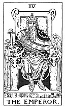

  
[Intangible Textual Heritage](../../index)  [Tarot](../index)  [Tarot
Reading](tarot0)  [Index](index)  [Previous](pktar03)  [Next](pktar05) 

------------------------------------------------------------------------

[Buy this Book at
Amazon.com](https://www.amazon.com/exec/obidos/ASIN/B002ACPMP4/internetsacredte)

------------------------------------------------------------------------

  
*The Pictorial Key to the Tarot*, by A.E. Waite, ill. by Pamela Colman
Smith \[1911\], at Intangible Textual Heritage

------------------------------------------------------------------------

### IV

### The Emperor

  [  
Click to enlarge](img/ar04.jpg)

He has a form of the *Crux ansata* for his sceptre and a globe in his
left hand. He is a crowned monarch--commanding, stately, seated on a
throne, the arms of which axe fronted by rams' heads. He is executive
and realization, the power of this world, here clothed with the highest
of its natural attributes. He is occasionally represented as seated on a
cubic stone, which, however, confuses some of the issues. He is the
virile power, to which the Empress responds, and in this sense is he who
seeks to remove the Veil of Isis; yet she remains *virgo intacta*.

It should be understood that this card and that of the Empress do not
precisely represent the condition of married life, though this state is
implied. On the surface, as I have indicated, they stand for mundane
royalty, uplifted on the seats of the mighty; but above this there is
the suggestion of another presence. They signify also--and the male
figure especially--the higher kingship, occupying the intellectual
throne. Hereof is the lordship of thought rather than of the animal
world. Both personalities, after their own manner, are "full of strange
experience," but theirs is not consciously the wisdom which draws from a
higher world. The Emperor has been described as (a) will in its embodied
form, but this is only one of its applications, and (b) as an expression
of virtualities contained in the Absolute Being--but this is fantasy.

------------------------------------------------------------------------

[Next: V. The Hierophant](pktar05)
