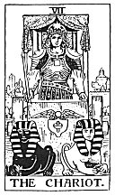

  
[Intangible Textual Heritage](../../index)  [Tarot](../index.md)  [Tarot
Reading](tarot0)  [Index](index)  [Previous](pktar06)  [Next](pktar08.md) 

------------------------------------------------------------------------

[Buy this Book at
Amazon.com](https://www.amazon.com/exec/obidos/ASIN/B002ACPMP4/internetsacredte.md)

------------------------------------------------------------------------

  
*The Pictorial Key to the Tarot*, by A.E. Waite, ill. by Pamela Colman
Smith \[1911\], at Intangible Textual Heritage

------------------------------------------------------------------------

### VII

### The Chariot

  [  
Click to enlarge](img/ar07.jpg.md)

An erect and princely figure carrying a drawn sword and corresponding,
broadly speaking, to the traditional description which I have given in
the first part. On the shoulders of the victorious hero are supposed to
be the *Urim* and *Thummim*. He has led captivity captive; he is
conquest on all planes--in the mind, in science, in progress, in certain
trials of initiation. He has thus replied to the sphinx, and it is on
this account that I have accepted the variation of Éliphas Lévi; two
sphinxes thus draw his chariot. He is above all things triumph in the
mind.

It is to be understood for this reason (a) that the question of the
sphinx is concerned with a Mystery of Nature and not of the world of
Grace, to which the charioteer could offer no answer; (b) that the
planes of his conquest are manifest or external and not within himself;
(c) that the liberation which he effects may leave himself in the
bondage of the logical understanding; (d) that the tests of initiation
through which he has passed in triumph are to be understood physically
or rationally; and (e) that if he came to the pillars of that Temple
between which the High Priestess is seated, he could not open the scroll
called *Tora*, nor if she questioned him could he answer. He is not
hereditary royalty and he is not priesthood.

------------------------------------------------------------------------

[Next: VIII. Strength, or Fortitude](pktar08.md)
