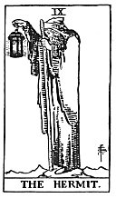

  
[Intangible Textual Heritage](../../index)  [Tarot](../index)  [Tarot
Reading](tarot0)  [Index](index)  [Previous](pktar08)  [Next](pktar10) 

------------------------------------------------------------------------

[Buy this Book at
Amazon.com](https://www.amazon.com/exec/obidos/ASIN/B002ACPMP4/internetsacredte)

------------------------------------------------------------------------

  
*The Pictorial Key to the Tarot*, by A.E. Waite, ill. by Pamela Colman
Smith \[1911\], at Intangible Textual Heritage

------------------------------------------------------------------------

### IX

### The Hermit

  [  
Click to enlarge](img/ar09.jpg)

The variation from the conventional models in this card is only that the
lamp is not enveloped partially in the mantle of its bearer, who blends
the idea of the Ancient of Days with the Light of the World It is a star
which shines in the lantern. I have said that this is a card of
attainment, and to extend this conception the figure is seen holding up
his beacon on an eminence. Therefore the Hermit is not, as Court de
Gebelin explained, a wise man in search of truth and justice; nor is he,
as a later explanation proposes, an especial example of experience. His
beacon intimates that "where I am, you also may be."

It is further a card which is understood quite incorrectly when it is
connected with the idea of occult isolation, as the protection of
personal magnetism against admixture. This is one of the frivolous
renderings which we owe to Éliphas Lévi. It has been adopted by the
French Order of Martinism and some of us have heard a great deal of the
Silent and Unknown Philosophy enveloped by his mantle from the knowledge
of the profane. In true Martinism, the significance of the term
*Philosophe inconnu* was of another order. It did not refer to the
intended concealment of the Instituted Mysteries, much less of their
substitutes, but--like the card itself--to the truth that the Divine
Mysteries secure their own protection from those who are unprepared.

------------------------------------------------------------------------

[Next: X. Wheel of Fortune](pktar10)
