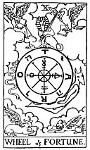

  
[Intangible Textual Heritage](../../index)  [Tarot](../index.md)  [Tarot
Reading](tarot0)  [Index](index)  [Previous](pktar09)  [Next](pktar11.md) 

------------------------------------------------------------------------

[Buy this Book at
Amazon.com](https://www.amazon.com/exec/obidos/ASIN/B002ACPMP4/internetsacredte.md)

------------------------------------------------------------------------

  
*The Pictorial Key to the Tarot*, by A.E. Waite, ill. by Pamela Colman
Smith \[1911\], at Intangible Textual Heritage

------------------------------------------------------------------------

### X

### Wheel of Fortune

  [  
Click to enlarge](img/ar10.jpg.md)

In this symbol I have again followed the reconstruction of Éliphas Lévi,
who has furnished several variants. It is legitimate--as I have
intimated--to use Egyptian symbolism when this serves our purpose,
provided that no theory of origin is implied therein. I have, however,
presented Typhon in his serpent form. The symbolism is, of course, not
exclusively Egyptian, as the four Living Creatures of Ezekiel occupy the
angles of the card, and the wheel itself follows other indications of
Lévi in respect of Ezekiel's vision, as illustrative of the particular
Tarot Key. With the French occultist, and in the design itself, the
symbolic picture stands for the perpetual motion of a fluidic universe
and for the flux of human life. The Sphinx is the equilibrium therein.
The transliteration of *Taro* as *Rota* is inscribed on the wheel,
counterchanged with the letters of the Divine Name--to shew that
Providence is imphed through all. But this is the Divine intention
within, and the similar intention without is exemplified by the four
Living Creatures. Sometimes the sphinx is represented couchant on a
pedestal above, which defrauds the symbolism by stultifying the
essential idea of stability amidst movement.

Behind the general notion expressed in the symbol there lies the denial
of chance and the fatality which is implied therein. It may be added
that, from the days of Lévi onward, the occult explanations of this card
are--even for occultism itself--of a singularly fatuous kind. It has
been said to mean principle, fecundity, virile honour, ruling authority,
etc. The findings of common fortune-telling are better than this on
their own plane.

------------------------------------------------------------------------

[Next: XI. Justice](pktar11.md)
