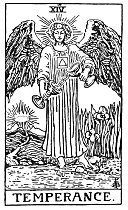

  
[Intangible Textual Heritage](../../index)  [Tarot](../index.md)  [Tarot
Reading](tarot0)  [Index](index)  [Previous](pktar13)  [Next](pktar15.md) 

------------------------------------------------------------------------

[Buy this Book at
Amazon.com](https://www.amazon.com/exec/obidos/ASIN/B002ACPMP4/internetsacredte.md)

------------------------------------------------------------------------

  
*The Pictorial Key to the Tarot*, by A.E. Waite, ill. by Pamela Colman
Smith \[1911\], at Intangible Textual Heritage

------------------------------------------------------------------------

### XIV

### Temperance

  [  
Click to enlarge](img/ar14.jpg.md)

A winged angel, with the sign of the sun upon his forehead and on his
breast the square and triangle of the septenary. I speak of him in the
masculine sense, but the figure is neither male nor female. It is held
to be pouring the essences of life from chalice to chalice. It has one
foot upon the earth and one upon waters, thus illustrating the nature of
the essences. A direct path goes up to certain heights on the verge of
the horizon, and above there is a great light, through which a crown is
seen vaguely. Hereof is some part of the Secret of Eternal Life, as it
is possible to man in his incarnation. All the conventional emblems are
renounced herein.

So also are the conventional meanings, which refer to changes in the
seasons, perpetual movement of life and even the combination of ideas.
It is, moreover, untrue to say that the figure symbolizes the genius of
the sun, though it is the analogy of solar light, realized in the third
part of our human triplicity. It is called Temperance fantastically,
because, when the rule of it obtains in our consciousness, it tempers,
combines and harmonises the psychic and material natures. Under that
rule we know in our rational part something of whence we came and
whither we are going.

------------------------------------------------------------------------

[Next: XV. The Devil](pktar15.md)
