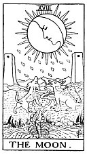

  
[Intangible Textual Heritage](../../index)  [Tarot](../index.md)  [Tarot
Reading](tarot0)  [Index](index)  [Previous](pktar17)  [Next](pktar19.md) 

------------------------------------------------------------------------

[Buy this Book at
Amazon.com](https://www.amazon.com/exec/obidos/ASIN/B002ACPMP4/internetsacredte.md)

------------------------------------------------------------------------

  
*The Pictorial Key to the Tarot*, by A.E. Waite, ill. by Pamela Colman
Smith \[1911\], at Intangible Textual Heritage

------------------------------------------------------------------------

### XVIII

### The Moon

  [  
Click to enlarge](img/ar18.jpg.md)

The distinction between this card and some of the conventional types is
that the moon is increasing on what is called the side of mercy, to the
right of the observer. It has sixteen chief and sixteen secondary rays.
The card represents life of the imagination apart from life of the
spirit. The path between the towers is the issue into the unknown. The
dog and wolf are the fears of the natural mind in the presence of that
place of exit, when there is only reflected light to guide it.

The last reference is a key to another form of symbolism. The
intellectual light is a reflection and beyond it is the unknown mystery
which it cannot shew forth. It illuminates our animal nature, types of
which are represented below--the dog, the wolf and that which comes up
out of the deeps, the nameless and hideous tendency which is lower than
the savage beast. It strives to attain manifestation, symbolized by
crawling from the abyss of water to the land, but as a rule it sinks
back whence it came. The face of the mind directs a calm gaze upon the
unrest below; the dew of thought falls; the message is: Peace, be still;
and it may be that there shall come a calm upon the animal nature, while
the abyss beneath shall cease from giving up a form.

------------------------------------------------------------------------

[Next: XIX. The Sun](pktar19.md)
