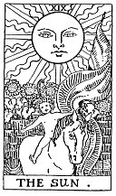

  
[Intangible Textual Heritage](../../index)  [Tarot](../index.md)  [Tarot
Reading](tarot0)  [Index](index)  [Previous](pktar18)  [Next](pktar20.md) 

------------------------------------------------------------------------

[Buy this Book at
Amazon.com](https://www.amazon.com/exec/obidos/ASIN/B002ACPMP4/internetsacredte.md)

------------------------------------------------------------------------

  
*The Pictorial Key to the Tarot*, by A.E. Waite, ill. by Pamela Colman
Smith \[1911\], at Intangible Textual Heritage

------------------------------------------------------------------------

### XIX

### The Sun

  [  
Click to enlarge](img/ar19.jpg.md)

The naked child mounted on a white horse and displaying a red standard
has been mentioned already as the better symbolism connected with this
card. It is the destiny of the Supernatural East and the great and holy
light which goes before the endless procession of humanity, coming out
from the walled garden of the sensitive life and passing on the journey
home. The card signifies, therefore, the transit from the manifest light
of this world, represented by the glorious sun of earth, to the light of
the world to come, which goes before aspiration and is typified by the
heart of a child.

But the last allusion is again the key to a different form or aspect of
the symbolism. The sun is that of consciousness in the spirit - the
direct as the antithesis of the reflected light. The characteristic type
of humanity has become a little child therein--a child in the sense of
simplicity and innocence in the sense of wisdom. In that simplicity, he
bears the seal of Nature and of Art; in that innocence, he signifies the
restored world. When the self-knowing spirit has dawned in the
consciousness above the natural mind, that mind in its renewal leads
forth the animal nature in a state of perfect conformity.

------------------------------------------------------------------------

[Next: XX. The Last Judgement](pktar20.md)
