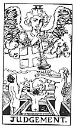

  
[Intangible Textual Heritage](../../index)  [Tarot](../index.md)  [Tarot
Reading](tarot0)  [Index](index)  [Previous](pktar19)  [Next](pktar00.md) 

------------------------------------------------------------------------

[Buy this Book at
Amazon.com](https://www.amazon.com/exec/obidos/ASIN/B002ACPMP4/internetsacredte.md)

------------------------------------------------------------------------

  
*The Pictorial Key to the Tarot*, by A.E. Waite, ill. by Pamela Colman
Smith \[1911\], at Intangible Textual Heritage

------------------------------------------------------------------------

### XX

### The Last Judgment

  [  
Click to enlarge](img/ar20.jpg.md)

I have said that this symbol is essentially invariable in all Tarot
sets, or at least the variations do not alter its character. The great
angel is here encompassed by clouds, but he blows his bannered trumpet,
and the cross as usual is displayed on the banner. The dead are rising
from their tombs--a woman on the right, a man on the left hand, and
between them their child, whose back is turned. But in this card there
are more than three who are restored, and it has been thought worth
while to make this variation as illustrating the insufficiency of
current explanations. It should be noted that all the figures are as one
in the wonder, adoration and ecstacy expressed by their attitudes. It is
the card which registers the accomplishment of the great work of
transformation in answer to the summons of the Supernal--which summons
is heard and answered from within.

Herein is the intimation of a significance which cannot well be carried
further in the present place. What is that within us which does sound a
trumpet and all that is lower in our nature rises in response--almost in
a moment, almost in the twinkling of an eye? Let the card continue to
depict, for those who can see no further, the Last judgment and the
resurrection in the natural body; but let those who have inward eyes
look and discover therewith. They will understand that it has been
called truly in the past a card of eternal life, and for this reason it
may be compared with that which passes under the name of Temperance.

------------------------------------------------------------------------

[Next: Zero. The Fool](pktar00.md)
