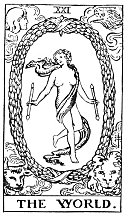

  
[Intangible Textual Heritage](../../index)  [Tarot](../index)  [Tarot
Reading](tarot0)  [Index](index)  [Previous](pktar00)  [Next](pkt0203) 

------------------------------------------------------------------------

[Buy this Book at
Amazon.com](https://www.amazon.com/exec/obidos/ASIN/B002ACPMP4/internetsacredte)

------------------------------------------------------------------------

  
*The Pictorial Key to the Tarot*, by A.E. Waite, ill. by Pamela Colman
Smith \[1911\], at Intangible Textual Heritage

------------------------------------------------------------------------

### XXI

### The World

  [  
Click to enlarge](img/ar21.jpg)

As this final message of the Major Trumps is unchanged--and indeed
unchangeable--in respect of its design, it has been partly described
already regarding its deeper sense. It represents also the perfection
and end of the Cosmos, the secret which is within it, the rapture of the
universe when it understands itself in God. It is further the state of
the soul in the consciousness of Divine Vision, reflected from the
self-knowing spirit. But these meanings are without prejudice to that
which I have said concerning it on the material side.

It has more than one message on the macrocosmic side and is, for
example, the state of the restored world when the law of manifestation
shall have been carried to the highest degree of natural perfection. But
it is perhaps more especially a story of the past, referring to that day
when all was declared to be good, when the morning stars sang together
and all the Sons of God shouted for joy. One of the worst explanations
concerning it is that the figure symbolizes the Magus when he has
reached the highest degree of initiation; another account says that it
represents the absolute, which is ridiculous. The figure has been said
to stand for Truth, which is, however, more properly allocated to the
seventeenth card. Lastly, it has been called the Crown of the Magi.

------------------------------------------------------------------------

[Next: Section 3: Conclusion as to the Greater Keys](pkt0203)
