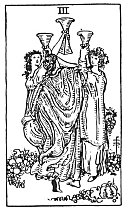

  
[Intangible Textual Heritage](../../index)  [Tarot](../index)  [Tarot
Reading](tarot0)  [Index](index)  [Previous](pktcu04)  [Next](pktcu02) 

------------------------------------------------------------------------

[Buy this Book at
Amazon.com](https://www.amazon.com/exec/obidos/ASIN/B002ACPMP4/internetsacredte)

------------------------------------------------------------------------

  
*The Pictorial Key to the Tarot*, by A.E. Waite, ill. by Pamela Colman
Smith \[1911\], at Intangible Textual Heritage

------------------------------------------------------------------------

#### CUPS

#### Three

  [  
Click to enlarge](img/cu03.jpg)

Maidens in a garden-ground with cups uplifted, as if pledging one
another. *Divinatory Meanings*: The conclusion of any matter in plenty,
perfection and merriment; happy issue, victory, fulfilment, solace,
healing, *Reversed*: Expedition, dispatch, achievement, end. It
signifies also the side of excess in physical enjoyment, and the
pleasures of the senses.

------------------------------------------------------------------------

[Next: Two of Cups](pktcu02)
