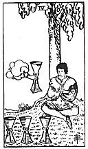

  
[Intangible Textual Heritage](../../index)  [Tarot](../index.md)  [Tarot
Reading](tarot0)  [Index](index)  [Previous](pktcu05)  [Next](pktcu03.md) 

------------------------------------------------------------------------

[Buy this Book at
Amazon.com](https://www.amazon.com/exec/obidos/ASIN/B002ACPMP4/internetsacredte.md)

------------------------------------------------------------------------

  
*The Pictorial Key to the Tarot*, by A.E. Waite, ill. by Pamela Colman
Smith \[1911\], at Intangible Textual Heritage

------------------------------------------------------------------------

#### CUPS

#### Four

  [  
Click to enlarge](img/cu04.jpg.md)

A young man is seated under a tree and contemplates three cups set on
the grass before him; an arm issuing from a cloud offers him another
cup. His expression notwithstanding is one of discontent with his
environment. *Divinatory Meanings*: Weariness, disgust, aversion,
imaginary vexations, as if the wine of this world had caused satiety
only; another wine, as if a fairy gift, is now offered the wastrel, but
he sees no consolation therein. This is also a card of blended pleasure.
*Reversed*: Novelty, presage, new instruction, new relations.

------------------------------------------------------------------------

[Next: Three of Cups](pktcu03.md)
