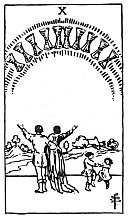

  
[Intangible Textual Heritage](../../index)  [Tarot](../index.md)  [Tarot
Reading](tarot0)  [Index](index)  [Previous](pktcupa)  [Next](pktcu09.md) 

------------------------------------------------------------------------

[Buy this Book at
Amazon.com](https://www.amazon.com/exec/obidos/ASIN/B002ACPMP4/internetsacredte.md)

------------------------------------------------------------------------

  
*The Pictorial Key to the Tarot*, by A.E. Waite, ill. by Pamela Colman
Smith \[1911\], at Intangible Textual Heritage

------------------------------------------------------------------------

#### CUPS

#### Ten

  [  
Click to enlarge](img/cu10.jpg.md)

Appearance of Cups in a rainbow; it is contemplated in wonder and
ecstacy by a man and woman below, evidently husband and wife. His right
arm is about her; his left is raised upward; she raises her right arm.
The two children dancing near them have not observed the prodigy but are
happy after their own manner. There is a home-scene beyond. *Divinatory
Meanings*: Contentment, repose of the entire heart; the perfection of
that state; also perfection of human love and friendship; if with
several picture-cards, a person who is taking charge of the Querent's
interests; also the town, village or country inhabited by the Querent.
*Reversed*: Repose of the false heart, indignation, violence.

------------------------------------------------------------------------

[Next: Nine of Cups](pktcu09.md)
