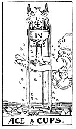

  
[Intangible Textual Heritage](../../index)  [Tarot](../index.md)  [Tarot
Reading](tarot0)  [Index](index)  [Previous](pktcu02)  [Next](pktswki.md) 

------------------------------------------------------------------------

[Buy this Book at
Amazon.com](https://www.amazon.com/exec/obidos/ASIN/B002ACPMP4/internetsacredte.md)

------------------------------------------------------------------------

  
*The Pictorial Key to the Tarot*, by A.E. Waite, ill. by Pamela Colman
Smith \[1911\], at Intangible Textual Heritage

------------------------------------------------------------------------

#### CUPS

#### Ace

  [  
Click to enlarge](img/cuac.jpg.md)

The waters are beneath, and thereon are water-lilies; the hand issues
from the cloud, holding in its palm the cup, from which four streams are
pouring; a dove, bearing in its bill a cross-marked Host, descends to
place the Wafer in the Cup; the dew of water is falling on all sides. It
is an intimation of that which may lie behind the Lesser Arcana.
*Divinatory Meanings*: House of the true heart, joy, content, abode,
nourishment, abundance, fertility; Holy Table, felicity hereof.
*Reversed*: House of the false heart, mutation, instability, revolution.

------------------------------------------------------------------------

[Next: King of Swords](pktswki.md)
