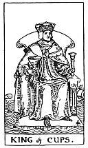

  
[Intangible Textual Heritage](../../index)  [Tarot](../index)  [Tarot
Reading](tarot0)  [Index](index)  [Previous](pktwaac)  [Next](pktcuqu) 

------------------------------------------------------------------------

[Buy this Book at
Amazon.com](https://www.amazon.com/exec/obidos/ASIN/B002ACPMP4/internetsacredte)

------------------------------------------------------------------------

  
*The Pictorial Key to the Tarot*, by A.E. Waite, ill. by Pamela Colman
Smith \[1911\], at Intangible Textual Heritage

------------------------------------------------------------------------

### THE SUIT OF CUPS

#### King

  [  
Click to enlarge](img/cuki.jpg)

He holds a short sceptre in his left hand and a great cup in his right;
his throne is set upon the sea; on one side a ship is riding and on the
other a dolphin is leaping. The implicit is that the Sign of the Cup
naturally refers to water, which appears in all the court cards.
*Divinatory Meanings*: Fair man, man of business, law, or divinity;
responsible, disposed to oblige the Querent; also equity, art and
science, including those who profess science, law and art; creative
intelligence. *Reversed*: Dishonest, double-dealing man; roguery,
exaction, injustice, vice, scandal, pillage, considerable loss.

------------------------------------------------------------------------

[Next: Queen of Cups](pktcuqu)
