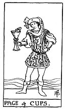

  
[Intangible Textual Heritage](../../index)  [Tarot](../index.md)  [Tarot
Reading](tarot0)  [Index](index)  [Previous](pktcukn)  [Next](pktcu10.md) 

------------------------------------------------------------------------

[Buy this Book at
Amazon.com](https://www.amazon.com/exec/obidos/ASIN/B002ACPMP4/internetsacredte.md)

------------------------------------------------------------------------

  
*The Pictorial Key to the Tarot*, by A.E. Waite, ill. by Pamela Colman
Smith \[1911\], at Intangible Textual Heritage

------------------------------------------------------------------------

#### CUPS

#### Page

  [  
Click to enlarge](img/cupa.jpg.md)

A fair, pleasing, somewhat effeminate page, of studious and intent
aspect, contemplates a fish rising from a cup to look at him. It is the
pictures of the mind taking form. *Divinatory Meanings*: Fair young man,
one impelled to render service and with whom the Querent will be
connected; a studious youth; news, message; application, reflection,
meditation; also these things directed to business. *Reversed*: Taste,
inclination, attachment, seduction, deception, artifice.

------------------------------------------------------------------------

[Next: Ten of Cups](pktcu10.md)
