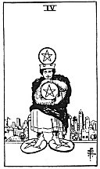

  
[Intangible Textual Heritage](../../index)  [Tarot](../index.md)  [Tarot
Reading](tarot0)  [Index](index)  [Previous](pktpe05)  [Next](pktpe03.md) 

------------------------------------------------------------------------

[Buy this Book at
Amazon.com](https://www.amazon.com/exec/obidos/ASIN/B002ACPMP4/internetsacredte.md)

------------------------------------------------------------------------

  
*The Pictorial Key to the Tarot*, by A.E. Waite, ill. by Pamela Colman
Smith \[1911\], at Intangible Textual Heritage

------------------------------------------------------------------------

#### PENTACLES

#### Four

  [  
Click to enlarge](img/pe04.jpg.md)

A crowned figure, having a pentacle over his crown, clasps another with
hands and arms; two pentacles are under his feet. He holds to that which
he has. *Divinatory Meanings*: The surety of possessions, cleaving to
that which one has, gift, legacy, inheritance. *Reversed*: Suspense,
delay, opposition.

------------------------------------------------------------------------

[Next: Three of Pentacles](pktpe03.md)
