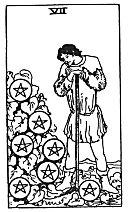

  
[Intangible Textual Heritage](../../index)  [Tarot](../index)  [Tarot
Reading](tarot0)  [Index](index)  [Previous](pktpe08)  [Next](pktpe06) 

------------------------------------------------------------------------

[Buy this Book at
Amazon.com](https://www.amazon.com/exec/obidos/ASIN/B002ACPMP4/internetsacredte)

------------------------------------------------------------------------

  
*The Pictorial Key to the Tarot*, by A.E. Waite, ill. by Pamela Colman
Smith \[1911\], at Intangible Textual Heritage

------------------------------------------------------------------------

#### PENTACLES

#### Seven

  [  
Click to enlarge](img/pe07.jpg)

A young man, leaning on his staff, looks intently at seven pentacles
attached to a clump of greenery on his right; one would say that these
were his treasures and that his heart was there. *Divinatory Meanings*:
These are exceedingly contradictory; in the main, it is a card of money,
business, barter; but one reading gives altercation, quarrels--and
another innocence, ingenuity, purgation. *Reversed*: Cause for anxiety
regarding money which it may be proposed to lend.

------------------------------------------------------------------------

[Next: Six of Pentacles](pktpe06)
