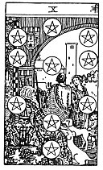

  
[Intangible Textual Heritage](../../index)  [Tarot](../index.md)  [Tarot
Reading](tarot0)  [Index](index)  [Previous](pktpepa)  [Next](pktpe09.md) 

------------------------------------------------------------------------

[Buy this Book at
Amazon.com](https://www.amazon.com/exec/obidos/ASIN/B002ACPMP4/internetsacredte.md)

------------------------------------------------------------------------

  
*The Pictorial Key to the Tarot*, by A.E. Waite, ill. by Pamela Colman
Smith \[1911\], at Intangible Textual Heritage

------------------------------------------------------------------------

#### PENTACLES

#### Ten

  [  
Click to enlarge](img/pe10.jpg.md)

A man and woman beneath an archway which gives entrance to a house and
domain. They are accompanied by a child, who looks curiously at two dogs
accosting an ancient personage seated in the foreground. The child's
hand is on one of them. *Divinatory Meanings*: Gain, riches; family
matters, archives, extraction, the abode of a family. *Reversed*:
Chance, fatality, loss, robbery, games of hazard; sometimes gift, dowry,
pension.

------------------------------------------------------------------------

[Next: Nine of Pentacles](pktpe09.md)
