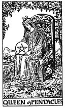

  
[Intangible Textual Heritage](../../index)  [Tarot](../index)  [Tarot
Reading](tarot0)  [Index](index)  [Previous](pktpeki)  [Next](pktpekn) 

------------------------------------------------------------------------

[Buy this Book at
Amazon.com](https://www.amazon.com/exec/obidos/ASIN/B002ACPMP4/internetsacredte)

------------------------------------------------------------------------

  
*The Pictorial Key to the Tarot*, by A.E. Waite, ill. by Pamela Colman
Smith \[1911\], at Intangible Textual Heritage

------------------------------------------------------------------------

#### PENTACLES

#### Queen

  [  
Click to enlarge](img/pequ.jpg)

The face suggests that of a dark woman, whose qualities might be summed
up in the idea of greatness of soul; she has also the serious cast of
intelligence; she contemplates her symbol and may see worlds therein.
*Divinatory Meanings*: Opulence, generosity, magnificence, security,
liberty. *Reversed*: Evil, suspicion, suspense, fear, mistrust.

------------------------------------------------------------------------

[Next: Knight of Pentacles](pktpekn)
