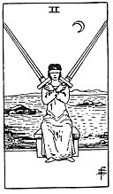

  
[Intangible Textual Heritage](../../index)  [Tarot](../index.md)  [Tarot
Reading](tarot0)  [Index](index)  [Previous](pktsw03)  [Next](pktswac.md) 

------------------------------------------------------------------------

[Buy this Book at
Amazon.com](https://www.amazon.com/exec/obidos/ASIN/B002ACPMP4/internetsacredte.md)

------------------------------------------------------------------------

  
*The Pictorial Key to the Tarot*, by A.E. Waite, ill. by Pamela Colman
Smith \[1911\], at Intangible Textual Heritage

------------------------------------------------------------------------

#### SWORDS

#### Two

  [  
Click to enlarge](img/sw02.jpg.md)

A hoodwinked female figure balances two swords upon her shoulders.
*Divinatory Meanings*: Conformity and the equipoise which it suggests,
courage, friendship, concord in a state of arms; another reading gives
tenderness, affection, intimacy. The suggestion of harmony and other
favourable readings must be considered in a qualified manner, as Swords
generally are not symbolical of beneficent forces in human affairs.
*Reversed*: Imposture, falsehood, duplicity, disloyalty.

------------------------------------------------------------------------

[Next: Ace of Swords](pktswac.md)
