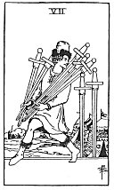

  
[Intangible Textual Heritage](../../index)  [Tarot](../index.md)  [Tarot
Reading](tarot0)  [Index](index)  [Previous](pktsw08)  [Next](pktsw06.md) 

------------------------------------------------------------------------

[Buy this Book at
Amazon.com](https://www.amazon.com/exec/obidos/ASIN/B002ACPMP4/internetsacredte.md)

------------------------------------------------------------------------

  
*The Pictorial Key to the Tarot*, by A.E. Waite, ill. by Pamela Colman
Smith \[1911\], at Intangible Textual Heritage

------------------------------------------------------------------------

#### SWORDS

#### Seven

  [  
Click to enlarge](img/sw07.jpg.md)

A man in the act of carrying away five swords rapidly; the two others of
the card remain stuck in the ground. A camp is close at hand.
*Divinatory Meanings*: Design, attempt, wish, hope, confidence; also
quarrelling, a plan that may fail, annoyance. The design is uncertain in
its import, because the significations are widely at variance with each
other. *Reversed*: Good advice, counsel, instruction, slander, babbling.

------------------------------------------------------------------------

[Next: Six of Swords](pktsw06.md)
