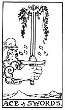

  
[Intangible Textual Heritage](../../index)  [Tarot](../index.md)  [Tarot
Reading](tarot0)  [Index](index)  [Previous](pktsw02)  [Next](pktpeki.md) 

------------------------------------------------------------------------

[Buy this Book at
Amazon.com](https://www.amazon.com/exec/obidos/ASIN/B002ACPMP4/internetsacredte.md)

------------------------------------------------------------------------

  
*The Pictorial Key to the Tarot*, by A.E. Waite, ill. by Pamela Colman
Smith \[1911\], at Intangible Textual Heritage

------------------------------------------------------------------------

#### SWORDS

#### Ace

  [  
Click to enlarge](img/swac.jpg.md)

A hand issues from a cloud, grasping as word, the point of which is
encircled by a crown. *Divinatory Meanings*: Triumph, the excessive
degree in everything, conquest, triumph of force. It is a card of great
force, in love as well as in hatred. The crown may carry a much higher
significance than comes usually within the sphere of fortune-telling.
*Reversed*: The same, but the results are disastrous; another account
says--conception, childbirth, augmentation, multiplicity.

------------------------------------------------------------------------

[Next: King of Pentacles](pktpeki.md)
