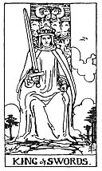

  
[Intangible Textual Heritage](../../index)  [Tarot](../index.md)  [Tarot
Reading](tarot0)  [Index](index)  [Previous](pktcuac)  [Next](pktswqu.md) 

------------------------------------------------------------------------

[Buy this Book at
Amazon.com](https://www.amazon.com/exec/obidos/ASIN/B002ACPMP4/internetsacredte.md)

------------------------------------------------------------------------

  
*The Pictorial Key to the Tarot*, by A.E. Waite, ill. by Pamela Colman
Smith \[1911\], at Intangible Textual Heritage

------------------------------------------------------------------------

### THE SUIT OF SWORDS

#### King

  [  
Click to enlarge](img/swki.jpg.md)

He sits in judgment, holding the unsheathed sign of his suit. He
recalls, of course, the conventional Symbol of justice in the Trumps
Major, and he may represent this virtue, but he is rather the power of
life and death, in virtue of his office. *Divinatory Meanings*:
Whatsoever arises out of the idea of judgment and all its
connexions-power, command, authority, militant intelligence, law,
offices of the crown, and so forth. *Reversed*: Cruelty, perversity,
barbarity, perfidy, evil intention.

------------------------------------------------------------------------

[Next: Queen of Swords](pktswqu.md)
