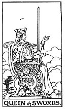

  
[Intangible Textual Heritage](../../index)  [Tarot](../index)  [Tarot
Reading](tarot0)  [Index](index)  [Previous](pktswki)  [Next](pktswkn) 

------------------------------------------------------------------------

[Buy this Book at
Amazon.com](https://www.amazon.com/exec/obidos/ASIN/B002ACPMP4/internetsacredte)

------------------------------------------------------------------------

  
*The Pictorial Key to the Tarot*, by A.E. Waite, ill. by Pamela Colman
Smith \[1911\], at Intangible Textual Heritage

------------------------------------------------------------------------

#### SWORDS

#### Queen

  [  
Click to enlarge](img/swqu.jpg)

Her right hand raises the weapon vertically and the hilt rests on an arm
of her royal chair the left hand is extended, the arm raised her
countenance is severe but chastened; it suggests familiarity with
sorrow. It does not represent mercy, and, her sword notwithstanding, she
is scarcely a symbol of power. *Divinatory Meanings*: Widowhood, female
sadness and embarrassment, absence, sterility, mourning, privation,
separation. *Reversed*: Malice, bigotry, artifice, prudery, bale,
deceit.

------------------------------------------------------------------------

[Next: Knight of Swords](pktswkn)
