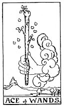

  
[Intangible Textual Heritage](../../index)  [Tarot](../index.md)  [Tarot
Reading](tarot0)  [Index](index)  [Previous](pktwa02)  [Next](pktcuki.md) 

------------------------------------------------------------------------

[Buy this Book at
Amazon.com](https://www.amazon.com/exec/obidos/ASIN/B002ACPMP4/internetsacredte.md)

------------------------------------------------------------------------

  
*The Pictorial Key to the Tarot*, by A.E. Waite, ill. by Pamela Colman
Smith \[1911\], at Intangible Textual Heritage

------------------------------------------------------------------------

#### WANDS

#### Ace

  [  
Click to enlarge](img/waac.jpg.md)

A hand issuing from a cloud grasps a stout wand or club. *Divinatory
Meanings*: Creation, invention, enterprise, the powers which result in
these; principle, beginning, source; birth, family, origin, and in a
sense the virility which is behind them; the starting point of
enterprises; according to another account, money, fortune, inheritance.
*Reversed*: Fall, decadence, ruin, perdition, to perish also a certain
clouded joy.

------------------------------------------------------------------------

[Next: King of Cups](pktcuki.md)
