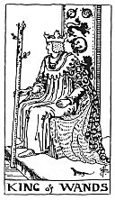

  
[Intangible Textual Heritage](../../index)  [Tarot](../index)  [Tarot
Reading](tarot0)  [Index](index)  [Previous](pkt0302)  [Next](pktwaqu) 

------------------------------------------------------------------------

[Buy this Book at
Amazon.com](https://www.amazon.com/exec/obidos/ASIN/B002ACPMP4/internetsacredte)

------------------------------------------------------------------------

  
*The Pictorial Key to the Tarot*, by A.E. Waite, ill. by Pamela Colman
Smith \[1911\], at Intangible Textual Heritage

------------------------------------------------------------------------

### THE SUIT OF WANDS

#### King

  [  
Click to enlarge](img/waki.jpg)

The physical and emotional nature to which this card is attributed is
dark, ardent, lithe, animated, impassioned, noble. The King uplifts a
flowering wand, and wears, like his three correspondences in the
remaining suits, what is called a cap of maintenance beneath his crown.
He connects with the symbol of the lion, which is emblazoned on the back
of his throne. *Divinatory Meanings*: Dark man, friendly, countryman,
generally married, honest and conscientious. The card always signifies
honesty, and may mean news concerning an unexpected heritage to fall in
before very long. *Reversed*: Good, but severe; austere, yet tolerant.

------------------------------------------------------------------------

[Next: Queen of Wands](pktwaqu)
