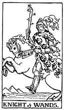

  
[Intangible Textual Heritage](../../index)  [Tarot](../index)  [Tarot
Reading](tarot0)  [Index](index)  [Previous](pktwaqu)  [Next](pktwapa) 

------------------------------------------------------------------------

[Buy this Book at
Amazon.com](https://www.amazon.com/exec/obidos/ASIN/B002ACPMP4/internetsacredte)

------------------------------------------------------------------------

  
*The Pictorial Key to the Tarot*, by A.E. Waite, ill. by Pamela Colman
Smith \[1911\], at Intangible Textual Heritage

------------------------------------------------------------------------

#### WANDS

#### Knight

  [  
Click to enlarge](img/wakn.jpg)

He is shewn as if upon a journey, armed with a short wand, and although
mailed is not on a warlike errand. He is passing mounds or pyramids. The
motion of the horse is a key to the character of its rider, and suggests
the precipitate mood, or things connected therewith. *Divinatory
Meanings*: Departure, absence, flight, emigration. A dark young man,
friendly. Change of residence. *Reversed*: Rupture, division,
interruption, discord.

------------------------------------------------------------------------

[Next: Page of Wands](pktwapa)
