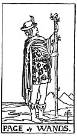

  
[Intangible Textual Heritage](../../index)  [Tarot](../index)  [Tarot
Reading](tarot0)  [Index](index)  [Previous](pktwakn)  [Next](pktwa10) 

------------------------------------------------------------------------

[Buy this Book at
Amazon.com](https://www.amazon.com/exec/obidos/ASIN/B002ACPMP4/internetsacredte)

------------------------------------------------------------------------

  
*The Pictorial Key to the Tarot*, by A.E. Waite, ill. by Pamela Colman
Smith \[1911\], at Intangible Textual Heritage

------------------------------------------------------------------------

#### WANDS

#### Page

  [  
Click to enlarge](img/wapa.jpg)

In a scene similar to the former, a young man stands in the act of
proclamation. He is unknown but faithful, and his tidings are strange.
*Divinatory Meanings*: Dark young man, faithful, a lover, an envoy, a
postman. Beside a man, he will bear favourable testimony concerning him.
A dangerous rival, if followed by the Page of Cups. Has the chief
qualities of his suit. He may signify family intelligence. *Reversed*:
Anecdotes, announcements, evil news. Also indecision and the instability
which accompanies it.

------------------------------------------------------------------------

[Next: Ten of Wands](pktwa10)
