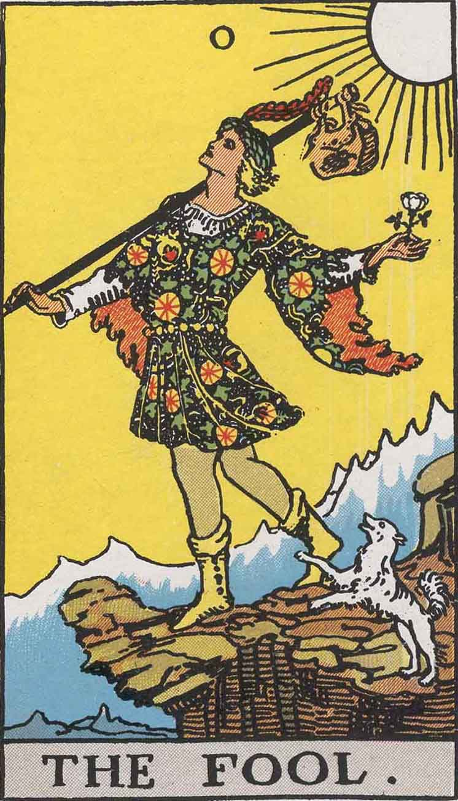
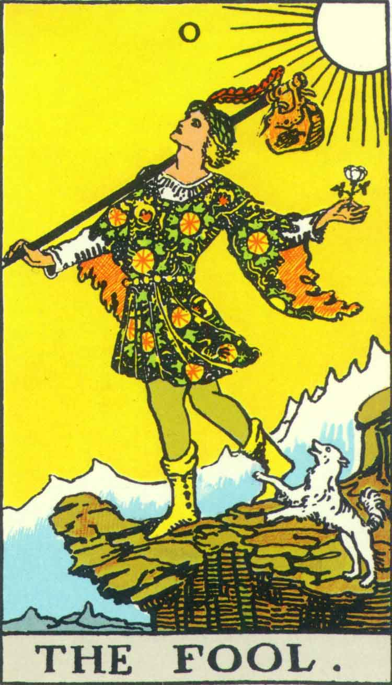

[Intangible Textual Heritage](../../index)  [Tarot](../index.md)  [Tarot
Copyright FAQ](../faq)  [Index](index)  [Previous](tcc00.md) 
[Next](tcc02.md) 

------------------------------------------------------------------------

# The Fool

The Fool card is one of the only ones in which there is an obvious
difference between Pamela-A and the USGS deck. This is the edge of the
bluish highlighting on the background mountains. A close comparison
reveals some other minor differences between the two cards, for instance
the little touch of white at the top of the mountain under the edge of
the cliff that is not seen in the USGS version.

If the cards were recolored at some point in time, and the artist was
working systematically, this might have been the first one that they
worked on; it is possible that it took a card or two before the
recolorist got their bearings. Another, more sinister, interpretation is
that this was introduced deliberately so that there would be at least
one difference between US Games deck and the original. However, it is
dubious whether this minor change would be sufficient to claim a new
copyright. In general, small alterations to a work, such as fixing
punctuation or spelling errors in a public domain book, do not create a
new copyrighted work.

On a less paranoid note, if someone was attempting to suggest that the
cards were different, they weren't trying very hard. There are glitches
in the line art which are the same on both cards, for instance the
sketchy left border of the satchel, and the tiny dot on the edge of the
(skirt?), directly above the Fool's right calf. These would be obvious
places to clean up if a professional artist was trying to 'improve' the
artwork for whatever reason.

<table data-cellspacing="0" data-border="0" data-cellpadding="9" width="798">
<colgroup>
<col style="width: 50%" />
<col style="width: 50%" />
</colgroup>
<tbody>
<tr class="odd">
<td width="50%" data-valign="TOP">
Pamela A (1909)
</td>
<td width="50%" data-valign="TOP">
US Games (1970)
</td>
</tr>
<tr class="even">
<td width="50%" data-valign="TOP">
  
courtesy of <a href="https://home.comcast.net/~vilex/">H. Voley</a>
</td>
<td width="50%" data-valign="TOP">
 
</td>
</tr>
</tbody>
</table>

 

------------------------------------------------------------------------

[Next: The High Priestess](tcc02.md)
