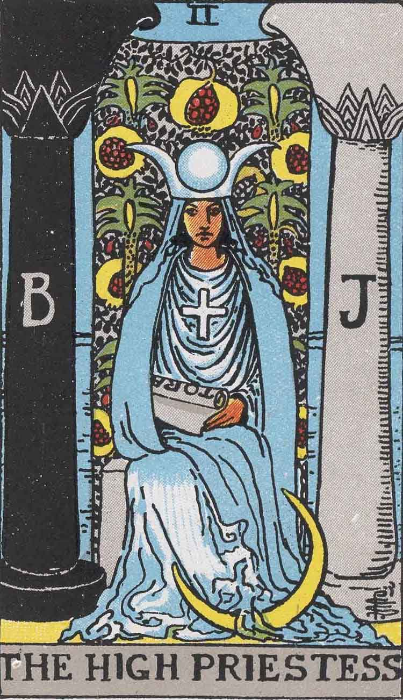
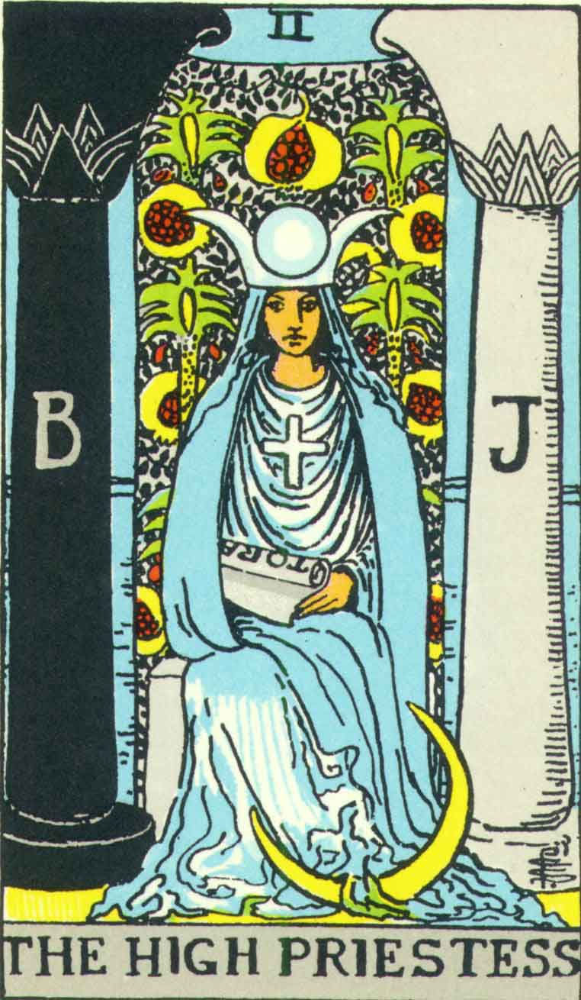

[Intangible Textual Heritage](../../index)  [Tarot](../index.md)  [Tarot
Copyright FAQ](../faq)  [Index](index)  [Previous](tcc01.md) 
[Next](tcc03.md) 

------------------------------------------------------------------------

# The High Priestess

This card shows how closely the colors in the US Games deck match the
original. Take a close look at the drapery of the dress. Allowing for
differences in color and screening, the white areas in this portion of
the card are almost an exact match.

What is different here are the color variations in the face of the
priestess. The 1909 version has subtle shading which makes the face look
a lot more three dimensional, whereas the face is essentially a single
color in the US Games deck. This is visible in other cards. This is
possibly just an artifact of the reproduction process.

<table data-cellspacing="0" data-border="0" data-cellpadding="9" width="798">
<colgroup>
<col style="width: 50%" />
<col style="width: 50%" />
</colgroup>
<tbody>
<tr class="odd">
<td width="50%" data-valign="TOP">
Pamela A (1909)
</td>
<td width="50%" data-valign="TOP">
US Games (1970)
</td>
</tr>
<tr class="even">
<td width="50%" data-valign="TOP">
  
courtesy of <a href="https://home.comcast.net/~vilex/">H. Voley</a>
</td>
<td width="50%" data-valign="TOP">
 
</td>
</tr>
</tbody>
</table>

 

------------------------------------------------------------------------

[Next: The Sun](tcc03.md)
