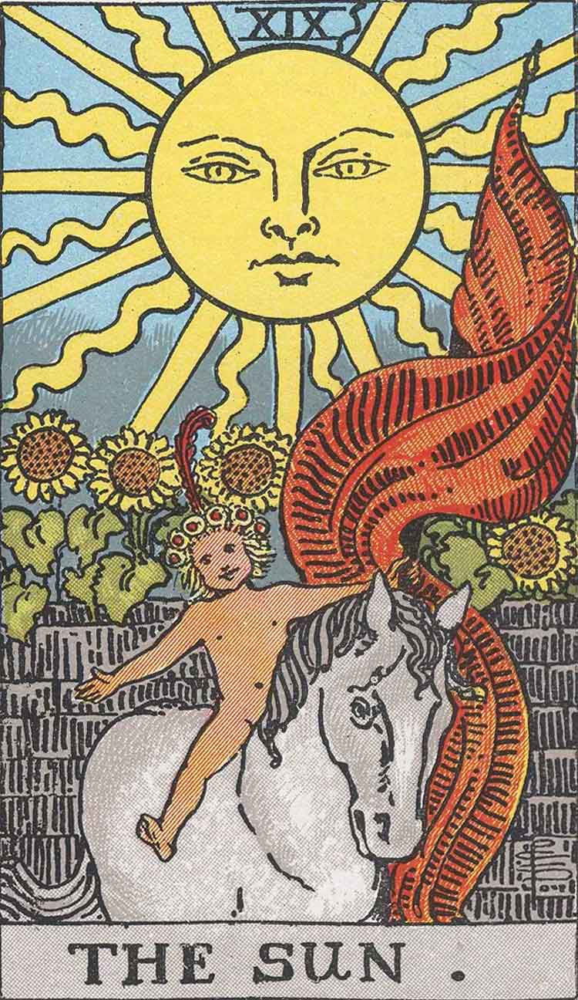
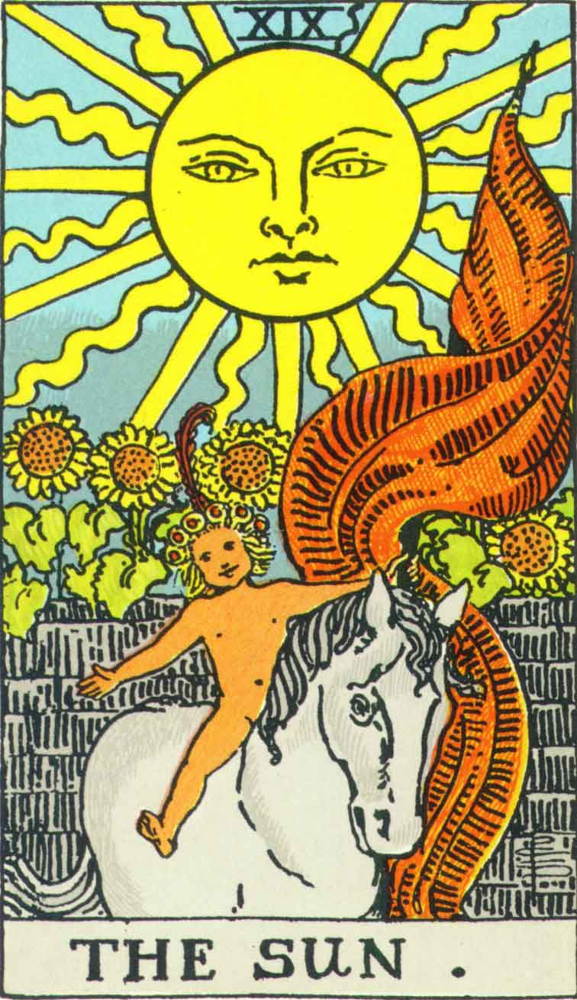

[Intangible Textual Heritage](../../index)  [Tarot](../index.md)  [Tarot
Copyright FAQ](../faq)  [Index](index)  [Previous](tcc02.md) 

------------------------------------------------------------------------

# The Sun

The Sun card line art has an obvious glitch which appears in both the
Pamela A and US Games decks. This is an additional wavy line just to the
right of the Roman numeral XIX at the top of the card. This is a sure
sign that the two decks are essentially identical. If the US Games deck
was redrawn, this superfluous line would have raised the eyebrows of any
competent artist.

There *is* one difference in the line art on this card: note the break
in the Sun's left eyebrow in Pamela A--the left eyebrow line is solid in
the USGS deck. Whether this was introduced deliberately is up for
speculation.

It is worth taking a close look at some of the shading in the Pamela A
Sun card, particularly on the horse and the flag. This is washed-out in
the US Games version; there is a much better sense of depth in Pamela-A.
There also appear to be subtle variations in the skin tone of the baby
which are completely lost in the USGS version; again, this appears to be
the case on many of the other cards.

<table data-cellspacing="0" data-border="0" data-cellpadding="9" width="798">
<colgroup>
<col style="width: 50%" />
<col style="width: 50%" />
</colgroup>
<tbody>
<tr class="odd">
<td width="50%" data-valign="TOP">
Pamela A (1909)
</td>
<td width="50%" data-valign="TOP">
US Games (1970)
</td>
</tr>
<tr class="even">
<td width="50%" data-valign="TOP">
  
courtesy of <a href="https://home.comcast.net/~vilex/">H. Voley</a>
</td>
<td width="50%" data-valign="TOP">
 
</td>
</tr>
</tbody>
</table>

 

 
