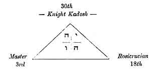
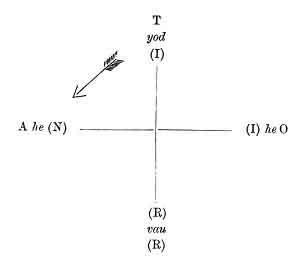

  
[Intangible Textual Heritage](../../index)  [Tarot](../index)  [Tarot
Reading](../pkt/tarot0)  [Index](index)  [Previous](tob02) 
[Next](tob04) 

------------------------------------------------------------------------

p. 3

# THE TAROT.

### CHAPTER I.

### INTRODUCTION TO THE STUDY OF THE TAROT.

Approaching End of Materialism--Synthesis--The Occult Science--The
Secret Societies--The Cultus--*The People*, Organ of the Transmission of
Esoterism--The Gypsies--The Sacred Word of Freemasonry--Our Work.

"Therefore you must open the book and carefully weigh the statements
made in it. Then you will know that the drug within is of very different
value from the promise of the box, that is to say, that the subjects
treated in it are not so frivolous as the title may imply."--RABBLAIS.

WE are on the eve of a complete transformation of our scientific
methods. Materialism has given us all that we can expect from it, and
inquirers, disappointed as a rule, hope for great things from the
future, whilst they are unwilling to spend more time in pursuing the
path adopted in modern times. Analysis has been carried, in every branch
of knowledge, as far as possible, and has only deepened the moats which
divide the sciences.

Synthesis becomes necessary; but how can we realize it?

If we would condescend to waive for one moment our belief in the
indefinite progress and fatal superiority of

p. 4

later generations over the ancients, we should at once perceive that the
colossal civilizations of antiquity possessed Science, Universities, and
Schools.

India and Egypt are still strewn with valuable remains, which reveal to
archæologists the existence of this ancient science.

We are now in a position to affirm that the dominant character of this
teaching was synthesis, which condenses in a few very simple laws the
whole of the acquired knowledge.

But the use of synthesis had been almost entirely lost, through several
causes, which it is important to enumerate.

Amongst the ancients, knowledge was only transmitted to men whose worth
had been proved by a series of tests. This transmittal took place in the
temples, under the name of *mysteries*, and the adept assumed the title
of *priest* or *Initiate*. [1](#fn_0) This
science was therefore secret or occult, and thus originated the name of
*occult science*, given by our contemporaries to the ancient synthesis.

Another reason for the limited diffusion of the higher branches of
knowledge, was the length and difficulty of the journeys involved before
the most important centres of initiation could be reached.

However, when the Initiates found that a time was approaching when these
doctrines might be lost to humanity, they made strenuous efforts to save
the law of synthesis from oblivion. Three great methods were used for
this purpose--

1\. Secret societies,, a direct continuation of the *mysteries*;

2\. The cultus, a symbolic translation of the higher doctrines, for the
use of the people;

p. 5

3\. Lastly, the people itself became the unconscious depository of the
doctrine.

Let us now see what use each of these groups made of the treasure
confided to it.

THE SECRET SOCIETIES.

The school of Alexandria was the principal source from which the secret
societies of the West arose.

The majority of the Initiates had taken refuge in the East, and quite
recently (in 1884) the West discovered the existence in India, and above
all in Thibet, of an occult fraternity, which possessed, practically,
the ancient synthesis in its integrity. The Theosophite Society was
founded with the object of uniting Western initiation with Oriental
initiation.

But we are less interested in the existence of this doctrine in the
East, than in the history of the development of the initiative societies
in the West.

The Gnostic sects, the Arabs, Alchemists, Templars, Rosicrucians, and
lastly the Freemasons, form the Western chain in the transmission of
occult science.

A rapid glance over the doctrines of these associations is sufficient
to. prove that the present form of Freemasonry has almost entirely lost
the meanings of the traditional symbols, which constitute the trust
which it ought to have transmitted through the ages.

The elaborate ceremonials of the ritual appear ridiculous to the vulgar
common sense of a lawyer or grocer, the actual modern representatives of
the profound doctrines of antiquity.

p. 6

We must, however, make some exceptions in favour of great thinkers, like
Ragon and a few others.

In short, Freemasonry has lost the doctrine confided to it, and cannot
by its self provide us with the synthetic law for which we are seeking.

THE CULTUS.

The secret societies were to transmit in their symbolism the scientific
side of primitive initiation, the religious sects were to develop the
philosophical and metaphysical aspects of the doctrine.

Every priest of an ancient creed was one of the *Initiates*, that is to
say, he knew perfectly well that only one religion existed, and that the
cultus merely served to translate this religion to the different nations
according to their particular temperaments. This fact led to one
important result, namely, that a priest, no matter which of the gods he
served, was received with honour in the temples of all the other gods,
and was allowed to offer sacrifice to them. Yet this circumstance must
not be supposed to imply any idea of *polytheism*. The Jewish High
Priest in Jerusalem received one of the Initiates, Alexander the Great,
into the Temple, and led him into the Holy of Holies, to offer
sacrifice.

Our religious disputes for the supremacy of one creed over another would
have caused much amusement to one of the ancient Initiate priests; they
were unable to suppose that intelligent men could ignore the unity of
all creeds in one fundamental religion.

Sectarianism, chiefly sustained by two creeds, equally

p. 7

blinded by their errors, the Christian and the Mussulman, was the cause
of the total loss of the secret doctrine, which gave the key to
Synthetic Unity.

Still greater labour is required to re-discover Synthesis in our Western
religions, than to find it in Freemasonry.

The Jews alone possessed, no longer the spirit, but the letter of their
oral or Kabbalistic traditions. The Bible, written in Hebrew, is
marvellous from this point of view, for it contains all the occult
traditions, although its true sense has never yet been revealed. Fabre
d'Olivet commenced this prodigious work, but the ignorant descendants of
the Inquisition at Rome have placed these studies on the list of those
prohibited. [1](#fn_1) Posterity will judge them.

Yet every cultus has its tradition, its book, its Bible, which teach
those who know how to read them the unity of all creeds, in spite of the
difference existing in the ritual of various countries.

The *Sepher Bereschit* of Moses is the Jewish Bible, the *Apocalypse*
and the *Esoteric Gospels* form the Christian Bible, the *Legend of
Hiram* is the Bible of Freemasonry, the *Odyssey* the Bible of the
so-called polytheism of Greece, the *Æneid* that of Rome, and lastly the
*Hindu Vedas* and the *Mussulman Koran* are well known to all students
of ancient theology.

To any one possessing the key, all these Bibles reveal the same
doctrine; but this key, which can open Esoterism, is lost by the
sectarians of our Western creeds. It is therefore useless to seek for it
any longer amongst them.

p. 8

THE PEOPLE.

The Sages were under no illusions respecting the possible future of the
tradition, which they confided to the intelligence and virtue of future
generations.

Moses had chosen a people to hand down through succeeding ages the book
which contained all the science of Egypt; but before Moses, the Hindu
Initiates had selected a nation to hand down to the generations of the
future the primitive doctrines of the great civilizations of the
Atlantides.

The people have never disappointed the expectations of those who trusted
it. Understanding none of the truths which it possessed, it carefully
abstained from altering them in an way, and treated the least attack
made upon them as sacrilege.

Thus the Jews have transmitted intact to us the letters which form the
Sepher of Moses. But Moses had not solved the problem so authoritatively
as the Thibetans.

It was a great thing to give the people a book which it could adore
respectfully, and always guard intact; but to give it a book which would
enable it to live, was yet better.

The people intrusted with the transmission of occult doctrines from the
earliest ages was the Bohemian or Gypsy race.

THE GYPSIES.

The Gypsies possess a Bible, which has proved their means of gaining a
livelihood, for it enables them to tell

p. 9

fortunes; at the same time it has been a perpetual source of amusement,
for it enables them to gamble.

Yes; the game of cards called the Tarot, which the Gypsies possess, is
the Bible of Bibles. It is the book of Thoth Hermes Trismegistus, the
book of Adam, the book of the primitive Revelation of ancient
civilizations.

Thus whilst the Freemason, an intelligent and virtuous man, has lost the
tradition; whilst the priest, also intelligent and virtuous, has lost
his esoterism; the Gypsy, although both ignorant and vicious, has given
us the key which enables us to explain all the symbolism of the ages.

We must admire the wisdom of the Initiates, who utilized vice and made
it produce more beneficial results than virtue.

The Gypsy pack of cards is a wonderful book according to Court de
Gébelin [1](#fn_2) and Vaillant. [2](#fn_3) This pack, under the name of TAROT, [3](#fn_4) THORA, [4](#fn_5)
ROTA, [5](#fn_6) has formed the basis of the
synthetic teachings of all the ancient nations successively. [6](#fn_7)

In it, where a man of the people only sees a means of amusement, the
thinker will find the key to an obscure tradition. Raymond Lulle has
based his *Ars Magna* upon the Tarot; Jerome Cardan has written a
treatise upon subtility from the keys of the Tarot; [7](#fn_8) Guillaume Postel has found in it the key to
the ancient mysteries; whilst Louis-Claude de Saint-Martin, the unknown

p. 10

philosopher, finds written in it the mysterious links which unite God,
the Universe, and Man!

Through the Tarot we are now able to discover and develop the synthetic
law, concealed in all these symbolisms.

The hour is approaching when the Missing word will be refound. Masters,
Rosicrucian and Kadosh, you who form the sacred triangle of Masonic
initiation, do you remember!

 

 

 

Remember, MASTER, that illustrious man, killed through the most cowardly
of conspiracies; remember *Hiram*, whose resurrection, promised by the
Branch of Acacia, thou art looking for in faith!

Remember, ROSICRUCIAN, the mysterious word which thou hast sought for so
long, of which the meaning still escapes thee!

Remember, KADOSH, the *magnificent symbol* which radiated from the
centre of the luminous triangle, when the real meaning of the letter G
was revealed to thee!

HIRAM--INRI--YOD--HE--VAU--HE! indicate the same mystery under different
aspects.

He who understands one of these words possesses the key which opens the
*tomb of Hiram*, the symbol of the

p. 11

synthetic science of the Ancients; he can open the tomb and fearlessly
grasp the *heart* of the revered Master, the symbol of esoteric
teaching.

The whole Tarot is based upon this word, ROTA, arranged as a wheel.

 

 

 

INRI! is the word which indicates the Unity of your origin, Freemasons
and Catholics!

Igne Natura Renovatur Integra.

Iesus Nazareus Rex Iudeorum are the opposite poles, scientific and
religious, physical and metaphysical, of the same doctrine.

YOD-HE-VAU-HE (יהוה) is the word which indicates to you both, Freemasons
and Kabbalists, the Unity of your origin. TAROT, THORA, ROTA are the
words which point out to you all, Easterns and Westerns, the Unity of
your requirements and of your aspirations in the eternal

p. 12

\[paragraph continues\] Adam-Eve, the source of all our knowledge and of
all our creeds.

All honour, therefore, to the Gypsy Nomad, to whom we are indebted for
the preservation of this marvellous instrument, the synthetic summary of
the whole teaching of antiquity.

OUR WORK.

We will commence by a preliminary study of the elements of the Kabbalah
and of numbers.

Supplied with these data, we will explain the construction of the Tarot
in all its details, studying separately each of the pieces which compose
our machine, then studying the action of these pieces upon each other.
Upon this point we shall be as explicit as possible. We will then touch
upon some applications of the machine, but upon a few only, leaving to
the genuine inquirer the work of discovering others. We must confine our
personal work to giving a key, based upon a synthetic formula; we can
only supply the implement of labour, in order that those who wish for
knowledge may use it as they like; and we feel assured that they will
understand the utility of our efforts and of their own.

Lastly, we will do our best to explain the elements of divination by the
Tarot as practised by the Gypsies.

But those who think that occult science should not be revealed must not
be too angry with us. Experience has taught us that everything may be
fearlessly said, those only who should understand can understand; the
others will accuse our work of being obscure and incomprehensible.

p. 13

We have warned them by placing at the head of our work--

For the exclusive use of Initiates.

It is one characteristic of the study of true occult science, that it
may be freely explained to all men. Like the parables, so dear to the
ancients, it appears to many only the expression of the flight of a bold
imagination: we need, therefore, never be afraid of speaking too openly,
the Word will only reach those who should be touched by it.

To you all, philosophers of Unity, enemies of scientific, social. and
religious sectarianism, I now address myself, to you I dedicate this
result of several years' study. May I thus aid in the erection of the
temple which you are about to raise to the honour of the UNKNOWN GOD,
from whom all the others emanate throughout Eternity!

------------------------------------------------------------------------

### Footnotes

[4:1](tob03.htm#fr_0) See Jamblichus, Porphyry,
and Apuleius.

[7:1](tob03.htm#fr_1) See Fabre d'Olivet, *La
Langue Hébraïque Restituée*.

[9:1](tob03.htm#fr_2) Court de Gébelin.--*Le
Monde Primitif*.

[9:2](tob03.htm#fr_3) Vaillant.--*Les Rômes,
Histoire des Bohémiens*.

[9:3](tob03.htm#fr_4) Eliphas Levi.--*Rituel de
la Haute Magie*.

[9:4](tob03.htm#fr_5) Vaillant.--*Op. cit*.

[9:5](tob03.htm#fr_6) Guillaume
Postel.--*Clavis*.

[9:6](tob03.htm#fr_7) Vaillant.--*Loc. cit*.

[9:7](tob03.htm#fr_8) Eliphas Levi.--*Op. cit*.

------------------------------------------------------------------------

[Next: Chapter II. The Sacred Word Yod-He-Vau-He](tob04)
