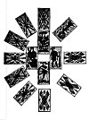
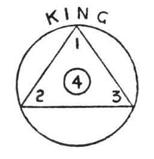
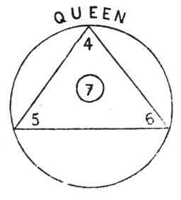
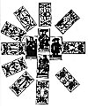
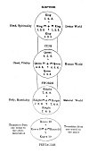
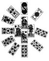

  
[Intangible Textual Heritage](../../index)  [Tarot](../index.md)  [Tarot
Reading](../pkt/tarot0)  [Index](index)  [Previous](tob06.md) 
[Next](tob08.md) 

------------------------------------------------------------------------

p. 35

# CHAPTER V.

### THE KEY TO THE MINOR ARCANA.

Formation of the Tarot--Study of a Colour--The Four Figures--The Ten
Numbers--Affinity between the Figures and the Numbers--Study of the Four
Colours--General Study of the Minor Arcana.

THE KEY TO THE MINOR ARCANA.

THE Tarot is composed of 78 cards, divided as follows--

 

56 cards called the *minor* arcana.

22 cards called the *major* arcana.

 

The 56 minor arcana are formed of 4 series of 14 cards each.

The 22 major arcana are formed of 21 numbered cards, and of one
un-numbered.

In order to study the Tarot with success, we must then arrange the
following packets--

<table data-cellspacing="0" data-border="0" data-cellpadding="9" width="401">
<colgroup>
<col style="width: 33%" />
<col style="width: 33%" />
<col style="width: 33%" />
</colgroup>
<tbody>
<tr class="odd">
<td width="66%" data-valign="TOP">
4 packets of 14 cards each.
</td>
<td width="14%" data-valign="TOP">
 
</td>
<td width="20%" data-valign="TOP">
 
</td>
</tr>
<tr class="even">
<td width="66%" data-valign="TOP">
         14 + 14 + 14 + 14
</td>
<td width="14%" data-valign="TOP">
=
</td>
<td width="20%" data-valign="TOP">
56
</td>
</tr>
<tr class="odd">
<td width="66%" data-valign="TOP">
1 packet of 21 cards
</td>
<td width="14%" data-valign="TOP">
=
</td>
<td width="20%" data-valign="TOP">
21
</td>
</tr>
<tr class="even">
<td width="66%" data-valign="TOP">
1 packet of 1 card
</td>
<td width="14%" data-valign="TOP">
=
</td>
<td width="20%" data-valign="TOP"><u></u>

  1
</td>
</tr>
<tr class="odd">
<td width="66%" data-valign="TOP">
Total . . . . . . . .
</td>
<td width="14%" data-valign="TOP">
 
</td>
<td width="20%" data-valign="TOP">
78
</td>
</tr>
</tbody>
</table>

 

p. 36

We shall presently return to the origin of this marvellous conception of
the human mind, but for the present we must confine ourselves to the
dissection of the machine, and to displaying its mysterious arrangement.

Starting from a fixed and immovable principle, the constitution of the
sacred tetragrammaton, *Yod-he-vau-he*, the Tarot develops the most
divers combinations, without one departure from its basis. We shall now
unveil this wonderful construction, which confirms in its application
the universal law of analogies.

The explanations which follow may appear dry to some persons; but they
must remember that we are now giving them an almost infallible key to
the ancient or occult science; and they will understand that they must
open the door of the sacred arch for themselves.

STUDY OF A COLOUR.

Let us now take one of the packets of fourteen cards and analyze its
construction.

This packet, taken as a whole, corresponds to one of the *colours* of
our pack of cards. The 4 packets respectively represent the *wands* or
*sceptres*, corresponding to our clubs; the *cups* or *goblets*,
corresponding to our hearts; the *swords*, corresponding to our spades;
and *money* or *Pentacles*, corresponding to our diamonds.

We shall now study one of these packets, for instance that of
*Sceptres*.

The packet consists of 4 figures: the king, queen, knight, and knave,
and of ten cards which simply bear numbers.

The ace, two, three, four, five, six, seven, eight, nine, and ten.

 

 [  
Click to enlarge](img/03600.jpg.md)

 

p. 37

THE FOUR FIGURES.

We must first consider the four figures--

The king represents the active, the man, or male.

The queen represents the passive, the woman, or female.

The knight represents the neuter, the adolescent.

Lastly, the knave represents the 4th term of this sequence, which may be
figured in this way--

 

|       |                                                 |       |
|-------|-------------------------------------------------|-------|
|       | King                                            |       |
| Queen |   | Knave |
|       | Knight                                          |       |

 

This sequence is only an application of the general law *Yod-he-vau-he*,
which we already know, and the analogy is easily established--

 

<table data-cellspacing="0" data-border="0" data-cellpadding="9" width="420">
<colgroup>
<col style="width: 33%" />
<col style="width: 33%" />
<col style="width: 33%" />
</colgroup>
<tbody>
<tr class="odd">
<td width="33%" data-valign="MIDDLE">
 
</td>
<td width="33%" data-valign="MIDDLE">
King 
or 
<em>Yod</em> 
</td>
<td width="33%" data-valign="MIDDLE">
 
</td>
</tr>
<tr class="even">
<td width="33%" data-valign="MIDDLE">
Queen 
or 
1<em>st He</em> 
</td>
<td width="33%" data-valign="MIDDLE">
 
</td>
<td width="33%" data-valign="MIDDLE">
Knave 
or 
2<em>nd He</em> 
</td>
</tr>
<tr class="odd">
<td width="33%" data-valign="MIDDLE">
 
</td>
<td width="33%" data-valign="MIDDLE">
Knight 
or 
<em>Vau</em> 
</td>
<td width="33%" data-valign="MIDDLE">
 
</td>
</tr>
</tbody>
</table>

 

The knave therefore corresponds with the *second He*, i. e. it is only a
term of transition; but transition between what?

Between the four figures and the ten numbers following.

p. 38

THE TEN NUMBERS.

Let us now study these numbers. We are acquainted with *the Law* of
numbers, or law of the sequences, which we have already stated in these
terms--

 

1 -- 2. 3

4 -- 5. 6

7 -- etc.

 

The ten cards cannot escape from this law, and we can at once arrange
them in series.

The first series will be formed of the ace, or 1, representing the
*active*, of the 2 personating the *passive*, of the 3 for the *neuter*,
and lastly of the 4, which represents the transition from one series to
another.

1, 2, 3, 4 therefore correspond also with the *Yod-he-vau-he*, and are
thins formulated--

 

<table data-cellspacing="0" data-border="0" data-cellpadding="9" width="420">
<colgroup>
<col style="width: 33%" />
<col style="width: 33%" />
<col style="width: 33%" />
</colgroup>
<tbody>
<tr class="odd">
<td width="33%" data-valign="MIDDLE">
 
</td>
<td width="33%" data-valign="MIDDLE"><em></em>

Ace  
or 
Yod 
</td>
<td width="33%" data-valign="MIDDLE">
 
</td>
</tr>
<tr class="even">
<td width="33%" data-valign="MIDDLE"><em></em>

Two or 1st He 
</td>
<td width="33%" data-valign="MIDDLE">
 
</td>
<td width="33%" data-valign="MIDDLE">
2nd He <em>Four</em> 
</td>
</tr>
<tr class="odd">
<td width="33%" data-valign="MIDDLE">
 
</td>
<td width="33%" data-valign="MIDDLE">
Vau 
or 
<em>Three</em> 
</td>
<td width="33%" data-valign="MIDDLE">
 
</td>
</tr>
</tbody>
</table>

 

The other series follow the same rule exactly, the *second He* of the
preceding series becoming the *Yod* of the following, series: thus 4,
the fourth term of the first series, becomes the first term of the
second series; 7, the fourth term of the second, becomes the first term
of the third, as follows--

p. 39

 

 

 

We see that the same law, *Yod-he-vau-he*, can be applied to these
series. Since this law is also applicable to the four figures, we can
make a comparison based on the following proposition--

Two terms (the numbers and the figures) equal to a same third (the law
*Yod-he-vau-he*) are equal between themselves.

 

THE SEQUENCE IN ONE COLOR

|     |                                                 |     |       |                                                 |       |     |                                                 |     |
|-----|-------------------------------------------------|-----|-------|-------------------------------------------------|-------|-----|-------------------------------------------------|-----|
|     |                                                 |     |       | King                                            |       |     |                                                 |     |
|     |                                                 |     | Queen |   | Knave |     |                                                 |     |
|     |                                                 |     |       | Knight                                          |       |     |                                                 |     |
|     | 1                                               |     |       | 4                                               |       |     | 7                                               |     |
| 2   |   | 4   | 5     |   | 7     | 8   |   | 10  |
|     | 3                                               |     |       | 6                                               |       |     | 9                                               |     |

 

If we now group all the numbers of the sequence according to the letter
of the tetragrammaton, to which they are analogous, we shall find--

p. 40

|                            |         |
|----------------------------|---------|
| Representing *Yod*         | 1--4--7 |
| Representing the 1*st He*  | 2--5--8 |
| Representing the *Vau*     | 3--6--9 |
| Representing the 2*nd He*  | 10      |

 

 

<table data-cellspacing="0" data-border="0" data-cellpadding="9" width="420">
<colgroup>
<col style="width: 33%" />
<col style="width: 33%" />
<col style="width: 33%" />
</colgroup>
<tbody>
<tr class="odd">
<td width="33%" data-valign="MIDDLE">
 
</td>
<td width="33%" data-valign="MIDDLE">
(1. 4. 7) 
Yod
</td>
<td width="33%" data-valign="MIDDLE">
 
</td>
</tr>
<tr class="even">
<td width="33%" data-valign="MIDDLE">
(2. 5. 8) 1st He
</td>
<td width="33%" data-valign="MIDDLE">
 
</td>
<td width="33%" data-valign="MIDDLE">
2nd He (10)
</td>
</tr>
<tr class="odd">
<td width="33%" data-valign="MIDDLE">
 
</td>
<td width="33%" data-valign="MIDDLE">
Vau 
(3. 6. 9)
</td>
<td width="33%" data-valign="MIDDLE">
 
</td>
</tr>
</tbody>
</table>

 

The figure 10 therefore acts for the *numbers*, as the knave acts for
the figures, that is to say, it serves as a *transition*. Between what?

Between one colour and another.

AFFINITY BETWEEN THE FIGURES AND THE NUMBERS.

We have already studied both the figures and the numbers separately, let
us now see what connection exists between the figures and the numbers.

If we group the similar terms according to the identical *Law* which
rules them, we shall find them as follows--

<table data-cellspacing="0" data-border="0" data-cellpadding="9" width="445">
<colgroup>
<col style="width: 25%" />
<col style="width: 25%" />
<col style="width: 25%" />
<col style="width: 25%" />
</colgroup>
<tbody>
<tr class="odd">
<td width="45%" data-valign="TOP">
The King is the
</td>
<td width="20%" data-valign="TOP"><em></em>

Yod 
</td>
<td width="17%" data-valign="TOP">
of
</td>
<td width="18%" data-valign="TOP">
1. 4. 7
</td>
</tr>
<tr class="even">
<td width="45%" data-valign="TOP">
The Queen ---
</td>
<td width="20%" data-valign="TOP"><em></em>

He 
</td>
<td width="17%" data-valign="TOP">
of
</td>
<td width="18%" data-valign="TOP">
2. 5. 8
</td>
</tr>
<tr class="odd">
<td width="45%" data-valign="TOP">
The Knight ---
</td>
<td width="20%" data-valign="TOP"><em></em>

Vau 
</td>
<td width="17%" data-valign="TOP">
of
</td>
<td width="18%" data-valign="TOP">
3. 6. 9
</td>
</tr>
<tr class="even">
<td width="45%" data-valign="TOP">
The Knave---
</td>
<td width="20%" data-valign="TOP">
2<em>nd He</em> 
</td>
<td width="17%" data-valign="TOP">
of
</td>
<td width="18%" data-valign="TOP">
10
</td>
</tr>
</tbody>
</table>

 

The sequence of the figures is reproduced *three times* in the series of
numbers, that is to say, that each series of numbers represents a
conception of the figures in each of the three Kabbalistic worlds.

The series 1, 2, 3, 4 represents the emanation of the sequence king,
queen, knight, knave in the divine world.

p. 41

The series 4, 5, 6, 7 represents this evolution in the human world.

The series 7, 8, 9, 10 represents this evolution in the material world.

Each colour is a complete whole, formed after the manner of beings.

Of a material body:

(Knight---7.8.9)

Of a vital force:

(Queen---4.5.6)

Of an intellect:

(King---1.2.3)

Of reproductive organs:

(Knave---10)

Each of these parts can subdivide itself into three others, as the
numbers indicate. [1](#fn_24.md)

Ut us, however, return to our deduction, and by summing up the results
obtained, we shall find--

Representations of the *Yod*:

The King  
The 1 or Ace  
The 4  
The 7

Representations of the *He*:

The Queen  
The 2  
The 5  
The 8

 

p. 42

Representations of the *Vau*:

The Knight  
The 3  
The 6  
The 9

Representations of the 2*nd He*:

The Knave  
The 10

 

  
FIGURATION OF ONE COLOR

 

 [  
Click to enlarge](img/04201.jpg.md)

 

p. 43

 

Head--Spirituality  
Divine World

Chest--Vitality   Human
World

Body--Materiality  
Material World

Transition from one being to another 
 Transition from another one world to

 

p. 44

STUDY OF THE FOUR COLOURS.

Supplied with these data, let us continue our study, and apply the same
principle to the other cards.

The laws which we have defined for the constitution of one colour, apply
in the same way to the other three colours.

But when we consider the four colours of the Tarot, new deductions will
be called forth. We must remember that these four colours are: the
Sceptre, the Cup, the Sword, and the Money or Pentacles.

The Sceptre represents the Male or the Active.

The Cup is the image of the Passive or Feminine.

The Sword represents the union of the two by its crucial form.

Lastly, the Pentacles represent the second He.

The authors who have philosophically studied the Tarot are all unanimous
in asserting the analogy that exists between the tetragrammaton and the
four colours. Guillaume Postel, [1](#fn_25.md) and
above all Eliphas Levi, [2](#fn_26.md) have
developed these studies with great results, and they show us the four
letters of the tetragrammaton applied in the symbolism of every cultus.

We must pause one moment to notice the analogy, between these letters
and the symbols of the Christian religion.

The Yod or Sceptre of the Tarot is represented by the episcopal crosier.

The 1*st He* or Cup is represented by the Chalice.

The Vau or Sword by the Cross, bearing the same form.

The 2*nd He* or Pentacles by the Host, the transition from the natural
to the Supernatural world.

 

 [  
Click to enlarge](img/04400.jpg.md)

 

p. 45

The series which we have studied in one colour is defined equally
strictly in the four colours regarded as a whole, thus--

 

<table data-cellspacing="0" data-border="0" data-cellpadding="9" width="513">
<colgroup>
<col style="width: 33%" />
<col style="width: 33%" />
<col style="width: 33%" />
</colgroup>
<tbody>
<tr class="odd">
<td width="33%" data-valign="MIDDLE">
 
</td>
<td width="33%" data-valign="MIDDLE">
Sceptre 
or 
<em>Yod</em> 
</td>
<td width="33%" data-valign="MIDDLE">
 
</td>
</tr>
<tr class="even">
<td width="33%" data-valign="MIDDLE">
Cup or <em>He</em> 
</td>
<td width="33%" data-valign="MIDDLE">
 
</td>
<td width="33%" data-valign="MIDDLE">
2nd <em>He</em> or Money
</td>
</tr>
<tr class="odd">
<td width="33%" data-valign="MIDDLE">
 
</td>
<td width="33%" data-valign="MIDDLE"><em></em>

Vau  
or 
Sword
</td>
<td width="33%" data-valign="MIDDLE">
 
</td>
</tr>
</tbody>
</table>

 

A COMPREHENSIVE GLANCE OVER TIRE MINOR ARCANA.

If we look back a little, we can easily judge the road we have
traversed.

The four colours considered *in globo* have shown us the application of
the law *Yod-he-vau-he*.

But the same law is reproduced in each of the colours taken separately.

The four figures represent *Yod-he-vau-he*;

The four series of numbers also.

Let us then arrange all the cards according to their affinities, and we
shall obtain the following results--

|                                                 |          |
|-------------------------------------------------|----------|
| The 4 Kings                                     | = *Yod*  |
| The 4 Aces                                      |          |
| The 4 Fours                                     |          |
| The 4 Sevens                                    |          |
| The 4 Queens                                    | =*He*    |
| The 4 Twos                                      |          |
| The 4 Fives                                     |          |
| The 4 Eights                                    |          |
| p. 46 The 4 Cavaliers | =*Vau*   |
| The 4 Threes                                    |          |
| The 4 Sixes                                     |          |
| The 4 Nines                                     |          |
| The 4 Knaves                                    | = *He*   |
| The 4 Tens                                      |          |

 

If we wished to represent this arrangement by a synthetic diagram, we
should place the sacred name in *the centre* of a circle divided into
four parts, which respectively correspond with each of the letters
*Yod-he-vau-he*. In each of the quarters, the cards that are analogous
to the letters of the tetragrammaton will radiate from the centre. See
the diagram on page opposite.

The figures have the same connection with the colours as the numbers
have with the figures.

The sequence of the figures is reproduced in the three worlds by the
numbers; the same thing takes place in the sequence of colours: Sceptre,
Cup, Sword, Pentacles are reproduced in the figures.

 

The Sceptre is the *Yod* of the 4 Kings.  
The Cup is the *He* of the 4 Queens.  
The Sword is the *Vau* of the 4 Knights.  
The Pentacles is the *He* of the 4 Knaves.

 

And just as each colour has a complete whole, formed of a body, of a
soul, and of a mind or vital force, so the four colours form a complete
whole thus composed:--

The material body of the minor arcana:

 

The 4 Knights  
The 4 Sevens  
The 4 Eights  
The 4 Nines

 

p. 47

 

 [  
Click to enlarge](img/04700.jpg.md)  
GENERAL FIGURE OF THE MINOR ARCANA.--Disposition of Series.  

 

The vital body of the minor arcana:

 

The 4 Queens  
The 4 Fours  
The 4 Fives  
The 4 Sixes

 

p. 48

 

 [  
Click to enlarge](img/04800.jpg.md)

 [  
Click to enlarge](img/04801.jpg.md)

 

p. 49

The intellectual body:

 

The 4 Kings  
The 4 Aces  
The 4 Twos  
The 4 Threes

 

Reproductive organs:

 

The 4 Knaves  
The 4 Tens

 

We can only point out the very instructive affinities shown in these
figures; they can be carried to a great length.

We give these indications in order to demonstrate the management of
*analogy*, the method of the occult science, to which we have so
frequently alluded in our preceding works.

We need only compare this last diagram, which represents the four
colours, with the first, which depicted one only, to see at once that
the law upon which these two diagrams are constructed is the same, only
that the applications of it are varied.

It is the same law by which the cells that form the human being group
themselves to constitute *organs*, the organs group themselves to form
*members*, and the grouping of the latter produces the
*individual*. [1](#fn_27.md)

We have drawn the following conclusion from all that we have already
stated--

The *Pentacles*, responding to the second *He*, indicates a transition.

Between what?

Between the *minor and major arcana*.

------------------------------------------------------------------------

### Footnotes

[41:1](tob07.htm#fr_24.md) We wished to make this
application of the Tarot in order to show Initiates what results might
be expected from the laws explained by studying it.

[44:1](tob07.htm#fr_25.md) *Clavis abscunditarum
reram*.

[44:2](tob07.htm#fr_26.md) Eliphas Levi, *Dogme et
Rituel de la Haute Magie*.

[49:1](tob07.htm#fr_27.md) See the *Traité
Élémentaire de Science Occulte*, chap. iii.

------------------------------------------------------------------------

[Next: Chapter VI: The Key to the Major Arcana](tob08.md)
