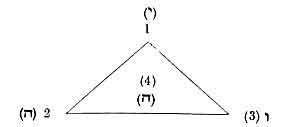
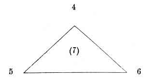
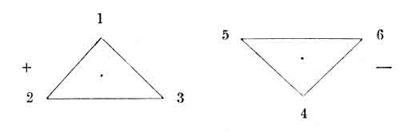
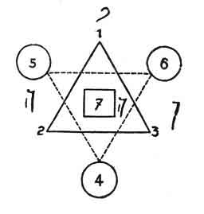
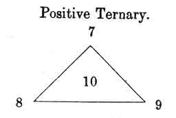
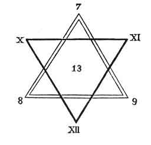
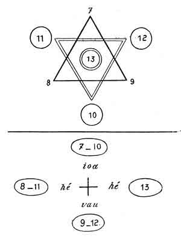
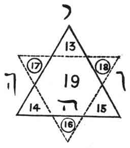
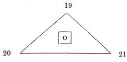

  
[Intangible Textual Heritage](../../index)  [Tarot](../index)  [Tarot
Reading](../pkt/tarot0)  [Index](index)  [Previous](tob07) 
[Next](tob09) 

------------------------------------------------------------------------

p. 50

 [  
Click to enlarge](img/05000.jpg)  
GENERAL KEY TO MINOR ARCANA  

p. 51

# CHAPTER VI.

### THE KEY TO THE MAJOR ARCANA.

The Major Arcana--1st Ternary--2nd Ternary--1st Septenary--2nd
Septenary--The Three Septenaries and the Ternary of Transition.

THE MAJOR ARCANA.

THE fundamental difference which exists between the minor and major
arcana, is that in the latter the figures and numbers are united, whilst
in the former they are distinct.

There are 22 major arcana, but one of them bears a 0, so that, in
reality, there are only 21 great or major arcana.

Most of the authors who have studied the Tarot have devoted all their
attention to these 22 cards, without noticing the others, which,
however, contain the real key to the system.

But we will leave these digressions and commence the application of the
law *Yod-he-vau-he* to this portion of the Tarot.

A little reflection will suggest to us that there should be *some
sequences* in the major arcana as well as in the minor arcana. But how
are we to define the limits of these series?

p. 52

Each card of the minor arcana bears a symbol which easily connects it
with the whole scheme (Sceptre, Cup, Sword, or Pentacles); it is
different in this case. Each card bears a *different symbol*. Therefore
it is not *symbolism* that can guide us here, at all events for the
moment.

Besides the symbol, each card expresses an idea. This idea is already a
better guide, for it is easier to classify than the symbol; but this
guide does not yet offer all the security that we could desire, for it
may be read differently by various persons. Again, the idea proceeds
from the action of the symbol upon the other term expressed by the card,
*the number*.

The number is certainly the most reliable element, the easiest to follow
in its evolutions; it is, therefore, the number that will guide us; and
through it we shall discover the two other terms.

Let us now recall our explanation of the numbers, and we shall easily
define the series of the major arcana.

However, from the commencement we must make one great reservation. The
series which we are about to enumerate are the *most usual*, but they
are not the *only ones*.

This said, we will now study the four first major arcana.

The numbers 1, 2, 3, 4 at once indicate the classification to be adopted
and the nature of the terms.

<table data-cellspacing="0" data-border="0" data-cellpadding="9" width="780">
<colgroup>
<col style="width: 25%" />
<col style="width: 25%" />
<col style="width: 25%" />
<col style="width: 25%" />
</colgroup>
<tbody>
<tr class="odd">
<td width="6%" data-valign="TOP">
1
</td>
<td width="19%" data-valign="TOP">
corresponds to
</td>
<td width="18%" data-valign="TOP"><em></em>

Yod,
</td>
<td width="57%" data-valign="TOP">
and is active.
</td>
</tr>
<tr class="even">
<td width="6%" data-valign="TOP">
2
</td>
<td width="19%" data-valign="TOP">
----
</td>
<td width="18%" data-valign="TOP">
to <em>He</em>
</td>
<td width="57%" data-valign="TOP">
---- passive.
</td>
</tr>
<tr class="odd">
<td width="6%" data-valign="TOP">
3
</td>
<td width="19%" data-valign="TOP">
----
</td>
<td width="18%" data-valign="TOP">
to <em>Vau</em>
</td>
<td width="57%" data-valign="TOP">
---- neuter.
</td>
</tr>
<tr class="even">
<td width="6%" data-valign="TOP">
4
</td>
<td width="19%" data-valign="TOP">
----
</td>
<td width="18%" data-valign="TOP">
to the 2nd <em>He</em>,
</td>
<td width="57%" data-valign="TOP">
and indicates transition.
</td>
</tr>
</tbody>
</table>

 

This 4th arcanum corresponds to the Knave and to the 10 of the minor
arcana, and becomes Yod in the next or following series.

p. 53

If we wish to make a figure of the first ternary 1, 2, 3, we should do
it in this way--

 

 

 

The active term 1 is at the head of the triangle, the two other terms
are at the other angles.

This ternary can also be represented in its affinities with
*Yod-he-vau-he*--

 

<table data-cellspacing="0" data-border="0" data-cellpadding="9" width="420">
<colgroup>
<col style="width: 33%" />
<col style="width: 33%" />
<col style="width: 33%" />
</colgroup>
<tbody>
<tr class="odd">
<td width="33%" data-valign="MIDDLE">
 
</td>
<td width="33%" data-valign="MIDDLE">
1 
<em>yod</em>
</td>
<td width="33%" data-valign="MIDDLE">
 
</td>
</tr>
<tr class="even">
<td width="33%" data-valign="MIDDLE">
2 <em>he</em> 
</td>
<td width="33%" data-valign="MIDDLE">
 
</td>
<td width="33%" data-valign="MIDDLE">
2nd <em>he</em> 4
</td>
</tr>
<tr class="odd">
<td width="33%" data-valign="MIDDLE">
 
</td>
<td width="33%" data-valign="MIDDLE"><em></em>

vau  
3
</td>
<td width="33%" data-valign="MIDDLE">
 
</td>
</tr>
</tbody>
</table>

 

SECOND TERNARY.--We have stated that the 4 becomes the Yod or active
term in the following sequence.

This is realized in the figure below--

 

<table data-cellspacing="0" data-border="0" data-cellpadding="9" width="420">
<colgroup>
<col style="width: 33%" />
<col style="width: 33%" />
<col style="width: 33%" />
</colgroup>
<tbody>
<tr class="odd">
<td width="33%" data-valign="MIDDLE">
 
</td>
<td width="33%" data-valign="MIDDLE">
4 
<em>yod</em>
</td>
<td width="33%" data-valign="MIDDLE">
 
</td>
</tr>
<tr class="even">
<td width="33%" data-valign="MIDDLE">
5 <em>he</em> 
</td>
<td width="33%" data-valign="MIDDLE">
 
</td>
<td width="33%" data-valign="MIDDLE">
2nd <em>he</em> 7
</td>
</tr>
<tr class="odd">
<td width="33%" data-valign="MIDDLE">
 
</td>
<td width="33%" data-valign="MIDDLE"><em></em>

vau  
6
</td>
<td width="33%" data-valign="MIDDLE">
 
</td>
</tr>
</tbody>
</table>

 

p. 54

The 4 representing the Yod, therefore, acts with regard to 5 and 6, as
the 1 acted with regard to 2 and 3, and we obtain another ternary.

 

 

 

The 7 acts here as the 4 acted previously, and the same rule applies to
all the series in the arcana.

FIRST SEPTENARY.--The application of one law to very different terms has
led us so far; we must not abandon this system, but persevere and say--

If in one ternary exist an *active* term = *yod*, a *passive* term =
*he*, and a *neuter* term = *vau*, resulting from the two first, why
should not the same result be found in several ternaries taken together?

The first ternary is active and corresponds to *yod*; the second ternary
is passive and corresponds to *he*; the reaction of one ternary upon
another gives birth to a third ternary or *vau*.

Let us make a figure representing this--

 

 

 

p. 55

 

 

 

The 7 therefore forms the element of transition between *one septenary*
and another.

If we define the analogy between this first septenary and the
*Yod-he-vau-he*, we shall find--

 

<table data-cellspacing="0" data-border="0" data-cellpadding="9" width="577">
<colgroup>
<col style="width: 33%" />
<col style="width: 33%" />
<col style="width: 33%" />
</colgroup>
<tbody>
<tr class="odd">
<td width="33%" data-valign="MIDDLE">
 
</td>
<td width="33%" data-valign="MIDDLE">
(1--4) 
י 
<em>yod</em> 
</td>
<td width="33%" data-valign="MIDDLE">
 
</td>
</tr>
<tr class="even">
<td width="33%" data-valign="MIDDLE">
(2--5) ה <em>he</em> 
</td>
<td width="33%" data-valign="MIDDLE">
 
</td>
<td width="33%" data-valign="MIDDLE">
2nd ה <em>he</em> (7)
</td>
</tr>
<tr class="odd">
<td width="33%" data-valign="MIDDLE">
 
</td>
<td width="33%" data-valign="MIDDLE"><em></em>

vau  
ו 
(3--6)
</td>
<td width="33%" data-valign="MIDDLE">
 
</td>
</tr>
</tbody>
</table>

 

A deduction may be made in passing, from which a great deal of
information may be derived, if it be carefully studied: the 4 being only
the 1, considered *negatively*, the 5 is only the 2 considered
negatively, whilst the 6 is the negative of 3. It is always *the same
number* under *different aspects*.

We have therefore defined a first septenary, formed of two opposing
ternaries.

p. 56

We have seen that this septenary also reproduces *Yod-he-vau-he*.

SECOND SEPTENARY.--The law that applies to the first ternaries is also
true for the others, and following the same method we obtain a second
septenary, thus formed--

      

 

The two ternaries, positive and negative, will balance each other to
give birth to a second septenary and to its term of transition 13.
Thus--

 

 

 

p. 57

General figure--

 

 

 

But if the two ternaries respectively act as positive and negative, why
should not the two septenaries do the same?

The first septenary, taken as a whole, will therefore be *positive*,
relatively to the second septenary, which will be *negative*.

The first septenary corresponds to *yod*, the second to *he*.

p. 58

THIRD SEPTENARY. The third septenary is thus formed--

<table data-cellspacing="0" data-border="0" data-cellpadding="9" width="577">
<colgroup>
<col style="width: 33%" />
<col style="width: 33%" />
<col style="width: 33%" />
</colgroup>
<tbody>
<tr class="odd">
<td width="33%" data-valign="MIDDLE">
 
</td>
<td width="33%" data-valign="MIDDLE">
(13--16) 
<em>yod</em> 
</td>
<td width="33%" data-valign="MIDDLE">
 
</td>
</tr>
<tr class="even">
<td width="33%" data-valign="MIDDLE">
(14--17) <em>he</em> 
</td>
<td width="33%" data-valign="MIDDLE">
 
</td>
<td width="33%" data-valign="MIDDLE"><em></em>

he (19)
</td>
</tr>
<tr class="odd">
<td width="33%" data-valign="MIDDLE">
 
</td>
<td width="33%" data-valign="MIDDLE"><em></em>

vau  
(15--18)
</td>
<td width="33%" data-valign="MIDDLE">
 
</td>
</tr>
</tbody>
</table>

 

 

 

If the first septenary is positive and the second negative, the third
will be neuter, and will correspond with *vau*. We should have
therefore, definitely--

1st, A POSITIVE SEPTENARY = *Yod*.  
2nd, A NEGATIVE SEPTENARY = *He*.  
3rd, A NEUTER SEPTENARY = *Vau*.

Yet each septenary contains one term which belongs to the preceding
septenary, and one which belongs to the following septenary.

Thus the 7 is the 7th term of the first septenary and the 1st term of
the second. 13 is the last term of the second septenary and the 1st of
the third, etc.

The result is that three terms remain to be classed. These are--

19 ---- 20 ---- 21

These three terms form the last ternary, the ternary of transition
between the *major arcana* and the *minor arcana*, a ternary which
corresponds to the second *he*, and which may be thus represented--

p. 59

 

 

<table data-cellspacing="0" data-border="0" data-cellpadding="9" width="577">
<colgroup>
<col style="width: 33%" />
<col style="width: 33%" />
<col style="width: 33%" />
</colgroup>
<tbody>
<tr class="odd">
<td width="33%" data-valign="MIDDLE">
 
</td>
<td width="33%" data-valign="MIDDLE">
(19) 
<em>yod</em> 
</td>
<td width="33%" data-valign="MIDDLE">
 
</td>
</tr>
<tr class="even">
<td width="33%" data-valign="MIDDLE">
(20) <em>he</em> 
</td>
<td width="33%" data-valign="MIDDLE">
 
</td>
<td width="33%" data-valign="MIDDLE">
2nd <em>he</em> (0)
</td>
</tr>
<tr class="odd">
<td width="33%" data-valign="MIDDLE">
 
</td>
<td width="33%" data-valign="MIDDLE"><em></em>

vau  
(21)
</td>
<td width="33%" data-valign="MIDDLE">
 
</td>
</tr>
</tbody>
</table>

 

The last numbered card, which ought correctly to bear the number 22 (or
its Hebrew correspondent), closes the Tarot by a marvellous figure,
which represents its constitution to those who can understand it. We
will return to it presently. Therefore, in the major arcana, the great
law is thus definitely represented. (See next page.)

The first septenary corresponds to the Divine World, to God.

The second to Man.

The third to Nature.

Finally, the last ternary indicates the passage from the creative and
providential World to the created and fatal world.

This ternary establishes the connection between the *major* and *minor
arcana*.

------------------------------------------------------------------------

[Next: Chapter VII. Connection Between the Major and Minor
Arcana](tob09)
