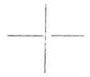
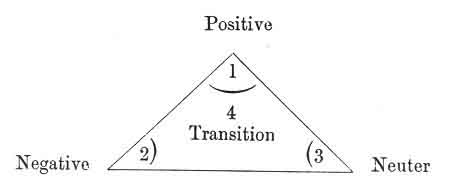
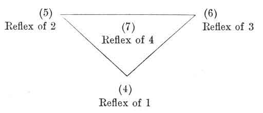

  
[Intangible Textual Heritage](../../index)  [Tarot](../index.md)  [Tarot
Reading](../pkt/tarot0)  [Index](index)  [Previous](tob09.md) 
[Next](tob11.md) 

------------------------------------------------------------------------

p. 69

# PART II.

# SYMBOLISM IN THE TAROT.

### APPLICATION OF THE GENERAL KEY TO SYMBOLISM.

 

p. 71

# CHAPTER VIII.

### INTRODUCTION TO THE STUDY OF SYMBOLISM.

The Symbols--The Primitive Terms--Key of Symbolism--Definition of the
Sense of one of the Symbols--The General Law of Symbolism.

INTRODUCTION TO THE STUDY OF SYMBOLISM IN THE TAROT.

OUR study of the Tarot and its numerical arrangement has given us the
*general key*, which should be applied to all the further developments
of which our subject may be susceptible.

The symbols should therefore exactly follow the evolution of the
numbers, and this we shall find them do. However, as we shall now study
each of the cards of the Tarot in turn, and as the reader's attention
may be a little diverted by all these details, we have determined to
commence by a short introduction to the study of the symbolism of the
Tarot, an introduction in which we shall say a few words upon the
grouping of the symbols.

This point explained, we can pass on to further details, which we shall
terminate by a synthetic recapitulation. We thus hope to obtain the
greatest possible light upon these difficult subjects.

The analysis of the word *Yod-he-vau-he* has given us

p. 72

the general law upon which the whole Tarot is constructed. This law is
thus represented--

 

 

<table data-cellspacing="0" data-border="0" data-cellpadding="9" width="493">
<colgroup>
<col style="width: 33%" />
<col style="width: 33%" />
<col style="width: 33%" />
</colgroup>
<tbody>
<tr class="odd">
<td width="33%" data-valign="MIDDLE">
 
</td>
<td width="33%" data-valign="MIDDLE">
1 
<em>yod</em> 
</td>
<td width="33%" data-valign="MIDDLE">
 
</td>
</tr>
<tr class="even">
<td width="33%" data-valign="MIDDLE">
2 <em>he</em> 
</td>
<td width="33%" data-valign="MIDDLE">
 
</td>
<td width="33%" data-valign="MIDDLE">
2nd <em>he</em> 4
</td>
</tr>
<tr class="odd">
<td width="33%" data-valign="MIDDLE">
 
</td>
<td width="33%" data-valign="MIDDLE"><em></em>

vau  
3
</td>
<td width="33%" data-valign="MIDDLE">
 
</td>
</tr>
</tbody>
</table>

 

We must therefore first define the four primitive terms in our symbols,
which form the law exactly applicable to the whole symbolism.

And, in fact, we find these four terms in our four first cards; the
general sense of these terms being--

1--Creator or Divine.  
2--Preserver or Astral.  
3--Transformer or Physical and Diffuser.  
4--Generator or Transitional becoming Creator.

This law corresponds in all points with our sacred word, thus--

 

 

<table data-cellspacing="0" data-border="0" data-cellpadding="8" width="779">
<colgroup>
<col style="width: 20%" />
<col style="width: 20%" />
<col style="width: 20%" />
<col style="width: 20%" />
<col style="width: 20%" />
</colgroup>
<tbody>
<tr class="odd">
<td width="20%" data-valign="MIDDLE">
 
</td>
<td width="20%" data-valign="MIDDLE">
 
</td>
<td width="20%" data-valign="MIDDLE">
Creator or Divine
</td>
<td width="20%" data-valign="MIDDLE">
 
</td>
<td width="20%" data-valign="MIDDLE">
 
</td>
</tr>
<tr class="even">
<td width="20%" data-valign="MIDDLE">
 
</td>
<td width="20%" data-valign="MIDDLE">
 
</td>
<td width="20%" data-valign="MIDDLE">
1 
<em>yod</em> 
</td>
<td width="20%" data-valign="MIDDLE">
 
</td>
<td width="20%" data-valign="MIDDLE">
 
</td>
</tr>
<tr class="odd">
<td width="20%" data-valign="MIDDLE">
Preserver or Astral
</td>
<td width="20%" data-valign="MIDDLE">
2 <em>he</em> 
</td>
<td width="20%" data-valign="MIDDLE">
 
</td>
<td width="20%" data-valign="MIDDLE">
2nd <em>he</em> 4
</td>
<td width="20%" data-valign="MIDDLE">
Transition or Generation
</td>
</tr>
<tr class="even">
<td width="20%" data-valign="MIDDLE">
 
</td>
<td width="20%" data-valign="MIDDLE">
 
</td>
<td width="20%" data-valign="MIDDLE"><em></em>

vau  
3
</td>
<td width="20%" data-valign="MIDDLE">
 
</td>
<td width="20%" data-valign="MIDDLE">
 
</td>
</tr>
<tr class="odd">
<td width="20%" data-valign="MIDDLE">
 
</td>
<td width="20%" data-valign="MIDDLE">
 
</td>
<td width="20%" data-valign="MIDDLE">
Transformer or Physical
</td>
<td width="20%" data-valign="MIDDLE">
 
</td>
<td width="20%" data-valign="MIDDLE">
 
</td>
</tr>
</tbody>
</table>

 

p. 73

We shall see that this law applies exactly to each of the cards which
possess three meanings.

 

A superlative or Divine meaning.  
A comparative or Magic-Astral meaning.  
A positive or Physical meaning, responding, to a transition.

 

GENERAL STUDY OF THE FOUR FIRST CARDS.

Key to the Symbolism of the Tarot.

The four first cards of the major arcana form, symbolically as well as
numerically, a complete sequence, which corresponds with the sacred word
*Yod-he-vau-he*.

For the first card expresses the *active absolute*, and corresponds with
*Yod*.

The second card denotes the *reflex* of the first, the *passive
absolute*; it corresponds with the *first He*.

The third indicates the median term, the convertible transforming term,
corresponding to *Vau*.

Lastly, the fourth card is a term of transition between the preceding
series and the one that follows it.

The symbolic series of the Tarot is therefore completely represented by
the four first cards, exactly as the numerical sequence is represented
by the four first numbers. This fact produces a very important
consideration, namely, that all the symbols of the Tarot are but
transformations of the *three first*, and that the latter will supply us
with the *general law* of symbolism, a law which will enable us to
determine mathematically the sense of each card that follows.

But we can go still further.

p. 74

Since the second card is the reflex of the first, and is formed by the
first considered *negatively*, and since the third card results from the
two others, *it suffices to be perfectly acquainted with the first card
of the Tarot to determine mathematically the sense of all the others*.

Some details upon this subject are necessary.

The general law of the four first cards is as follows--

1--Positive. Creator.  
2--Negative. Reflex of the first. Preserver.  
3--Neuter, enveloping the two others. Transformer.  
4--Passage from one series to another.

We can then represent the series in this way--

 

 

 

And what is true for each of the terms of a ternary is also true for the
ternary taken *as a whole*, and this leads us to new considerations.

For the first ternary would be positive, corresponding to *Yod*, the
active, the creator.

The second ternary would be negative, and would correspond to the first
*He*, i. e. that all the terms of this ternary would be reflections of
the terms of the first, just as the second card was the reflex of the
first.

p. 75

This gives us--

 

 

 

We can thus determine the meaning of the arcana 4, 5, 6, 7 in the three
worlds, since we know the meaning of the arcana 1, 2, 3, 4.

We need only refer to the study of the Tarot by numbers, to find the
symbols, which correspond respectively to *Yod*, to *He*, to *Vau*, and
to the second *He*.

But if the second ternary is the reflex of the first, the same rule
applies to the septenaries.

All the cards of the second septenary will therefore be the symbolical
reflection of those of the first.

All the cards of the third septenary are representatives of the third
term, or of transformation.

We have then--

The 1*st septenary*,

Which represents the *active Creation*. The Divine Osiris-Brahma, or the
Father.

The 2*nd septenary*,

Which represents *Preservation*. The Astral, Isis, Vishnu, the Son.

The 3rd septenary,

Which represents *Transformation*, Physics, Horus, Siva, the Holy
Spirit.

p. 76

The three first arcana will therefore give the sense of all the others
according to the following figure:

<table data-border="" data-cellspacing="1" data-cellpadding="9" width="779">
<colgroup>
<col style="width: 12%" />
<col style="width: 12%" />
<col style="width: 12%" />
<col style="width: 12%" />
<col style="width: 12%" />
<col style="width: 12%" />
<col style="width: 12%" />
<col style="width: 12%" />
</colgroup>
<tbody>
<tr class="odd">
<td colspan="8" data-valign="TOP">
FIGURE

SHOWING THE SENSE OF EACH OF THE 22 MAJOR ARCANA
</td>
</tr>
<tr class="even">
<td width="21%" data-valign="TOP"><em></em>

yod 
positive or creative series
</td>
<td width="11%" data-valign="TOP">
1.
</td>
<td width="11%" data-valign="TOP">
4.
</td>
<td width="11%" data-valign="TOP">
7.
</td>
<td width="11%" data-valign="TOP">
10.
</td>
<td width="11%" data-valign="TOP">
13.
</td>
<td width="11%" data-valign="TOP">
16.
</td>
<td width="11%" data-valign="TOP">
19.
</td>
</tr>
<tr class="odd">
<td width="21%" data-valign="TOP">
1st <em>he</em> 
negative or preservative series
</td>
<td width="11%" data-valign="TOP">
2.
</td>
<td width="11%" data-valign="TOP">
5.
</td>
<td width="11%" data-valign="TOP">
8.
</td>
<td width="11%" data-valign="TOP">
11.
</td>
<td width="11%" data-valign="TOP">
14.
</td>
<td width="11%" data-valign="TOP">
17.
</td>
<td width="11%" data-valign="TOP">
20.
</td>
</tr>
<tr class="even">
<td width="21%" data-valign="TOP"><em></em>

vau 
neuter or transforming series equilibrium
</td>
<td width="11%" data-valign="TOP">
3.
</td>
<td width="11%" data-valign="TOP">
6.
</td>
<td width="11%" data-valign="TOP">
9.
</td>
<td width="11%" data-valign="TOP">
12.
</td>
<td width="11%" data-valign="TOP">
15.
</td>
<td width="11%" data-valign="TOP">
18.
</td>
<td width="11%" data-valign="TOP">
21.
</td>
</tr>
<tr class="odd">
<td width="21%" data-valign="TOP">
2nd <em>he</em> 
transitional series
</td>
<td width="11%" data-valign="TOP">
4 = 
+ 
positive
</td>
<td width="11%" data-valign="TOP">
(1) 
= 
negative
</td>
<td width="11%" data-valign="TOP">
---- 
+
</td>
<td width="11%" data-valign="TOP">
---- 
-
</td>
<td width="11%" data-valign="TOP">
---- 
+
</td>
<td width="11%" data-valign="TOP">
---- 
-
</td>
<td width="11%" data-valign="TOP">
---- 
∞
</td>
</tr>
<tr class="even">
<td width="21%" data-valign="TOP">
 
</td>
<td colspan="2" width="23%" data-valign="TOP"><em></em>

yod  
positive or creative series
</td>
<td colspan="2" width="23%" data-valign="TOP"><em></em>

he  
negative or preservative series
</td>
<td colspan="2" width="23%" data-valign="TOP"><em></em>

vau  
neuter or transforming series 
equilibrium
</td>
<td width="11%" data-valign="TOP">
2nd <em>he</em>  
transitional series
</td>
</tr>
</tbody>
</table>

 

This figure is very important, for it enables us to see at once the
symbolical value of any card in the Tarot, by working in the following
way--

p. 77

 

TO DISCOVER À PRIORI THE SYMBOLICAL VALUE OF ANY CARD IN THE TAROT.

We must see--

(1*st*) Which Hebrew letter is written to the left in the *horizontal*
column, which contains the card under consideration.

(2*nd*) Which Hebrew letter is written *at the foot* of the *vertical
column*, containing the card.

(3*rd*) Which sign (+ or -) governs the secondary vertical column,
containing the card in question.

EXAMPLE:

I wish to determine the sense of the 5th arcanum.

I look to the left and find the Hebrew letter *he*.

This shows that the 5th arcanum is the *he* of what?

In order to know, I look at the vertical column and find *yod*.

The 5th arcanum is the *he* of *yod*, but that is not enough, so I look
at the secondary column which contains the sign (-) negative.

I thus obtain a definite description of the 5th arcanum.

The fifth card of the Tarot is--

The He of Yod considered negatively.

This is a synthetic formula comprehensible to those only who are used to
manipulating the sense of the word *Yod-he-vau-he*. It is therefore
necessary to give further explanations.

He represents the *reflex*.

We may therefore say, more explicitly--

The 5th arcanum is:

The reflex of yod considered negatively. But what is *yod* considered
negatively?

 

p. 78

 

To find this out, I look in my left column at the letter *yod*, I seek
in the secondary vertical column the sign (-) negative, and at the
intersection of these two lines I find the 4th arcanum.

The *yod* considered negatively is the 4th arcanum.

This leads me to conclude--

That the 5th arcanum is the reflex of the 4th arcanum.

All the arcana can be explained in this way by each other, according to
the above rules.

This tableau is the key of the *Ars Magna* of Raymond Lulle.

\_\_\_\_\_\_\_\_\_\_\_\_\_\_\_\_\_\_\_\_\_\_\_

CORRESPONDENCE BETWEEN THE CARDS OF THE TAROT.

To obtain the origin and derivation of any card in the Tarot, it
suffices to take the third card before it, and the third card after it.

Thus the 8th arcanum is derived from the 5th arcanum, and gives rise to
the 11th arcanum.

|                 |                       |                                |
|-----------------|-----------------------|--------------------------------|
| 5               | 8                     | 11                             |
| Universal life. | Elementary existence. | Reflected and transitory life. |

\*  
\*     \*

 

From this it ensues that, when two cards added together give an *even*
number, we need only take the half of the number to discover the card
which serves to *unite* those under consideration.

Thus, in order to discover the link which binds the 4th arcanum to the
6th, *i.e.* the universal vivifying fluid, to universal love, I add
together 4 + 6 = 10, and I take one-half of the number obtained 10 /2
=5.

p. 79

The 5th arcanum (universal life) therefore unites the two
opposites. [1](#fn_29.md)

The passage of the vivifying fluid (4) into love (6) is performed
through the medium of universal life (5).

Since each card of the Tarot has three meanings, it is easy to
philosophize by means of our pack, without taking too much trouble about
it.

\*  
\*     \*

Another result of this rule is, that each card of the Tarot has a
complementary in any card bearing a number which, added to its own,
gives a total of 22.

For instance, what is the complementary card of the 1st arcanum?

It is the 21st arcanum, since 21 + 1 = 22. What is the transition from 1
to 21?

According to what we have just stated it is 21 + 1= 22/2 = 11.

The 11th arcanum (reflected and transitory life) therefore forms the
transition between the 1st arcanum (creative principle) and the 21st
arcanum (universal generation).

To find the card that serves as complementary to any other, we must
therefore subtract the number of the card in question from 22.

For instance to find the complementary card to 14--

22 - 14 = 8.

The 8th arcanum is therefore complementary to the 14th.

We have made this digression because all these details

p. 80

will be most useful to us presently. We can now return to the study of
our major arcana.

Let us once more recall the manner in which the four first arcana have
given us the key to the symbolism of all the others, according to their
affinities with the sacred word, as follows--

THE GENERAL LAW OF THE SYMBOLISM OF THE TAROT.

<table data-cellspacing="0" data-border="0" data-cellpadding="8" width="779">
<colgroup>
<col style="width: 20%" />
<col style="width: 20%" />
<col style="width: 20%" />
<col style="width: 20%" />
<col style="width: 20%" />
</colgroup>
<tbody>
<tr class="odd">
<td width="20%" data-valign="MIDDLE">
 
</td>
<td width="20%" data-valign="MIDDLE">
 
</td>
<td width="20%" data-valign="MIDDLE"><em></em>

Positive 
</td>
<td width="20%" data-valign="MIDDLE">
 
</td>
<td width="20%" data-valign="MIDDLE">
 
</td>
</tr>
<tr class="even">
<td width="20%" data-valign="MIDDLE">
 
</td>
<td width="20%" data-valign="MIDDLE">
 
</td>
<td width="20%" data-valign="MIDDLE">
(1) 
<em>yod</em> 
</td>
<td width="20%" data-valign="MIDDLE">
 
</td>
<td width="20%" data-valign="MIDDLE">
 
</td>
</tr>
<tr class="odd">
<td width="20%" data-valign="MIDDLE"><em></em>

Negative Reflex of <em>yod</em> 
</td>
<td width="20%" data-valign="MIDDLE">
(2) <em>he</em> 
</td>
<td width="20%" data-valign="MIDDLE">
 
</td>
<td width="20%" data-valign="MIDDLE">
2nd <em>he</em> (4)
</td>
<td width="20%" data-valign="MIDDLE"><em></em>

Transition yod of the following series
</td>
</tr>
<tr class="even">
<td width="20%" data-valign="MIDDLE">
 
</td>
<td width="20%" data-valign="MIDDLE">
 
</td>
<td width="20%" data-valign="MIDDLE"><em></em>

vau  
3
</td>
<td width="20%" data-valign="MIDDLE">
 
</td>
<td width="20%" data-valign="MIDDLE">
 
</td>
</tr>
<tr class="odd">
<td width="20%" data-valign="MIDDLE">
 
</td>
<td width="20%" data-valign="MIDDLE">
 
</td>
<td width="20%" data-valign="MIDDLE"><em></em>

Neuter  
Union of <em>yod</em> and of <em>he</em> 
</td>
<td width="20%" data-valign="MIDDLE">
 
</td>
<td width="20%" data-valign="MIDDLE">
 
</td>
</tr>
</tbody>
</table>

 

------------------------------------------------------------------------

### Footnotes

[79:1](tob10.htm#fr_29.md) The Hebrew alphabet
thoroughly establishes this affiliation for the letters corresponding to
these three numbers. (See 8th arcanum.)

------------------------------------------------------------------------

[Next: Chapter IX. History of the Symbolism of the Tarot. Inquiry into
its Origin](tob11.md)
