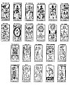

  
[Intangible Textual Heritage](../../index)  [Tarot](../index.md)  [Tarot
Reading](../pkt/tarot0)  [Index](index)  [Previous](tob10.md) 
[Next](tob12.md) 

------------------------------------------------------------------------

p. 81

# CHAPTER IX.

### HISTORY OF THE SYMBOLISM OF THE TAROT. INQUIRY INTO ITS ORIGIN.

The Tarot is an Egyptian Book--Its Transformations--Mantegna's
Pack--Venetian Tarot--Florentine Tarot--Bolognese--Hindu Tarot--Chinese
Tarot--Modern Tarots--Etteila--Marseilles--Besançon--Watillaux--Oswald
Wirth--Italian and German Tarots--Constitution of the Symbolism of the
Tarot--The 16 primitive Hieroglyphic Signs--The 22 Hebrew Letters.

ORIGIN OF THE SYMBOLISM OF THE TAROT.

As we have already stated, each card of the Tarot represents a symbol, a
number, and an idea.

We have endeavoured to avoid empiricism as far as possible in the course
of these explanations; and therefore we first studied the numbers, for
they are the most settled element, and give the most unvarying results
in their combinations.

Relying firmly upon the basis which we have thus constructed, we can now
study the symbols with absolute assurance.

We hope that for this purpose you have procured the Tarot [1](#fn_30.md) of Marseilles, the most correct in its
symbolism, or

p. 82

else the twenty-two keys designed by Oswald Wirth; perhaps--and this is
really almost indispensable--you have both of them.

You need, then, only deal the cards upon the table, to see at once that
the personages depicted upon them all wear *dresses of the Renaissance*
period.

And yet, is this pack of cards of ancient origin? It does not appear so.

Look at your figures more attentively and you will soon perceive
Egyptian symbols \[the triple cross (No. 5), ibis (No. 17)\] combined
with these Renaissance costumes.

They at once prove that the Tarot of Marseilles is really the exact
representation of the primitive Egyptian Tarot, slightly altered to the
epoch denoted by the costumes. Only the gypsies possess the primitive
pack intact.

The studies of those learned men who have investigated the Tarot have
confirmed this fact by the strongest evidence. And the works of
Chatto, [1](#fn_31.md) Boiteau [2](#fn_32.md) and above all of Merlin, [3](#fn_33.md) show us that history corroborates our
assertion.

Merlin conducted his researches very scientifically, and succeeded in
discovering the original of our Tarot of Marseilles in an Italian Tarot
at Venice, the father of all the later packs.

He believes also that he has discovered the origin of this Venetian
Tarot in the philosophical pack of *Mantegna*.

But he cannot determine the origin of this pack, because

p. 83

the one that Merlin believed to be the source of the Tarot is on the
contrary a *reproduction*, made by one of the Initiates. The *Ars Magna*
of Raymond Lulle was produced in the same way; it is drawn entirely from
the Tarot.

We have given for reference the *pack of Mantegna*, known in the trade
as the *cards of Baldini*, as well as the packs of the Italian Tarots,
from which most of ours are derived.

The tableau [1](#fn_34.md) which indicates the
connection between the Tarot packs and that of Mantegna, ought to be
reversed, and on the contrary show the cards of Mantegna derived from
the Tarot, as we have stated.

Here are the figures of the Tarots. (See page [84](#page_84)..md)

p. 84

MANTEGNA'S PACK.

|                        |                     |                |                |                                 |
|------------------------|---------------------|----------------|----------------|---------------------------------|
| 1 The beggar.          | 11 Calliope.        | 21 Grammar.    | 31 Astronomy.  | 41 Moon.                        |
| 2 The knave.           | 12 Urania.          | 22 Logic.      | 32 Chronology. | 42 Mercury.                     |
| 3 The artisan.         | 13 Terpsichore.     | 23 Rhetoric.   | 33 Cosmology.  | 43 Venus.                       |
| 4 The merchant.        | 14 Erato.           | 24 Geometry.   | 31 Temperance. | 44 Sun.                         |
| 5 The Nobleman.        | 15 Polyhymnia.      | 25 Arithmetic. | 35 Prudence.   | 45 Mars.                        |
| 6 The Knight.          | 16 Thalia.          | 26 Music.      | 36 Strength.   | 46 Jupiter.                     |
| 7 The Doge.            | 17 Melpomene.       | 27 Poetry.     | 37 Justice.    | 47 Saturn.                      |
| 8 The King.            | 18 Euterpe.         | 28 Philosophy. | 38 Charity.    | 48 8th sphere.                  |
| 9 The Emperor.         | 19 Clio.            | 29 Astrology.  | 39 Hope.       | 49 Chief agent.                 |
| 10 The Pope.           | 20 Apollo.          | 30 Theology.   | 40 Faith.      | 50 First cause.                 |
| A = Trumps.            | B = Sceptres.       | C = Cups       | D = Pentacles. | E = Swords.                     |
| E = Positions in life. | D = Muses and Arts. | C = Sciences.  | B = Virtues.   | A = The system of the Universe. |

 

p. 85

ORIGIN OF THE OTHERS.

<table data-cellspacing="0" data-border="0" data-cellpadding="9" width="798">
<colgroup>
<col style="width: 33%" />
<col style="width: 33%" />
<col style="width: 33%" />
</colgroup>
<tbody>
<tr class="odd">
<td width="33%" data-valign="TOP">
Minchiate of Florence. 
97 cards, of which 40 are Tarots.
</td>
<td width="33%" data-valign="TOP">
Venetian Tarot, 
78 cards, of which 21 are Tarots.
</td>
<td width="33%" data-valign="TOP">
Tarot of Bologna, 
62 cards, of which 21 are Tarots.
</td>
</tr>
<tr class="even">
<td width="33%" data-valign="TOP">
0 The Foolish Man.
</td>
<td width="33%" data-valign="TOP">
0 The Foolish Man.
</td>
<td width="33%" data-valign="TOP">
0 The Foolish Man.
</td>
</tr>
<tr class="odd">
<td width="33%" data-valign="TOP">
1 The Juggler.
</td>
<td width="33%" data-valign="TOP">
1 The Juggler.
</td>
<td width="33%" data-valign="TOP">
1 The Juggler.
</td>
</tr>
<tr class="even">
<td width="33%" data-valign="TOP">
2 The Grand Duke.
</td>
<td width="33%" data-valign="TOP">
2 The High Priestess
</td>
<td width="33%" data-valign="TOP">
2 The High Priestess.
</td>
</tr>
<tr class="odd">
<td width="33%" data-valign="TOP">
3 The Emperor of the West.
</td>
<td width="33%" data-valign="TOP">
3 The Empress.
</td>
<td width="33%" data-valign="TOP">
3 The Empress.
</td>
</tr>
<tr class="even">
<td width="33%" data-valign="TOP">
4 The Emperor of the East.
</td>
<td width="33%" data-valign="TOP">
4 The Emperor.
</td>
<td width="33%" data-valign="TOP">
4 The Emperor.
</td>
</tr>
<tr class="odd">
<td width="33%" data-valign="TOP">
5 Love.
</td>
<td width="33%" data-valign="TOP">
5 The Pope.
</td>
<td width="33%" data-valign="TOP">
5 The Pope.
</td>
</tr>
<tr class="even">
<td width="33%" data-valign="TOP">
6 Temperance.
</td>
<td width="33%" data-valign="TOP">
6 The Lovers.
</td>
<td width="33%" data-valign="TOP">
6 Love.
</td>
</tr>
<tr class="odd">
<td width="33%" data-valign="TOP">
7 Strength.
</td>
<td width="33%" data-valign="TOP">
7 The Chariot.
</td>
<td width="33%" data-valign="TOP">
7 The Chariot.
</td>
</tr>
<tr class="even">
<td width="33%" data-valign="TOP">
8 Justice.
</td>
<td width="33%" data-valign="TOP">
8 Justice.
</td>
<td width="33%" data-valign="TOP">
8 Temperance.
</td>
</tr>
<tr class="odd">
<td width="33%" data-valign="TOP">
9 The Wheel of Fortune.
</td>
<td width="33%" data-valign="TOP">
9 The Hermit.
</td>
<td width="33%" data-valign="TOP">
9 Justice.
</td>
</tr>
<tr class="even">
<td width="33%" data-valign="TOP">
10 The Chariot.
</td>
<td width="33%" data-valign="TOP">
10 The Wheel of Fortune.
</td>
<td width="33%" data-valign="TOP">
10 Strength.
</td>
</tr>
<tr class="odd">
<td width="33%" data-valign="TOP">
11 The Old Man, with an Hour-glass.
</td>
<td width="33%" data-valign="TOP">
11 Strength.
</td>
<td width="33%" data-valign="TOP">
11 Fortune.
</td>
</tr>
<tr class="even">
<td width="33%" data-valign="TOP">
12 The Hanged Man.
</td>
<td width="33%" data-valign="TOP">
12 The Hanged Man.
</td>
<td width="33%" data-valign="TOP">
12 The Old Man.
</td>
</tr>
<tr class="odd">
<td width="33%" data-valign="TOP">
13 Death.
</td>
<td width="33%" data-valign="TOP">
13 Death.
</td>
<td width="33%" data-valign="TOP">
13 The Hanged Man.
</td>
</tr>
<tr class="even">
<td width="33%" data-valign="TOP">
14 The Devil.
</td>
<td width="33%" data-valign="TOP">
14 Temperance.
</td>
<td width="33%" data-valign="TOP">
14 Death.
</td>
</tr>
<tr class="odd">
<td width="33%" data-valign="TOP">
15 Hell.
</td>
<td width="33%" data-valign="TOP">
15 The Devil.
</td>
<td width="33%" data-valign="TOP">
15 The Devil.
</td>
</tr>
<tr class="even">
<td width="33%" data-valign="TOP">
16 Hope.
</td>
<td width="33%" data-valign="TOP">
16 The Lightning-struck Tower.
</td>
<td width="33%" data-valign="TOP">
16 Thunder.
</td>
</tr>
<tr class="odd">
<td width="33%" data-valign="TOP">
17 Prudence.
</td>
<td width="33%" data-valign="TOP">
 
</td>
<td width="33%" data-valign="TOP">
 
</td>
</tr>
<tr class="even">
<td width="33%" data-valign="TOP">
18 Faith.
</td>
<td width="33%" data-valign="TOP">
 
</td>
<td width="33%" data-valign="TOP">
 
</td>
</tr>
<tr class="odd">
<td width="33%" data-valign="TOP">
19 Charity.
</td>
<td width="33%" data-valign="TOP">
 
</td>
<td width="33%" data-valign="TOP">
 
</td>
</tr>
<tr class="even">
<td width="33%" data-valign="TOP">
20 Fire.
</td>
<td width="33%" data-valign="TOP">
 
</td>
<td width="33%" data-valign="TOP">
 
</td>
</tr>
<tr class="odd">
<td width="33%" data-valign="TOP">
21 Water.
</td>
<td width="33%" data-valign="TOP">
 
</td>
<td width="33%" data-valign="TOP">
 
</td>
</tr>
<tr class="even">
<td width="33%" data-valign="TOP">
22 The Earth.
</td>
<td width="33%" data-valign="TOP">
 
</td>
<td width="33%" data-valign="TOP">
 
</td>
</tr>
<tr class="odd">
<td width="33%" data-valign="TOP">
23 Air.
</td>
<td width="33%" data-valign="TOP">
 
</td>
<td width="33%" data-valign="TOP">
 
</td>
</tr>
<tr class="even">
<td width="33%" data-valign="TOP">
24 The Scales.
</td>
<td width="33%" data-valign="TOP">
 
</td>
<td width="33%" data-valign="TOP">
 
</td>
</tr>
<tr class="odd">
<td width="33%" data-valign="TOP">
25 The Virgin.
</td>
<td width="33%" data-valign="TOP">
 
</td>
<td width="33%" data-valign="TOP">
 
</td>
</tr>
<tr class="even">
<td width="33%" data-valign="TOP">
26 The Scorpion.
</td>
<td width="33%" data-valign="TOP">
 
</td>
<td width="33%" data-valign="TOP">
 
</td>
</tr>
<tr class="odd">
<td width="33%" data-valign="TOP">
27 The Ram.
</td>
<td width="33%" data-valign="TOP">
 
</td>
<td width="33%" data-valign="TOP">
 
</td>
</tr>
<tr class="even">
<td width="33%" data-valign="TOP">
28 Capricornus.
</td>
<td width="33%" data-valign="TOP">
 
</td>
<td width="33%" data-valign="TOP">
 
</td>
</tr>
<tr class="odd">
<td width="33%" data-valign="TOP">
29 Sagittarius.
</td>
<td width="33%" data-valign="TOP">
 
</td>
<td width="33%" data-valign="TOP">
 
</td>
</tr>
<tr class="even">
<td width="33%" data-valign="TOP">
30 Cancer.
</td>
<td width="33%" data-valign="TOP">
 
</td>
<td width="33%" data-valign="TOP">
 
</td>
</tr>
<tr class="odd">
<td width="33%" data-valign="TOP">
31 Pisces.
</td>
<td width="33%" data-valign="TOP">
 
</td>
<td width="33%" data-valign="TOP">
 
</td>
</tr>
<tr class="even">
<td width="33%" data-valign="TOP">
32 Aquarius.
</td>
<td width="33%" data-valign="TOP">
 
</td>
<td width="33%" data-valign="TOP">
 
</td>
</tr>
<tr class="odd">
<td width="33%" data-valign="TOP">
33 The Lion.
</td>
<td width="33%" data-valign="TOP">
 
</td>
<td width="33%" data-valign="TOP">
 
</td>
</tr>
<tr class="even">
<td width="33%" data-valign="TOP">
34 The Bull.
</td>
<td width="33%" data-valign="TOP">
 
</td>
<td width="33%" data-valign="TOP">
 
</td>
</tr>
<tr class="odd">
<td width="33%" data-valign="TOP">
35 The Twins.
</td>
<td width="33%" data-valign="TOP">
 
</td>
<td width="33%" data-valign="TOP">
 
</td>
</tr>
<tr class="even">
<td width="33%" data-valign="TOP">
36 The Star.
</td>
<td width="33%" data-valign="TOP">
17 The Star.
</td>
<td width="33%" data-valign="TOP">
17 The Star.
</td>
</tr>
<tr class="odd">
<td width="33%" data-valign="TOP">
37 The Moon.
</td>
<td width="33%" data-valign="TOP">
18 The Moon.
</td>
<td width="33%" data-valign="TOP">
18 The Moon.
</td>
</tr>
<tr class="even">
<td width="33%" data-valign="TOP">
38 The Sun.
</td>
<td width="33%" data-valign="TOP">
19 The Sun.
</td>
<td width="33%" data-valign="TOP">
19 The Sun.
</td>
</tr>
<tr class="odd">
<td width="33%" data-valign="TOP">
39 The Universe.
</td>
<td width="33%" data-valign="TOP">
20 The Last Judgment.
</td>
<td width="33%" data-valign="TOP">
20 The Universe.
</td>
</tr>
<tr class="even">
<td width="33%" data-valign="TOP">
40 Fame.
</td>
<td width="33%" data-valign="TOP">
21 The Universe.
</td>
<td width="33%" data-valign="TOP">
21 The Angel.
</td>
</tr>
</tbody>
</table>

 

p. 86

CORRESPONDENCE BETWEEN THE PRIMITIVE ITALIAN PACKS AND THE MODERN
TAROT--

|               |           |                   |
|---------------|-----------|-------------------|
| Modern Tarot. | Mantegna. |                   |
| The King      | King      | No. 8 of Mantegna |
| The Knight    | Knight    | 6                 |
| The Knave     | Knave     | 2                 |

|             |     |                     |     |        |     |             |
|-------------|-----|---------------------|-----|--------|-----|-------------|
| The Emperor | 4   | of the Tarot is the | IX  | series | E   | of Mantegna |
| The Pope    | 5   | ----                | X   | ----   | E   | ----        |
| Temperance  | 14  | ----                | 34  | ----   | E   | ----        |
| Strength    | 11  | ----                | 36  | ----   | B   | ----        |
| Justice     | 8   | ----                | 37  | ----   | B   | ----        |
| The Moon    | 18  | ----                | 41  | ----   | A   | ----        |
| The Sun     | 19  | ----                | 44  | ----   | A   | ----        |

<table data-cellspacing="0" data-border="0" data-cellpadding="9" width="797">
<colgroup>
<col style="width: 20%" />
<col style="width: 20%" />
<col style="width: 20%" />
<col style="width: 20%" />
<col style="width: 20%" />
</colgroup>
<tbody>
<tr class="odd">
<td width="20%" data-valign="TOP">
The Foolish Man
</td>
<td width="20%" data-valign="TOP">
(unnumbered)
</td>
<td width="20%" data-valign="TOP">
Beggar
</td>
<td width="20%" data-valign="TOP">
No. 1
</td>
<td width="20%" data-valign="TOP">
Mantegna
</td>
</tr>
<tr class="even">
<td width="20%" data-valign="TOP">
The Star
</td>
<td width="20%" data-valign="TOP">
17
</td>
<td width="20%" data-valign="TOP">
Venus
</td>
<td width="20%" data-valign="TOP">
42
</td>
<td width="20%" data-valign="TOP">
----
</td>
</tr>
<tr class="odd">
<td width="20%" data-valign="TOP">
The Chariot
</td>
<td width="20%" data-valign="TOP">
7
</td>
<td width="20%" data-valign="TOP">
Mars
</td>
<td width="20%" data-valign="TOP">
10
</td>
<td width="20%" data-valign="TOP">
----
</td>
</tr>
<tr class="even">
<td width="20%" data-valign="TOP">
The Hermit
</td>
<td width="20%" data-valign="TOP">
9
</td>
<td width="20%" data-valign="TOP">
Saturn
</td>
<td width="20%" data-valign="TOP">
47
</td>
<td width="20%" data-valign="TOP">
----
</td>
</tr>
<tr class="odd">
<td width="20%" data-valign="TOP">
The Universe
</td>
<td width="20%" data-valign="TOP">
21
</td>
<td width="20%" data-valign="TOP">
Jupiter 
First cause
</td>
<td width="20%" data-valign="TOP">
46 
50
</td>
<td width="20%" data-valign="TOP">
---- 
-----
</td>
</tr>
</tbody>
</table>

 

If, however, the existence of purely Egyptian symbols in these so-called
Italian Tarots do not convince the reader, a few words on the
transformation of the Tarot in the East, and in other countries of
Europe besides Italy, will completely enlighten him on the subject.

HINDU TAROTS.

In spite of Merlin's assertions, the Tarot represents the summary of the
scientific knowledge of the ancients. This is unquestionably proved by
Chatto's researches amongst Orientals on this subject.

In fact the Indians possess a game of chess, the *Tchaturanga*,

p. 87

evidently derived from the Tarot, from the manner in which the men are
arranged in four series.

Elephants, chariots, horses, foot-soldiers.

The Mussulmen of India also possess a pack of cards that is derived from
the old symbols of the Tarot: the *Gungeifu* or *Ghendgifeh*.

This game is composed of eight series of twelve cards each, divided in
this way--

<table data-cellspacing="0" data-border="0" data-cellpadding="9" width="1173">
<colgroup>
<col style="width: 50%" />
<col style="width: 50%" />
</colgroup>
<tbody>
<tr class="odd">
<td width="50%" data-valign="TOP">
<em>Superior Section</em> or Bishbur:
</td>
<td width="50%" data-valign="TOP"><em></em>

Inferior Section or Kunbur:
</td>
</tr>
<tr class="even">
<td width="50%" data-valign="TOP">
Crowns
</td>
<td width="50%" data-valign="TOP">
Harps
</td>
</tr>
<tr class="odd">
<td width="50%" data-valign="TOP">
Moons
</td>
<td width="50%" data-valign="TOP">
Suns
</td>
</tr>
<tr class="even">
<td width="50%" data-valign="TOP">
Sabres
</td>
<td width="50%" data-valign="TOP">
Royal diplomas
</td>
</tr>
<tr class="odd">
<td width="50%" data-valign="TOP">
Slaves.
</td>
<td width="50%" data-valign="TOP">
Bales of Merchandise.
</td>
</tr>
</tbody>
</table>

 

CHINESE TAROT.

An inexperienced eye might find some difficulty in recognizing the Tarot
in these games, but the Chinese have given us an irrefutable argument in
favour of our assertion, in the arrangement of their Tarot, which is
represented by the figure on page [88](#page_88.md).

We have placed the correspondences of the minor and major arcana, and of
the four letters of the tetragrammaton, above this figure.

A description of this Chinese pack will be found in Court de Gébelin
(*Le Monde Primitif*), and in the work of J. A. Vaillant.

With. regard to the foreign Tarots, we possess nearly all of them at the
present time, and this induces us to name the various editions of the
Tarot which we are now able to consult.

p. 88

<table style="width:100%;" data-border="" data-cellspacing="1" data-cellpadding="8" width="446">
<colgroup>
<col style="width: 16%" />
<col style="width: 16%" />
<col style="width: 16%" />
<col style="width: 16%" />
<col style="width: 16%" />
<col style="width: 16%" />
</colgroup>
<tbody>
<tr class="odd">
<td colspan="4" width="68%" data-valign="TOP">
MINOR ARCANA.
</td>
<td colspan="2" width="34%" data-valign="TOP">
MAJOR ARCANA.
</td>
</tr>
<tr class="even">
<td width="17%" data-valign="TOP"><em></em>

yod
</td>
<td width="17%" data-valign="TOP"><em></em>

he
</td>
<td width="17%" data-valign="TOP"><em></em>

vau
</td>
<td width="17%" data-valign="TOP"><em></em>

he
</td>
<td width="17%" data-valign="TOP">
 
</td>
<td width="17%" data-valign="TOP">
 
</td>
</tr>
<tr class="odd">
<td width="17%" data-valign="TOP">
1
</td>
<td width="17%" data-valign="TOP">
15
</td>
<td width="17%" data-valign="TOP">
29
</td>
<td width="17%" data-valign="TOP">
43
</td>
<td width="17%" data-valign="TOP">
57
</td>
<td width="17%" data-valign="TOP">
71
</td>
</tr>
<tr class="even">
<td width="17%" data-valign="TOP">
12
</td>
<td width="17%" data-valign="TOP">
16
</td>
<td width="17%" data-valign="TOP">
30
</td>
<td width="17%" data-valign="TOP">
44
</td>
<td width="17%" data-valign="TOP">
58
</td>
<td width="17%" data-valign="TOP">
72
</td>
</tr>
<tr class="odd">
<td width="17%" data-valign="TOP">
3
</td>
<td width="17%" data-valign="TOP">
17
</td>
<td width="17%" data-valign="TOP">
31
</td>
<td width="17%" data-valign="TOP">
45
</td>
<td width="17%" data-valign="TOP">
59
</td>
<td width="17%" data-valign="TOP">
73
</td>
</tr>
<tr class="even">
<td width="17%" data-valign="TOP">
4
</td>
<td width="17%" data-valign="TOP">
18
</td>
<td width="17%" data-valign="TOP">
32
</td>
<td width="17%" data-valign="TOP">
46
</td>
<td width="17%" data-valign="TOP">
60
</td>
<td width="17%" data-valign="TOP">
74
</td>
</tr>
<tr class="odd">
<td width="17%" data-valign="TOP">
5
</td>
<td width="17%" data-valign="TOP">
19
</td>
<td width="17%" data-valign="TOP">
33
</td>
<td width="17%" data-valign="TOP">
47
</td>
<td width="17%" data-valign="TOP">
61
</td>
<td width="17%" data-valign="TOP">
75
</td>
</tr>
<tr class="even">
<td width="17%" data-valign="TOP">
6
</td>
<td width="17%" data-valign="TOP">
20
</td>
<td width="17%" data-valign="TOP">
34
</td>
<td width="17%" data-valign="TOP">
48
</td>
<td width="17%" data-valign="TOP">
62
</td>
<td width="17%" data-valign="TOP">
76
</td>
</tr>
<tr class="odd">
<td width="17%" data-valign="TOP">
7
</td>
<td width="17%" data-valign="TOP">
21
</td>
<td width="17%" data-valign="TOP">
35
</td>
<td width="17%" data-valign="TOP">
49
</td>
<td width="17%" data-valign="TOP">
63
</td>
<td width="17%" data-valign="TOP">
77
</td>
</tr>
<tr class="even">
<td width="17%" data-valign="TOP">
8
</td>
<td width="17%" data-valign="TOP">
22
</td>
<td width="17%" data-valign="TOP">
36
</td>
<td width="17%" data-valign="TOP">
50
</td>
<td width="17%" data-valign="TOP">
64
</td>
<td width="17%" data-valign="TOP">
 
</td>
</tr>
<tr class="odd">
<td width="17%" data-valign="TOP">
9
</td>
<td width="17%" data-valign="TOP">
23
</td>
<td width="17%" data-valign="TOP">
37
</td>
<td width="17%" data-valign="TOP">
51
</td>
<td width="17%" data-valign="TOP">
65
</td>
<td width="17%" data-valign="TOP">
 
</td>
</tr>
<tr class="even">
<td width="17%" data-valign="TOP">
10
</td>
<td width="17%" data-valign="TOP">
24
</td>
<td width="17%" data-valign="TOP">
38
</td>
<td width="17%" data-valign="TOP">
52
</td>
<td width="17%" data-valign="TOP">
66
</td>
<td width="17%" data-valign="TOP">
 
</td>
</tr>
<tr class="odd">
<td width="17%" data-valign="TOP">
11
</td>
<td width="17%" data-valign="TOP">
25
</td>
<td width="17%" data-valign="TOP">
39
</td>
<td width="17%" data-valign="TOP">
53
</td>
<td width="17%" data-valign="TOP">
67
</td>
<td width="17%" data-valign="TOP">
 
</td>
</tr>
<tr class="even">
<td width="17%" data-valign="TOP">
12
</td>
<td width="17%" data-valign="TOP">
26
</td>
<td width="17%" data-valign="TOP">
40
</td>
<td width="17%" data-valign="TOP">
54
</td>
<td width="17%" data-valign="TOP">
68
</td>
<td width="17%" data-valign="TOP">
 
</td>
</tr>
<tr class="odd">
<td width="17%" data-valign="TOP">
13
</td>
<td width="17%" data-valign="TOP">
27
</td>
<td width="17%" data-valign="TOP">
41
</td>
<td width="17%" data-valign="TOP">
55
</td>
<td width="17%" data-valign="TOP">
69
</td>
<td width="17%" data-valign="TOP">
 
</td>
</tr>
<tr class="even">
<td width="17%" data-valign="TOP">
14
</td>
<td width="17%" data-valign="TOP">
28
</td>
<td width="17%" data-valign="TOP">
42
</td>
<td width="17%" data-valign="TOP">
49
</td>
<td width="17%" data-valign="TOP">
56
</td>
<td width="17%" data-valign="TOP">
 
</td>
</tr>
</tbody>
</table>

 

MODERN TAROTS.

The following. ire the most important of these modern Tarots--

The Tarot of Etteila.  
The Italian Tarot.  
The Marseilles Tarot.  
The Tarot of Besançon. p. 89  
The double-headed Tarot of Besançon.  
The Tarot of Watillaux.  
The German Tarot.  
The Tarot of Oswald Wirth.

THE FRENCH TAROT PACKS.

The *Tarot of Etteila* is of no symbolic value, it is a bad mutilation
of the real Tarot.

This pack is used by all our fortune-tellers. Its sole interest lies in
the strangeness of its figures. it can be obtained for 5 or 8 francs
from all the great card-sellers in Paris.

The *Tarot of Watillaux*, or pack of the princess Tarot, reproduces the
minor arcana very correctly. It is worth consideration on this account.

The *Italian Tarot, that of Besançon and of Marseilles*, [1](#fn_35.md) are unquestionably the best which we now
possess, particularly the latter, which fairly reproduces the *Primitive
symbolical Tarot*.

FOREIGN PACKS OF TAROTS.

Besides the Italian we must quote the German Tarot, in which the symbols
of the minor arcana are [different](errata.htm#0.md).

For

|               |                    |            |
|---------------|--------------------|------------|
| The Cups      | are represented by | The Hearts |
| The Pentacles | ----               | The Bells  |
| The Swords    | ----               | The Leaves |
| The Sceptres  | ----               | The Acorns |

 

However, this Tarot is a very bad one.

p. 90

THE TAROT OF OSWALD WIRTH.

It became necessary to have a Tarot pack in which the symbolism was
definitely established. This work, suggested by Eliphas Levi, who
defined the principles on which it was to be based, has been
accomplished by Mr. Oswald Wirth.

This clever occultist, aided by the advice of Stanislas de Guaita, has
designed the series of the twenty-two major arcana. These drawings
reproduce the Tarot of Marseilles, with the symbolical modifications
suggested by the researches of Eliphas Levi upon this important
question.

Owing to the kindness of M. Poirel, who assisted the work by printing
these designs, we now possess a marvellous symbolic document in the
*Tarot of Oswald Wirth*.

It is therefore wise, as we have already said, for those who wish to
study the Tarot very thoroughly, to procure the *Tarot de Marseilles*,
and that of *Oswald Wirth*.

We shall use them both presently in our explanation of the symbolical
meaning of each card,

But before passing to the study of these symbols, card by card, we must
see if there are no means of positively defining the symbolism of the
Tarot.

HOW CAN WE HOPE TO DEFINE THE SYMBOLISM OF THE TAROT CONCLUSIVELY?

We have already and sufficiently explained that the Tarot represents the
ancient or occult science in every possible development.

If we then wish to find a solid basis for the study of the symbols
represented in the 22 major arcana, we may put the Tarot on one side for
an instant, and devote ourselves to this ancient science. It alone can
enable us

 

 [  
Click to enlarge](img/09000.jpg.md)

 

p. 91

to attain our end, not in *finding* the explanation of the symbols, but
in leading us to *create* them one by one, by deducing them from fixed
and general principles.

We shall thus commence work of quite a new character, whilst avoiding,
so far as possible, falling into those errors which arise from the
effort to explain the symbols of the Tarot by themselves, instead of
seeking for their solution at their original source.

The first step in the search for these particular symbols leads us to
discuss the grave problem of the origin of symbolism itself.

We cannot enter upon, much less solve, this question by ourselves; we
shall therefore quote the opinions of several writers upon this subject.
Truth, having Unity for its criterion, the agreement of various
conclusions in one point will he a valuable guide for us.

Claude de Saint-Martin, the unknown philosopher, states in his book, the
*Livre des Rapports*, that the primitive alphabet is composed of sixteen
signs. He received these data, so far as we can judge, from intuitive
revelation, joined to the teaching of the Illuminism, of which he was
one of the members.

Lacour, in his book on the Elohim or Gods of Moses, has inductively
determined the existence of a primitive alphabet, also composed of
sixteen signs. Another author, *Barrois*, pursuing inquiries of quite a
different nature, also reaches the conclusion of the existence of
sixteen primitive signs in his system of Dactylology.

But the labours of *Court de Gébelin*, and above all of *Fabre
d'Olivet*, are the most remarkable in this respect. In his *Langue
Hébraïque Restituée*, this learned Initiate established the existence of
primitive hieroglyphic signs from which the Hebrew letters are derived.

p. 92

All these writers, starting from very different points, agree in their
conclusions, and this gives us a strong argument in favour of the truth
of their inquiries.

But it matters very little to us whether these 16 primitive signs are
the direct origin, either of the Hebrew, Sanscrit, Chinese, or Greek
letters. The identity of source tends strongly to identity of results,
and any one of these derivative alphabets will answer our purpose.

The Hebrew alphabet, composed of 22 letters, seems preferable to us, on
account of the concordance between the number of its letters and that of
the Arcana in our Tarot.

We shall therefore adopt, as the starting-point of our study, the Hebrew
alphabet of 22 letters, derived from the 16 primitive hieroglyphic
signs.

This conclusion is scarcely reached, when fresh light shines upon us
from all sides.

Guillaume Postel [1](#fn_36.md) reveals to us the
connection between the Hebrew letters and the Tarot; *Van Helmont
fils*, [2](#fn_37.md) *Claude de
Saint-Martin*, [3](#fn_38.md) *Fabre
d'Olivet*, [4](#fn_39.md) all confirm our opinion;
lastly, *Eliphas Levi* [5](#fn_40.md) also throws
the weight of his marvellous learning into the question.

But we are more surprised to find that the *Sepher Yetzirah*, [6](#fn_41.md) an old book of the Kabbalah, which
contains a study upon the formation of the Hebrew alphabet, arrives at a
division of the letters which exactly corresponds with

p. 93

the astrological data contained in an old manuscript in the Vatican,
upon which *Christian* [1](#fn_42.md) based his
horoscopic works.

One single and identical conclusion arises from all these different
points of view: the value of the Hebrew letter as a symbol.

In it we possess a real symbol, of which we can ascertain not only the
meanings, but also the origin.

We could then make a Tarot exclusively composed of Hebrew letters and of
numbers, but this is not our object; we are seeking to discover in the
symbolism of the Hebrew characters the symbolism of the Tarot, and we
shall thus realize our intention of ascertaining deductively the value
of the figures of the Tarot and the reason they have been chosen.

THE HEBREW LETTERS AS THE BASIS OF THE SYMBOLICAL TAROT.

We shall now study the Hebrew letters one by one, in determining
successively--

1st. The hieroglyphic value of each one of them according to its origin
(Fabre d'Olivet, Barrois),

2nd. Its symbolic value derived from this hieroglyphic (Fabre d'Olivet,
Eliphas Levi, Christian);

3rd. Its astronomical value (Christian and the *Sepher Yetzirah*.).

Once acquainted with these data, it will be easy for us to deduce from
them the application of the letters to the symbols of the Tarot.

But before we enter upon this study, it is necessary to say a few words
upon the Hebrew alphabet in general and its constitution.

p. 94

The alphabet of the Hebrews is composed of 22 letters; these letters,
however, are not placed by chance, one after the other. Each of them
corresponds with a number according to its rank, with a hieroglyphic
according to its form, with a symbol according to its affinities with
the other letters.

As we have already said, all the letters are derived from one amongst
them, the *yod*. [1](#fn_43.md) The yod has
generated them in the following manner (see *Sepher Yetzirah*)--

1st. Three mothers:

|        |            |     |
|--------|------------|-----|
| The A  | (Aleph)    | א   |
| The M  | (The Mem)  | מ   |
| The Sh | (The Shin) | ש   |

 

2nd. Seven doubles (double because they express two sounds, the one
positive strong, the other negative soft);

|        |          |     |
|--------|----------|-----|
| The B  | (Beth)   | ב   |
| The G  | (Gimel)  | ג   |
| The D  | (Daleth) | ג   |
| The Ch | (Caph)   | כ   |
| The Ph | (Pe)     | פ   |
| The R  | (Resh)   | ר   |
| The T  | (Tau)    | ט   |

 

3rd. Lastly, twelve simple, formed by the other letters.

To render this clearer, we will give the Hebrew alphabet here,
indicating the quality of each letter and its rank. (See page
[95](#page_95)..md)

We have now given a fixed principle for symbolism in the Hebrew letter,
and need not fear being deceived by the false interpretation of a
costume, or of an incorrect figure. The Hebrew letter will be always
there, to enlighten us upon obscure or difficult points.

p. 95

We can therefore safely return to the Tarot, which we have left to make
this digression.

|                 |              |        |                        |                      |
|-----------------|--------------|--------|------------------------|----------------------|
| NUMBER IN ORDER | HIEROGLYPHIC | NAMES  | VALUE IN ROMAN LETTERS | VALUE IN ALPHABET    |
| 1               | א            | aleph  | A                      | mother               |
| 2               | ב            | beth   | B                      | double               |
| 3               | ג            | gimel  | G                      | double               |
| 4               | ד            | daleth | D                      | double               |
| 5               | ה            | he     | E                      | simple               |
| 6               | ו            | vau    | V                      | simple               |
| 7               | ז            | zain   | z                      | simple               |
| 8               | ה            | heth   | H                      | simple               |
| 9               | ט            | teth   | T                      | simple               |
| 10              | י            | Yod    | I                      | simple and principle |
| 11              | כ            | kaph   | CH                     | double               |
| 12              | ל            | lamed  | L                      | simple               |
| 13              | מ            | mem    | M                      | mother               |
| 14              | נ            | nun    | N                      | simple               |
| 15              | ס            | samech | S                      | simple               |
| 16              | ע            | ayin   | GH                     | simple               |
| 17              | פ            | phe    | PH                     | double               |
| 18              | צ            | tzaddi | TS                     | simple               |
| 19              | ק            | qoph   | K                      | simple               |
| 20              | ר            | resh   | R                      | double               |
| 21              | ש            | shin   | SH                     | mother               |
| 22              | ט            | tau    | TH                     | double               |

 

------------------------------------------------------------------------

### Footnotes

[81:1](tob11.htm#fr_30) See [p. 89](#page_89.md),
the price of the Tarots and the addresses where they may be procured.

[82:1](tob11.htm#fr_31.md) Chatto, *Facts and
Speculations on the Origin and History of Playing Cards in Europe*. 8vo.
London, 1848.

[82:2](tob11.htm#fr_32.md) Boiteau, *Les Cartes à
Jouer et la Cartomancie*. 4to. Paris, 1864.

[82:3](tob11.htm#fr_33.md) Merlin, *Origine des
Cartes à Jouer, recherches nouvelles sur les Naïbis, les Tarots et sur
les autres Espèces de Cartes*. A work ornamented with 70 illustrations.
4to. Paris, 1869.

[83:1](tob11.htm#fr_34) Page [86](#page_86.md).

[89:1](tob11.htm#fr_35.md) These Tarots are to be
found in Paris, 20 Rue de la Banque, M. Pussey, at 4 francs; and one is
published in London by Mr. George Redway, 15 York Street, Covent Garden.

[92:1](tob11.htm#fr_36.md) Clavis.

[92:2](tob11.htm#fr_37.md) *Origin of Language*
(Latin).

[92:3](tob11.htm#fr_38.md) *Tableaux naturels des
rapports qui existent entre Dieu, l'homme et l'Univers*.

[92:4](tob11.htm#fr_39.md) *La Langue Hébraïque
Restituée*.

[92:5](tob11.htm#fr_40.md) *Rituel de la Haute
Magie*.

[92:6](tob11.htm#fr_41.md) Translated into English
by Dr. Wynn Westcott.

[93:1](tob11.htm#fr_42.md) *Histoire de la Magie*.

[94:1](tob11.htm#fr_43.md) See above ([p.
19](tob04.htm#page_19).md): Study upon the word *Yod-he-vau-he*.

------------------------------------------------------------------------

[Next: Scheme of Work](tob12.md)
