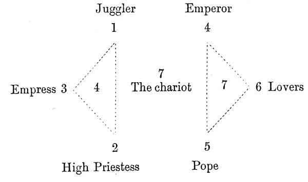
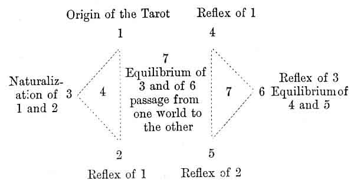

  
[Intangible Textual Heritage](../../index)  [Tarot](../index.md)  [Tarot
Reading](../pkt/tarot0)  [Index](index)  [Previous](tob11.md) 
[Next](tob13.md) 

------------------------------------------------------------------------

p. 96

# CHAPTER X.

### THE SYMBOLICAL TAROT.

### THE FIRST SEPTENARY, 1ST TO 7TH ARCANA. THEOGONY.

Scheme of Work--Key to the 1st Septenary--The 1st Card of the Tarot the
Origin of all the others--The three Principles of the Absolute--The
Trinity--Figure of the first Card and its Affinities--The High Priestess
and the Beth--The Gimel and the Empress--The Daleth and the Emperor--The
He and the Pope--The Van, the Lovers--Summary of the 1st
Septenary--Constitution of God.

STUDY OF EACH OF THE 22 MAJOR ARCANA.

Scheme of Work.

WE shall now apply this general law of symbolism to each of the
twenty-two major arcana.

We must here beg for the reader's careful attention in spite of the
length of the subject under consideration. We shall make every effort to
be as clear as possible, and therefore we shall first explain the scheme
which we have adopted in the study of each of the cards of the Tarot.

(1st) We shall always start from the hieroglyphic sign which has given
birth to the Hebrew letter. Court de Gébelin is the author whom we shall
consult chiefly upon this subject.

(2nd) We shall explain from the hieroglyphic character

p. 97

all the ideas that can be progressively deduced from it, and which
characterize the Hebrew letter considered as a *sign*. Kircher and Fabre
d'Olivet are our authorities in this work.

(3rd) When we have once defined the ideas signified by the Hebrew
letter, we shall search for the application of these ideas in the
symbolic figure of the Tarot.

Eliphas Levi, [1](#fn_44.md) Christian [2](#fn_45.md) and Barrois [3](#fn_46.md) will aid us in our inquiries.

(4th) Lastly, we shall determine the meaning which must be attributed to
the card of the Tarot, according to its numerical and symbolical
affinities with all the others, in applying to it the general law of
symbolism. This portion of our work is strictly personal.

(5th) We shall end the study upon each of the cards by a figure showing
all that we have said.

We must warn the reader that the perusal of the recapitulations only
will be of no use as a means of understanding the card of the Tarot, and
that the best way will be to carefully follow the successive
explanations of each card, with the Tarot before him.

We cannot end this opening chapter without alluding to the basis upon
which we have established the astronomical relations of each card of the
Tarot.

One of the most ancient books of the Kabbalah which we possess, the
*Sepher Yetzirah*, [4](#fn_47.md) says that the
three mother letters of the Hebrew alphabet correspond with the three
worlds, the seven doubles with the seven planets, and the twelve simple
with the twelve signs of the zodiac. [5](#fn_48.md)

p. 98

Now in studying the astrological manuscript published by Christian, we
have discovered that the numbers attributed to the planets by the author
of this manuscript exactly correspond with the *double* Hebrew letters.
The numbers attributed to the twelve signs of the zodiac exactly
correspond with the simple letters.

We considered that this absolute agreement between two documents of such
different origin deserved our serious attention, and we have therefore
given with each letter its astronomical correspondence.

p. 99

 

KEY OF THE FIRST SEPTENARY.

ARRANGEMENT OF THE FIGURES FOR STUDY.

 

CHARACTER OF THE FIGURES.

 

 

------------------------------------------------------------------------

### Footnotes

[97:1](tob12.htm#fr_44.md) *Rituel de la Haute
Magie*.

[97:2](tob12.htm#fr_45.md) *Histoire de la Magie*.

[97:3](tob12.htm#fr_46.md) *Dactylologie ou Langage
Primitif*.

[97:4](tob12.htm#fr_47.md) Translated into French
by Papus.

[97:5](tob12.htm#fr_48.md) See Franck, *The
Kabbala*, Paris, 8vo.

------------------------------------------------------------------------

[Next: The First Card of the Tarot: Origin of the Signification of All
the Others](tob13.md)
